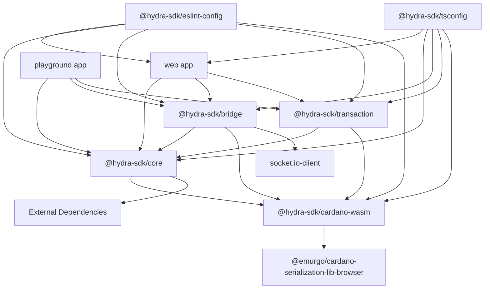

# Hydra SDK

A comprehensive software development kit for building Cardano wallet applications with Hydra Layer 2 integration. Built on a monorepo architecture using Turborepo, it provides essential libraries and tools to integrate Cardano wallet functionality and Hydra Head management into your applications.

## 🚀 Key Features

- **Cardano Wallet Management**: Create, restore, and manage Cardano wallets with full HD wallet support
- **Hydra Layer 2 Integration**: Complete Hydra Head lifecycle management and real-time transaction processing
- **WASM Integration**: Utilizes Cardano Serialization Library for optimal performance
- **TypeScript First**: Full TypeScript support with comprehensive type definitions
- **Modular Architecture**: Extensible package-based architecture for easy customization
- **Multiple Applications**: Demo web application and playground for testing
- **Transaction Builder**: Advanced transaction building with Hydra support
- **Real-time Events**: WebSocket and Socket.IO support for live updates

## 📁 Project Structure

```
hydra-sdk/
├── apps/                           # Applications
│   ├── web/                        # Main Nuxt.js web application (hydrawallet-client)
│   │   ├── components/             # Vue components
│   │   ├── pages/                  # Nuxt pages
│   │   ├── assets/                 # Static assets
│   │   ├── nuxt.config.ts          # Nuxt configuration
│   │   └── package.json
│   └── playground/                 # Development playground (hydrawallet-playground)
│       ├── components/             # Playground components
│       ├── pages/                  # Test pages
│       └── package.json
├── packages/                       # Core libraries and packages
│   ├── hydra-wallet/              # Core wallet library
│   │   ├── src/                   # Wallet management source code
│   │   ├── tsup.config.ts         # Build configuration
│   │   └── package.json           # @hydra-sdk/core
│   ├── hydra-bridge/              # Hydra Layer 2 bridge
│   │   ├── src/                   # Hydra Node connection and management
│   │   ├── tsup.config.ts         # Build configuration
│   │   └── package.json           # @hydra-sdk/bridge
│   ├── hydrawallet-transaction/   # Transaction builder
│   │   ├── src/                   # Transaction building utilities
│   │   ├── tsup.config.ts         # Build configuration
│   │   └── package.json           # @hydra-sdk/transaction
│   ├── cardano-wasm/              # Cardano WASM wrapper
│   │   ├── src/                   # WASM bindings
│   │   ├── tsup.config.ts         # Build configuration
│   │   └── package.json           # @hydra-sdk/cardano-wasm
│   ├── eslint-config/             # ESLint configuration
│   │   └── package.json           # @hydra-sdk/eslint-config
│   └── tsconfig/                  # TypeScript configurations
│       └── package.json           # @hydra-sdk/tsconfig
├── .changeset/                     # Changeset configuration for versioning
├── turbo.json                      # Turborepo configuration
├── pnpm-workspace.yaml            # PNPM workspace configuration
└── package.json                   # Root package.json
```

## 🏗️ Project Architecture

### Monorepo Architecture

The project uses **Turborepo** to manage the monorepo with benefits:

- **Shared Dependencies**: Share dependencies between packages
- **Incremental Builds**: Incremental builds, only build what changes
- **Remote Caching**: Cache build artifacts on cloud
- **Parallel Execution**: Run tasks in parallel

### Package Architecture



### Core Components

#### 1. **@hydra-sdk/core**
- **Purpose**: Core library for Cardano wallet management
- **Features**:
  - Create and restore wallets from mnemonic
  - HD wallet support with account/address derivation
  - Transaction signing and verification
  - Cardano network integration
  - UTxO management and querying

#### 2. **@hydra-sdk/bridge**
- **Purpose**: Hydra Layer 2 integration and management
- **Features**:
  - Hydra Head lifecycle management (Init, Open, Close, Abort, Fanout)
  - Real-time WebSocket and Socket.IO connections
  - Transaction processing within Hydra Heads
  - Event-driven architecture for state monitoring
  - Commit/Decommit operations

#### 3. **@hydra-sdk/transaction**
- **Purpose**: Advanced transaction building utilities
- **Features**:
  - Transaction builder with Hydra support
  - UTxO selection and management
  - Fee calculation and optimization
  - Multi-asset transaction support

#### 4. **@hydra-sdk/cardano-wasm**
- **Purpose**: Wrapper for Cardano Serialization Library
- **Features**:
  - WASM bindings for browser
  - Serialization/Deserialization of Cardano objects
  - Cryptographic operations
  - Address and key management

#### 5. **Applications**

##### **Web Application (hydrawallet-client)**
- **Framework**: Nuxt.js 3
- **UI**: Tailwind CSS + Reka UI
- **State Management**: Pinia
- **Features**:
  - Complete wallet management interface
  - Transaction history and monitoring
  - Address generation and management
  - Network switching (Mainnet/Testnet)
  - Hydra Head management UI

##### **Playground Application (hydrawallet-playground)**
- **Purpose**: Development and testing environment
- **Features**:
  - Interactive component testing
  - API endpoint testing
  - Hydra Bridge integration demos
  - Development utilities

## 🛠️ Technology Stack

### Core Technologies
- **TypeScript**: Static type checking
- **Turborepo**: Monorepo management
- **PNPM**: Package manager
- **Tsup**: Build tool for packages

### Frontend Stack
- **Nuxt.js 3**: Vue.js framework
- **Vue 3**: Progressive JavaScript framework
- **Tailwind CSS**: Utility-first CSS framework
- **Shadcn/ui**: Component library
- **Pinia**: State management

### Development Tools
- **ESLint**: Code linting
- **Prettier**: Code formatting
- **Vitest**: Unit testing
- **Changesets**: Version management

## 🚀 Getting Started

### System Requirements
- Node.js >= 18.20.0
- PNPM >= 8.0.0

### Installation

```bash
# Clone repository
git clone https://github.com/aniadev/hydra-wallet-sdk.git
cd hydra-wallet-sdk

# Install dependencies
pnpm install

# Build all packages
pnpm build

# Run development server
pnpm dev
```

### Development Commands

```bash
# Run main web application
pnpm dev

# Run playground application
pnpm dev:playground

# Build all packages and applications
pnpm build

# Build packages only (excluding apps)
pnpm build:packages

# Lint code across all packages
pnpm lint

# Format code with Prettier
pnpm format

# Clean all build artifacts and node_modules
pnpm clean

# Run tests for all packages
pnpm test

# Update test snapshots
pnpm test:u
```

## 📦 Using the SDK

### Package Installation

```bash
# Core wallet functionality
npm install @hydra-sdk/core

# Hydra Layer 2 integration
npm install @hydra-sdk/bridge

# Transaction building utilities
npm install @hydra-sdk/transaction

# Cardano WASM bindings
npm install @hydra-sdk/cardano-wasm

# Or install all at once
npm install @hydra-sdk/core @hydra-sdk/bridge @hydra-sdk/transaction
```

### Basic Wallet Usage

```typescript
import { AppWallet, NETWORK_ID } from '@hydra-sdk/core'

// Create new wallet
const wallet = new AppWallet({
  networkId: NETWORK_ID.PREPROD,
  key: {
    type: 'mnemonic',
    words: AppWallet.brew() // Generate new mnemonic
  }
})

// Get account
const account = wallet.getAccount(0, 0)
console.log('Base Address:', account.baseAddressBech32)
console.log('Enterprise Address:', account.enterpriseAddressBech32)
console.log('Stake Address:', account.stakeAddressBech32)

// Sign transaction
const signedTx = await wallet.signTx(txCborHex, false, 0, 0)
```

### Hydra Bridge Usage

```typescript
import { HydraBridge, HexcoreConnector } from '@hydra-sdk/bridge'

// Create connector with authentication
const connector = new HexcoreConnector({
  socketIoUrl: 'wss://your-hydra-api.com/hydra',
  socketIoOptions: {
    auth: { token: 'your_jwt_token' }
  }
})

// Initialize bridge
const bridge = new HydraBridge({ connector })

// Connect and listen to events
bridge.connect()

bridge.events.on('onConnected', async () => {
  console.log('Connected to Hydra Node')

  // Query UTxOs
  const utxos = await bridge.querySnapshotUtxo()
  console.log('Snapshot UTxOs:', utxos)
})

bridge.events.on('onMessage', (payload) => {
  console.log('Hydra message:', payload)
})

// Submit transaction
const result = await bridge.submitTxSync({
  txId: 'transaction_id',
  cborHex: 'transaction_cbor_hex',
  description: 'Transaction description',
  type: 'Witnessed Tx ConwayEra'
}, { timeout: 30000 })
```

### Transaction Builder Usage

```typescript
import { TxBuilder } from '@hydra-sdk/transaction'

// Create transaction builder
const txBuilder = new TxBuilder({
  isHydra: true, // Enable Hydra mode
  params: protocolParameters
})

// Build transaction
const tx = await txBuilder
  .setInputs(inputUtxos)
  .addLovelaceOutput(recipientAddress, '1000000') // 1 ADA
  .setChangeAddress(changeAddress)
  .complete()

console.log('Transaction CBOR:', tx.to_hex())
```

## 🔧 Configuration

### Environment Variables

```bash
# Blockfrost API Keys (for Cardano network access)
NUXT_PUBLIC_BLOCKFROST_IPFS_API_KEY=your_ipfs_api_key
NUXT_BLOCKFROST_API_KEY=your_blockfrost_api_key

# MongoDB (for web application data storage)
MONGODB_URI=mongodb://localhost:27017/hydrawallet

# Hydra Node Configuration (for bridge integration)
HYDRA_NODE_URL=ws://localhost:4001
HEXCORE_API_URL=wss://your-hexcore-api.com/hydra

# JWT Authentication (for Hexcore connector)
JWT_SECRET=your_jwt_secret
```

### Turborepo Configuration

The `turbo.json` file defines:
- **Build pipeline**: Build order for packages
- **Cache strategy**: Caching for builds and tests
- **Dependencies**: Dependency graph between packages

## 📚 Package Documentation

### Core Packages

- **[@hydra-sdk/core](./packages/hydra-wallet/README.md)** - Core Cardano wallet functionality
- **[@hydra-sdk/bridge](./packages/hydra-bridge/README.md)** - Hydra Layer 2 integration
- **[@hydra-sdk/transaction](./packages/hydrawallet-transaction/README.md)** - Transaction building utilities
- **[@hydra-sdk/cardano-wasm](./packages/cardano-wasm/README.md)** - Cardano WASM bindings

### Applications

- **[Web Application](./apps/web/README.md)** - Main Nuxt.js wallet application
- **[Playground](./apps/playground/README.md)** - Development and testing environment

### Configuration Packages

- **[@hydra-sdk/eslint-config](./packages/eslint-config/)** - Shared ESLint configuration
- **[@hydra-sdk/tsconfig](./packages/tsconfig/)** - Shared TypeScript configuration

## 🧪 Testing

```bash
# Run tests for all packages
pnpm test

# Run tests for specific package
pnpm --filter @hydra-sdk/core test
pnpm --filter @hydra-sdk/bridge test
pnpm --filter @hydra-sdk/transaction test

# Update test snapshots
pnpm test:u

# Run tests in watch mode
pnpm --filter @hydra-sdk/core test:watch
```

## � Quick Start Examples

### Create a Simple Wallet

```typescript
import { AppWallet, NETWORK_ID } from '@hydra-sdk/core'

// Generate new wallet
const mnemonic = AppWallet.brew()
const wallet = new AppWallet({
  networkId: NETWORK_ID.PREPROD,
  key: { type: 'mnemonic', words: mnemonic }
})

const account = wallet.getAccount(0, 0)
console.log('Wallet created!')
console.log('Address:', account.baseAddressBech32)
```

### Connect to Hydra Head

```typescript
import { HydraBridge } from '@hydra-sdk/bridge'

const bridge = new HydraBridge({
  url: 'ws://localhost:4001'
})

bridge.events.on('onConnected', () => {
  console.log('Connected to Hydra Head!')
})

bridge.connect()
```

### Build and Submit Transaction

```typescript
import { TxBuilder } from '@hydra-sdk/transaction'

const txBuilder = new TxBuilder({ params: protocolParams })
const tx = await txBuilder
  .setInputs(utxos)
  .addLovelaceOutput(recipientAddress, '1000000')
  .setChangeAddress(changeAddress)
  .complete()

const signedTx = await wallet.signTx(tx.to_hex(), false, 0, 0)
const result = await bridge.submitTxSync({
  txId: txId,
  cborHex: signedTx,
  description: 'Payment transaction',
  type: 'Witnessed Tx ConwayEra'
})
```

## �📝 Contributing

1. Fork the repository
2. Create feature branch: `git checkout -b feature/amazing-feature`
3. Commit changes: `git commit -m 'Add amazing feature'`
4. Push to branch: `git push origin feature/amazing-feature`
5. Create Pull Request

### Changeset Workflow

```bash
# Create changeset for changes
pnpm changeset

# Version packages
pnpm changeset version

# Publish packages
pnpm changeset publish
```

### Package Development

```bash
# Work on specific package
cd packages/hydra-bridge
pnpm dev

# Test specific package
pnpm test

# Build specific package
pnpm build
```

## 📄 License

MIT License - see [LICENSE](LICENSE) file for details.

## 🔗 Links

- **Documentation**: [Hydra Wallet SDK Docs](https://hydra-sdk.dev)
- **Cardano**: [Cardano Developer Portal](https://developers.cardano.org/)
- **Hydra**: [Hydra Head Protocol](https://hydra.family/head-protocol/)
- **Examples**: [SDK Examples](./examples/)
- **Changelog**: [Release Notes](./CHANGELOG.md)
- **Issues**: [GitHub Issues](https://github.com/aniadev/hydra-wallet-sdk/issues)
- **Discussions**: [GitHub Discussions](https://github.com/aniadev/hydra-wallet-sdk/discussions)

---

**Hydra Wallet SDK** - The complete toolkit for building Cardano wallet applications with Hydra Layer 2 integration.

## 🔗 Links

- [Cardano Developer Portal](https://developers.cardano.org/)
- [Turborepo Documentation](https://turbo.build/repo/docs)
- [Nuxt.js Documentation](https://nuxt.com/docs)
- [Cardano Serialization Library](https://github.com/Emurgo/cardano-serialization-lib)

## 🤝 Support

If you encounter issues or have questions, please:
- Create a [GitHub Issue](https://github.com/aniadev/hydra-wallet-sdk/issues)
- Contact the development team

---

**Hydra Wallet SDK** - Build Cardano wallet applications with ease and efficiency.

