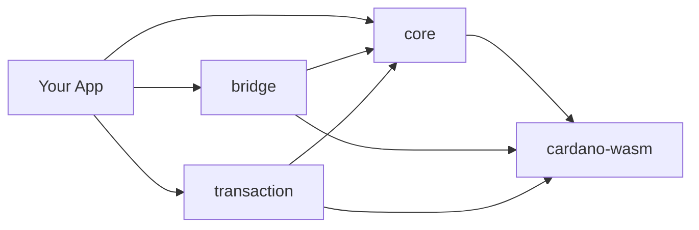

Hydra SDK is a TypeScript toolkit for building Cardano wallet applications with Hydra Layer 2 integration. It wraps the `cardano-serialization-lib` WASM bindings and the Hydra Head protocol behind a modular, type-safe API — delivering native-level performance in the browser while staying compatible with modern build tools like Vite and Rollup.

## Why Hydra SDK?

- **WASM-powered** — the core runs on `cardano-serialization-lib` compiled to WebAssembly, up to 10× faster than JavaScript-based SDKs.
- **Zero bundle issues** — no polyfills for `util`, `stream`, or `crypto`. Works out of the box with Vite, Rollup, Nuxt 3, React + Vite, and Next.js.
- **Browser-first** — designed for DApps, with an environment-aware WASM loader that also runs on Node.js.
- **Modular** — install only the packages you need; each ships ESM + CJS.
- **Type-safe** — comprehensive TypeScript definitions across every namespace and builder.

::note
Looking for the latest release notes? See the [Changelog](/resources/changelog).
::

## Prerequisites

Before you begin, make sure you have:

- **Node.js 18.20.0 or higher**
- A package manager — **npm**, **pnpm**, or **yarn**
- Basic **TypeScript / JavaScript** knowledge
- Familiarity with core **Cardano** concepts (addresses, UTxOs, transactions)

## Architecture

The SDK is a monorepo of four packages that build on each other:

| Package | Responsibility |
| --- | --- |
| [`@hydra-sdk/core`](/api/core) | HD wallet creation & management, UTxO types, Cardano utilities |
| [`@hydra-sdk/bridge`](/api/bridge) | Hydra Head lifecycle over WebSocket + REST |
| [`@hydra-sdk/transaction`](/api/transaction) | Low-level TxBuilder for Layer 1 and Hydra |
| [`@hydra-sdk/cardano-wasm`](/api/cardano-wasm) | Environment-aware WASM bindings |

All packages import Cardano primitives through `@hydra-sdk/cardano-wasm` — never import `@emurgo/cardano-serialization-lib` directly.

## Development workflow

A typical flow when building with the SDK:

::steps{level="3"}
### Install packages

Add the SDK packages your app needs.

### Create a wallet

Initialize an `AppWallet` (or `EmbeddedWallet` / `CardanoCLIWallet`) instance.

### Connect to a network

Connect to a Cardano network and/or a Hydra Node.

### Build & sign transactions

Compose transactions with the `TxBuilder` and sign them with the wallet.

### Submit

Submit to the Cardano network or into an open Hydra Head.
::

## Next steps

::card-group
  ::card{title="Installation" icon="i-lucide-download" to="/getting-started/installation"}
  Install the SDK packages and configure your bundler.
  ::

  ::card{title="Quick Start" icon="i-lucide-rocket" to="/getting-started/quick-start"}
  Create your first wallet and run a transaction.
  ::

  ::card{title="Configuration" icon="i-lucide-settings-2" to="/getting-started/configuration"}
  Tune the SDK for your framework and environment.
  ::

  ::card{title="Guides" icon="i-lucide-book-open" to="/guides"}
  Build a wallet app, mint tokens, and work with utilities.
  ::
::

Need help? Report issues on [GitHub](https://github.com/Vtechcom/hydra-sdk/issues) or start a [discussion](https://github.com/Vtechcom/hydra-sdk/discussions).
