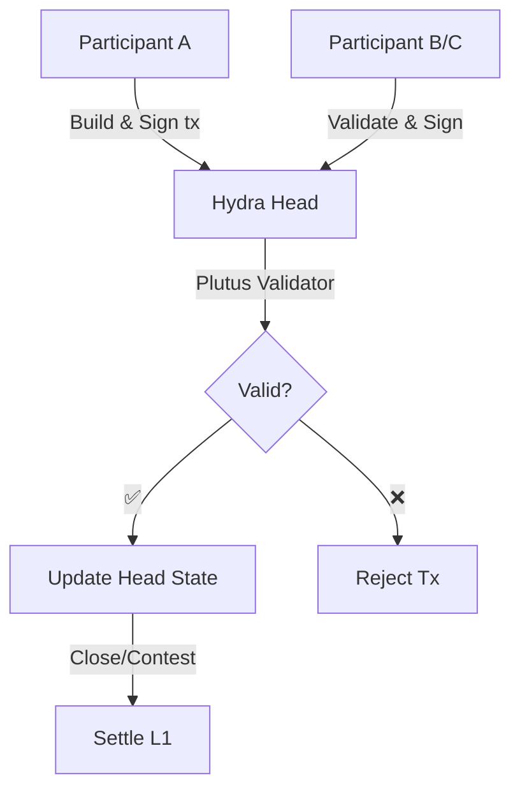

Hydra Heads support **isomorphic** smart contracts — the same Plutus scripts that run on Layer 1 work identically in Layer 2. This enables complex DeFi protocols, NFT mechanisms, and DApp logic with instant finality and minimal fees.

## Isomorphic Smart Contracts

### What does isomorphic mean?

**Isomorphic** means Hydra Heads use the same execution environment as Layer 1:

- ✅ Same validator scripts
- ✅ Same validation logic
- ✅ Same datum/redeemer structure
- ✅ Same native asset support
- ✅ No code changes required

```
┌──────────────────────────────┐
│    Your validator script     │
│                              │
│  validator :: Datum ->       │
│              Redeemer ->     │
│              ScriptContext ->│
│              Bool            │
└──────────┬─────────┬─────────┘
           │         │
     ┌─────▼─────┐   │
     │ Layer 1   │   │
     │ Mainnet   │   │
     └───────────┘   │
                     │
              ┌──────▼──────┐
              │ Hydra Head  │
              │  (Layer 2)  │
              └─────────────┘
```

## Using Smart Contracts in Hydra
Plutus smart contracts operate inside a Hydra Head the same way they operate on Cardano Layer 1. That means you can reuse the validator, datum, and redeemer without changing the on-chain logic while benefiting from fast transactions, low fees, and instant finality inside the Head.

### Quick process summary

- Write your Layer 1 validator as usual — keep datum/redeemer formats consistent.
- Lock a script UTxO on Layer 1 (for example, commit it to a Head or reference an existing script UTxO).
- In the Hydra Head, build an (off-chain) transaction that uses the same script, datum, and redeemer.
- The transaction is validated by Head participants against the validator rules; if valid, the Head’s state updates.
- When the Head is closed/settled, the final state is posted to L1 and the changes are applied by the script validator.

### Example: validator (Aiken, Always True)

```sh
# always-true.ak (apps/nodejs-playground/src/contract/always-true.ak)

use cardano/transaction.{ OutputReference, Transaction}
validator always_true {
    spend (
        _datum: Option<Data>,
        _redeemer: Data,
        _output_ref: OutputReference,
        _tx: Transaction,
    ) {
        True
    }

    else(_) {
        fail
    }
}
```
After compilation you will get the file:

`always-true.json`: [nodejs-playground/src/contract/always-true.json](https://github.com/Vtechcom/hydra-sdk/blob/master/apps/nodejs-playground/src/contract/always-true.json)


### Example: using the SDK (TypeScript)

The sample scripts in `apps/nodejs-playground/src/contract/` demonstrate lock/unlock flows:

- **Lock**: create a script UTxO → `npx tsx src/contract/hydra-lock.ts`

```ts
import contract from './always-true.json'
import { DatumUtils, Deserializer, TimeUtils, SLOT_CONFIG_NETWORK } from '@hydra-sdk/core'
import { buildRedeemer, emptyRedeemer, TxBuilder } from '@hydra-sdk/transaction'

// Build datum
const { paymentCredentialHash: pubKeyHash } = Deserializer.deserializeAddress(walletAddress)
const system_unlocked_at = Date.now() + 1 * 60 * 1000 // now + 1 minute

const datum = DatumUtils.mkConstr(0, [
      DatumUtils.mkBytes(pubKeyHash!),
      DatumUtils.mkInt(system_unlocked_at),
])

const txBuilder = new TxBuilder({
      isHydra: true,
      params: {
            minFeeA: 0,
            minFeeB: 0
      }
})
const txLock = await txBuilder
      .setInputs(addressUTxO)
      .addOutput({
            address: contract.address,
            amount: [{ unit: 'lovelace', quantity: String(2_000_000) }]
      })
      .txOutInlineDatumValue(datum)
      .changeAddress(walletAddress)
      .complete()

```

- **Unlock**: consume the script UTxO → `npx tsx src/contract/hydra-unlock.ts <txHash#index>`


```ts
import contract from './always-true.json'
import { DatumUtils, Deserializer, TimeUtils, SLOT_CONFIG_NETWORK } from '@hydra-sdk/core'
import { buildRedeemer, emptyRedeemer, TxBuilder } from '@hydra-sdk/transaction'

const txBuilder = new TxBuilder({
      isHydra: true,
      params: {
            minFeeA: 0,
            minFeeB: 0
      }
})

const SLOT_CONFIG: (typeof SLOT_CONFIG_NETWORK)['PREPROD'] = {
      zeroTime: 1762267312000, // Timestamp in ms when start hydra head network
      zeroSlot: 0,
      slotLength: 1000,
      epochLength: 432000,
      startEpoch: 0,
} as const;

const txUnlock = await txBuilder
      .setInputs(inputUTxOs)
      .txIn(
            scriptUTxO.input.txHash, 
            scriptUTxO.input.outputIndex, 
            scriptUTxO.output.amount, 
            scriptUTxO.output.address
      )
      .txInScript(contract.cborHex)
      .txInInlineDatum(scriptUTxO.output.inlineDatum!)
      .txInRedeemerValue(
            emptyRedeemer({ type: 'int', exUnits: { mem: '100000', steps: '25000000' } })
      )
      .txInCollateral(
            collateralUTxO.input.txHash,
            collateralUTxO.input.outputIndex,
            collateralUTxO.output.amount,
            collateralUTxO.output.address
      )
      .addOutput({
            address: walletAddress,
            amount: scriptUTxO.output.amount // send all assets back to myself
      })
      .changeAddress(walletAddress)
      .invalidBefore(TimeUtils.unixTimeToEnclosingSlot(Date.now(), SLOT_CONFIG)) // must be after current slot
      .invalidAfter(TimeUtils.unixTimeToEnclosingSlot(Date.now() + 60 * 60 * 1000, SLOT_CONFIG)) // must be within 1 hour
      .complete()
```


### Interaction flow (Mermaid)




### Notes & Best Practices

- Collateral: Consuming scripts on L1 still requires collateral; within a Head, the bonding/collateral rules depend on how you build the transaction bundle and the Head’s security policy.
- Consistency: Always serialize datum/redeemer in the same format between L1 and Head.
- Off-chain code: Off-chain logic (backend or dApp) is responsible for coordinating signatures, communicating with the Hydra node, and attaching the correct datum/redeemer values.
- Testing: Validate your validator on an L1 testnet and test multi-participant Head scenarios to ensure identical behavior.
- Minting/Burning: Mint/burn flows that use Plutus minting policies will still work in a Head if the policy doesn't depend on L1-specific data or time; keep policy semantics compatible.

### Limitations & Warnings

- Opening/closing a Head is still an L1 transaction — settlement costs and L1 fees still apply for those actions.
- Some validators that depend on L1-specific data (e.g., temporal constraints or slot-based checks) may need special handling when executed in a Head — verify semantics in context.
- Data availability: Ensure participants maintain necessary off-chain data to reconstruct state for dispute or close flows.

### References

- [Commit to Hydra](/concepts/commit-to-hydra)
- [Transactions in Hydra](/concepts/transactions-in-hydra)
- [Hydra Head Protocol](https://hydra.family/head-protocol/)
- [Hydra Known Issues](https://hydra.family/head-protocol/docs/known-issues)
