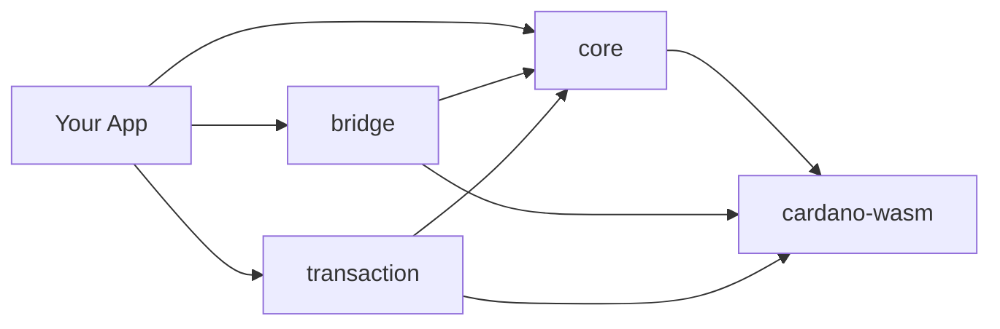

Hydra SDK は、Hydra Layer 2 統合を備えた Cardano ウォレットアプリケーションを構築するための TypeScript ツールキットです。`cardano-serialization-lib` の WASM バインディングと Hydra Head プロトコルを、モジュール式で型安全な API の背後にラップし、Vite や Rollup といった最新のビルドツールと互換性を保ちながら、ブラウザ上でネイティブ級のパフォーマンスを実現します。

## なぜ Hydra SDK なのか？

- **WASM 駆動** — コアは WebAssembly にコンパイルされた `cardano-serialization-lib` 上で動作し、JavaScript ベースの SDK と比べて最大 10 倍高速です。
- **バンドルの問題ゼロ** — `util`、`stream`、`crypto` のポリフィルは不要です。Vite、Rollup、Nuxt 3、React + Vite、Next.js ですぐに動作します。
- **ブラウザファースト** — DApp 向けに設計されており、環境を判別する WASM ローダーは Node.js 上でも動作します。
- **モジュール式** — 必要なパッケージだけをインストールできます。各パッケージは ESM + CJS を提供します。
- **型安全** — すべての名前空間とビルダーにわたる包括的な TypeScript 定義を備えています。

::note
最新のリリースノートをお探しですか？ [変更履歴](/resources/changelog)をご覧ください。
::

## 前提条件

始める前に、次のものが揃っていることを確認してください。

- **Node.js 18.20.0 以上**
- パッケージマネージャー — **npm**、**pnpm**、または **yarn**
- 基本的な **TypeScript / JavaScript** の知識
- 主要な **Cardano** の概念（アドレス、UTxO、トランザクション）への理解

## アーキテクチャ

この SDK は、互いに積み重なる 4 つのパッケージからなるモノレポです。

| パッケージ | 責務 |
| --- | --- |
| [`@hydra-sdk/core`](/api/core) | HD ウォレットの作成・管理、UTxO 型、Cardano ユーティリティ |
| [`@hydra-sdk/bridge`](/api/bridge) | WebSocket + REST 上での Hydra Head ライフサイクル |
| [`@hydra-sdk/transaction`](/api/transaction) | Layer 1 と Hydra 向けの低レベル TxBuilder |
| [`@hydra-sdk/cardano-wasm`](/api/cardano-wasm) | 環境を判別する WASM バインディング |

すべてのパッケージは `@hydra-sdk/cardano-wasm` を通じて Cardano プリミティブをインポートします。`@emurgo/cardano-serialization-lib` を直接インポートしないでください。

## 開発ワークフロー

SDK を使った構築の典型的な流れは次のとおりです。

::steps{level="3"}
### パッケージをインストールする

アプリに必要な SDK パッケージを追加します。

### ウォレットを作成する

`AppWallet`（または `EmbeddedWallet` / `CardanoCLIWallet`）のインスタンスを初期化します。

### ネットワークに接続する

Cardano ネットワークや Hydra Node に接続します。

### トランザクションを構築・署名する

`TxBuilder` でトランザクションを組み立て、ウォレットで署名します。

### 送信する

Cardano ネットワークへ、または開いている Hydra Head へ送信します。
::

## 次のステップ

::card-group
  ::card{title="インストール" icon="i-lucide-download" to="/getting-started/installation"}
  SDK パッケージをインストールし、バンドラーを設定します。
  ::

  ::card{title="クイックスタート" icon="i-lucide-rocket" to="/getting-started/quick-start"}
  最初のウォレットを作成し、トランザクションを実行します。
  ::

  ::card{title="設定" icon="i-lucide-settings-2" to="/getting-started/configuration"}
  フレームワークと環境に合わせて SDK を調整します。
  ::

  ::card{title="ガイド" icon="i-lucide-book-open" to="/guides"}
  ウォレットアプリを構築し、トークンをミントし、ユーティリティを活用します。
  ::
::

お困りですか？ [GitHub](https://github.com/Vtechcom/hydra-sdk/issues) で問題を報告するか、[ディスカッション](https://github.com/Vtechcom/hydra-sdk/discussions)を始めてください。
