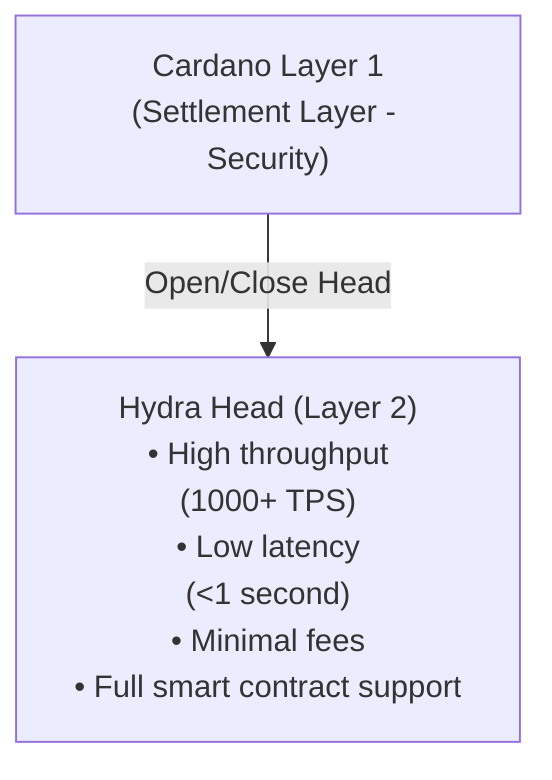

Hydraは、Cardanoのセキュリティと分散性を維持しながら、高いスループット、低いレイテンシ、最小限のトランザクションコストを実現することで、ブロックチェーンのトリレンマに取り組むCardanoのLayer 2スケーリングソリューションです。

## スケーラビリティの課題

ブロックチェーンネットワークは、根本的なスケーラビリティの制約に直面しています。

- **限られたスループット** - Layer 1ブロックチェーンはトランザクションの処理が遅い（Cardanoメインネット：理論上約250 TPS）
- **高いレイテンシ** - ブロック確認までの時間が遅延を生む（Cardanoでは20秒以上）
- **増加する手数料** - ネットワークの混雑がトランザクションコストを押し上げる
- **リソースの制約** - すべてのノードがすべてのトランザクションを処理しなければならない

これらの制約により、特定のアプリケーションはLayer 1では実用的でなくなります。

- リアルタイムゲーム
- マイクロペイメント
- 高頻度取引
- インタラクティブなDApp

## Hydraによる解決方法

### アイソモーフィックステートチャネル

Hydraは、Layer 1の機能を反映したオフチェーン環境である**アイソモーフィックステートチャネル**を生成します。



### 主なメリット

#### 1. **飛躍的なスループットの向上**

- **Layer 1**: 理論上約250 TPS、実用上約50〜100 TPS
- **Hydra Head**: ヘッドあたり1,000 TPS以上
- **複数のヘッド**: ヘッド数に応じた線形スケーリング

```typescript
// Example: Processing multiple transactions rapidly
for (let i = 0; i < 1000; i++) {
  await bridge.submitTx(tx)
  // Each transaction confirms in <1 second
}
```

#### 2. **ほぼ瞬時のファイナリティ**

Hydra Head内では、トランザクションが1秒未満で確認されます。

| 指標 | Layer 1 | Hydra Head |
|--------|---------|------------|
| 確認時間 | 20秒以上 | 1秒未満 |
| ブロック時間 | 20秒 | 約100ms |
| ファイナリティ | 2〜3分 | 瞬時 |

#### 3. **最小限のトランザクションコスト**

- **Layer 1**: 平均約0.17 ADAの手数料
- **Hydra Head**: ごくわずかな手数料（コンセンサスのオーバーヘッドのみ）
- **コスト削減**: 高頻度の操作で99%以上の削減

```typescript
// Cost comparison
const layer1Cost = 1000 * 0.17 // 170 ADA for 1000 txs
const hydraCost = 2 * 0.17 + 0.001 * 1000 // ~1.4 ADA total
// Savings: ~99.2%
```

#### 4. **完全なスマートコントラクトのサポート**

Hydra HeadはLayer 1と同じPlutusスマートコントラクトをサポートします。

- ✅ ネイティブトークンとNFT
- ✅ カスタムバリデータ
- ✅ 複雑なDeFiプロトコル
- ✅ ステートマシン
- ✅ マルチシグネチャのロジック

#### 5. **予測可能なパフォーマンス**

Layer 1とは異なり、Hydra Headのパフォーマンスは以下の影響を受けません。

- ネットワークの混雑
- ブロックサイズの制限
- メモリプールでの競合
- 他のユーザーのアクティビティ

## ユースケース

### 1. ゲームとメタバース

**要件**: リアルタイムのインタラクション、頻繁な状態更新、低コスト

```typescript
// In-game item transfer
const transferItem = async (from, to, itemNFT) => {
  // Instant, low-cost transfer within Hydra Head
  const tx = await builder.transferNFT({
    from: from.address,
    to: to.address,
    policyId: itemNFT.policy,
    assetName: itemNFT.name
  })
  
  await bridge.submitTx(tx)
  // Confirmed in <1 second
}
```

**例**:
- プレイヤー間の取引
- リアルタイムのリーダーボード
- ゲーム内通貨のトランザクション
- トーナメントの賞金分配

### 2. マイクロペイメントとストリーミング

**要件**: 極小のトランザクション額、高頻度、最小限の手数料

```typescript
// Content streaming payment (per second)
const streamingPayment = async () => {
  const perSecondCost = 0.001 // ADA
  
  setInterval(async () => {
    await bridge.submitTx(
      buildPayment(creator, perSecondCost)
    )
  }, 1000) // Pay every second
}
```

**例**:
- 秒単位課金のコンテンツストリーミング
- マイクロペイメントによるチップ
- 使用量ベースのAPI課金
- IoTデバイスの決済

### 3. DeFi取引

**要件**: 高速な実行、低レイテンシ、MEV耐性

```typescript
// High-frequency DEX trades
const executeTrade = async (tokenA, tokenB, amount) => {
  const tx = await dex.swap({
    from: tokenA,
    to: tokenB,
    amount: amount
  })
  
  await bridge.submitTx(tx)
  // Trade executes in <1 second with minimal slippage
}
```

**例**:
- DEXのオーダーブック
- 自動マーケットメーカー
- アービトラージの機会
- 清算メカニズム

### 4. NFTマーケットプレイス

**要件**: 高速なオークション、バッチ処理、低い出品コスト

```typescript
// Real-time NFT auction
const placeBid = async (auctionId, bidAmount) => {
  const tx = await marketplace.bid({
    auction: auctionId,
    amount: bidAmount,
    bidder: wallet.address
  })
  
  await bridge.submitTx(tx)
  // Bid placed instantly, outbidding is real-time
}
```

**例**:
- ライブNFTオークション
- コレクションのバッチミント
- 迅速な取引
- ロイヤリティの分配

### 5. ソーシャルとガバナンス

**要件**: 高いユーザーインタラクション、投票、コンテンツモデレーション

```typescript
// Real-time governance voting
const vote = async (proposalId, choice) => {
  const tx = await governance.castVote({
    proposal: proposalId,
    vote: choice,
    voter: wallet.address
  })
  
  await bridge.submitTx(tx)
  // Vote recorded instantly
}
```

**例**:
- DAOの投票
- ソーシャルメディアのインタラクション
- コンテンツへのチップ
- レピュテーションシステム

## Hydraと他のソリューションの比較

### Hydra対従来のLayer 1

| 特徴 | Cardano L1 | Hydra Head |
|---------|-----------|------------|
| スループット | 約100 TPS | 1,000 TPS以上 |
| レイテンシ | 20秒以上 | 1秒未満 |
| 手数料 | 約0.17 ADA | 約0.001 ADA |
| スマートコントラクト | 完全なPlutus | 完全なPlutus |
| セキュリティ | Layer 1 | 参加者のコンセンサス |
| ファイナリティ | 2〜3分 | 瞬時 |

### Hydra対他のL2ソリューション

**Hydraの利点**:
- ✅ 完全なスマートコントラクトのサポート（アイソモーフィック）
- ✅ 独立した仮想マシンが不要
- ✅ ネイティブなマルチアセットのサポート
- ✅ ヘッド内での瞬時のファイナリティ
- ✅ 予測可能なパフォーマンス

**トレードオフ**:
- ⚠️ 参加者の協力が必要
- ⚠️ ヘッド内の参加者に限定される
- ⚠️ ヘッドの開始・終了にLayer 1のコストがかかる

## Hydraを使うべきとき

### ✅ 理想的なユースケース

- **高いトランザクション量**: 既知の当事者間で多数のトランザクションが発生する
- **低レイテンシの要件**: リアルタイムまたはほぼリアルタイムのインタラクション
- **コストへの敏感さ**: 手数料が重要な要素となる
- **既知の参加者**: 信頼できる、または半信頼の当事者
- **セッションベース**: 一時的で範囲が限定されたインタラクション

### ❌ 適さないケース

- **一度きりのトランザクション**: 単発で孤立したトランザクション
- **未知の当事者**: 関係や信頼がない
- **長期保管**: インタラクションのない永続的な状態
- **パブリックアクセス**: 制限のない開かれた参加

## はじめに

Hydraをアプリケーションに統合する準備はできましたか？

1. **[Hydra SDKをセットアップする](/getting-started/installation)** - 必要なパッケージをインストールする
2. **[統合ガイドに従う](/guides/hydra-integration)** - ステップバイステップの統合
3. **[Commit/Decommitを探る](/concepts/commit-to-hydra)** - ヘッド内のUTxOを管理する
4. **[トランザクションを構築する](/concepts/transactions-in-hydra)** - Hydraトランザクションを作成する

## さらに詳しく

- [Hydra公式ドキュメント](https://hydra.family/head-protocol/)
- [Hydra研究論文](https://iohk.io/en/research/library/)
- [Cardanoスケーリングソリューション](https://docs.cardano.org/scaling-solutions/)

---

> **次へ**: [UTxOをHydraにcommitする](/concepts/commit-to-hydra)方法を学び、Hydra Headの利用を始めましょう
