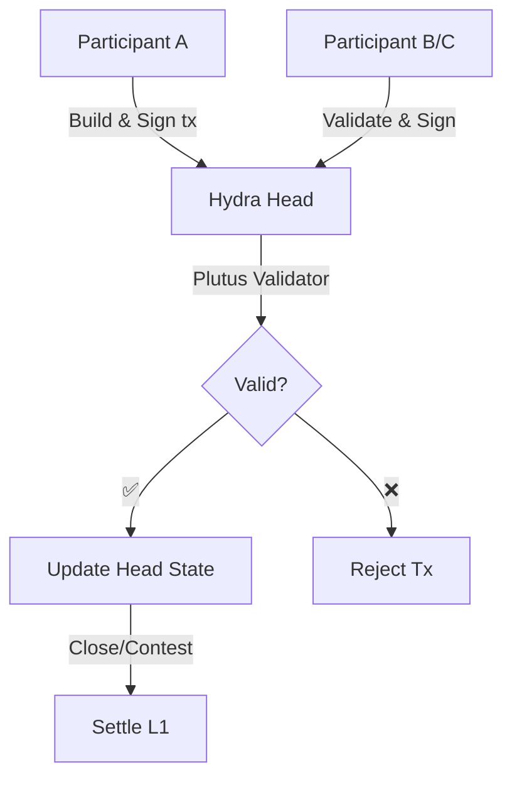

Hydra Head は **isomorphic** なスマートコントラクトをサポートします。Layer 1 で動作するのと同じ Plutus スクリプトが、Layer 2 でも同一に動作します。これにより、複雑な DeFi プロトコル、NFT メカニズム、DApp のロジックを、即時のファイナリティと最小限の手数料で実現できます。

## Isomorphic なスマートコントラクト

### isomorphic とは何を意味するのか？

**Isomorphic** とは、Hydra Head が Layer 1 と同じ実行環境を使用することを意味します:

- ✅ 同じ validator スクリプト
- ✅ 同じ検証ロジック
- ✅ 同じ datum/redeemer 構造
- ✅ 同じネイティブアセットのサポート
- ✅ コードの変更は不要

```
┌──────────────────────────────┐
│    Your validator script     │
│                              │
│  validator :: Datum ->       │
│              Redeemer ->     │
│              ScriptContext ->│
│              Bool            │
└──────────┬─────────┬─────────┘
           │         │
     ┌─────▼─────┐   │
     │ Layer 1   │   │
     │ Mainnet   │   │
     └───────────┘   │
                     │
              ┌──────▼──────┐
              │ Hydra Head  │
              │  (Layer 2)  │
              └─────────────┘
```

## Hydra でスマートコントラクトを使う
Plutus スマートコントラクトは、Cardano Layer 1 で動作するのと同じ方法で Hydra Head 内で動作します。つまり、オンチェーンロジックを変更することなく validator、datum、redeemer を再利用でき、同時に Head 内での高速なトランザクション、低い手数料、即時のファイナリティという利点を享受できます。

### プロセスの概要

- Layer 1 の validator を通常どおり記述します。datum/redeemer のフォーマットは一貫させてください。
- Layer 1 上でスクリプト UTxO をロックします（例えば、それを Head に commit する、または既存のスクリプト UTxO を参照します）。
- Hydra Head 内で、同じスクリプト、datum、redeemer を使う（オフチェーンの）トランザクションを構築します。
- トランザクションは Head の参加者によって validator のルールに対して検証されます。有効であれば Head の状態が更新されます。
- Head が閉じられ/決済されると、最終状態が L1 にポストされ、変更はスクリプト validator によって適用されます。

### 例: validator (Aiken, Always True)

```sh
# always-true.ak (apps/nodejs-playground/src/contract/always-true.ak)

use cardano/transaction.{ OutputReference, Transaction}
validator always_true {
    spend (
        _datum: Option<Data>,
        _redeemer: Data,
        _output_ref: OutputReference,
        _tx: Transaction,
    ) {
        True
    }

    else(_) {
        fail
    }
}
```
コンパイル後、次のファイルが生成されます:

`always-true.json`: [nodejs-playground/src/contract/always-true.json](https://github.com/Vtechcom/hydra-sdk/blob/master/apps/nodejs-playground/src/contract/always-true.json)


### 例: SDK を使う (TypeScript)

`apps/nodejs-playground/src/contract/` にあるサンプルスクリプトは、lock/unlock のフローを示します:

- **Lock**: スクリプト UTxO を作成する → `npx tsx src/contract/hydra-lock.ts`

```ts
import contract from './always-true.json'
import { DatumUtils, Deserializer, TimeUtils, SLOT_CONFIG_NETWORK } from '@hydra-sdk/core'
import { buildRedeemer, emptyRedeemer, TxBuilder } from '@hydra-sdk/transaction'

// Build datum
const { paymentCredentialHash: pubKeyHash } = Deserializer.deserializeAddress(walletAddress)
const system_unlocked_at = Date.now() + 1 * 60 * 1000 // now + 1 minute

const datum = DatumUtils.mkConstr(0, [
      DatumUtils.mkBytes(pubKeyHash!),
      DatumUtils.mkInt(system_unlocked_at),
])

const txBuilder = new TxBuilder({
      isHydra: true,
      params: {
            minFeeA: 0,
            minFeeB: 0
      }
})
const txLock = await txBuilder
      .setInputs(addressUTxO)
      .addOutput({
            address: contract.address,
            amount: [{ unit: 'lovelace', quantity: String(2_000_000) }]
      })
      .txOutInlineDatumValue(datum)
      .changeAddress(walletAddress)
      .complete()

```

- **Unlock**: スクリプト UTxO を消費する → `npx tsx src/contract/hydra-unlock.ts <txHash#index>`


```ts
import contract from './always-true.json'
import { DatumUtils, Deserializer, TimeUtils, SLOT_CONFIG_NETWORK } from '@hydra-sdk/core'
import { buildRedeemer, emptyRedeemer, TxBuilder } from '@hydra-sdk/transaction'

const txBuilder = new TxBuilder({
      isHydra: true,
      params: {
            minFeeA: 0,
            minFeeB: 0
      }
})

const SLOT_CONFIG: (typeof SLOT_CONFIG_NETWORK)['PREPROD'] = {
      zeroTime: 1762267312000, // Timestamp in ms when start hydra head network
      zeroSlot: 0,
      slotLength: 1000,
      epochLength: 432000,
      startEpoch: 0,
} as const;

const txUnlock = await txBuilder
      .setInputs(inputUTxOs)
      .txIn(
            scriptUTxO.input.txHash, 
            scriptUTxO.input.outputIndex, 
            scriptUTxO.output.amount, 
            scriptUTxO.output.address
      )
      .txInScript(contract.cborHex)
      .txInInlineDatum(scriptUTxO.output.inlineDatum!)
      .txInRedeemerValue(
            emptyRedeemer({ type: 'int', exUnits: { mem: '100000', steps: '25000000' } })
      )
      .txInCollateral(
            collateralUTxO.input.txHash,
            collateralUTxO.input.outputIndex,
            collateralUTxO.output.amount,
            collateralUTxO.output.address
      )
      .addOutput({
            address: walletAddress,
            amount: scriptUTxO.output.amount // send all assets back to myself
      })
      .changeAddress(walletAddress)
      .invalidBefore(TimeUtils.unixTimeToEnclosingSlot(Date.now(), SLOT_CONFIG)) // must be after current slot
      .invalidAfter(TimeUtils.unixTimeToEnclosingSlot(Date.now() + 60 * 60 * 1000, SLOT_CONFIG)) // must be within 1 hour
      .complete()
```


### インタラクションのフロー (Mermaid)




### 注意事項とベストプラクティス

- Collateral: L1 でスクリプトを消費するには依然として collateral が必要です。Head 内では、ボンディング/collateral のルールは、トランザクションバンドルの構築方法と Head のセキュリティポリシーに依存します。
- 一貫性: datum/redeemer は常に L1 と Head の間で同じフォーマットでシリアライズしてください。
- オフチェーンコード: オフチェーンロジック（バックエンドまたは dApp）は、署名の調整、Hydra ノードとの通信、正しい datum/redeemer 値の付与を担当します。
- テスト: L1 のテストネットで validator を検証し、複数参加者の Head シナリオをテストして、同一の挙動を確認してください。
- Minting/Burning: Plutus のミンティングポリシーを使う mint/burn のフローは、ポリシーが L1 固有のデータや時間に依存しない限り Head 内でも動作します。ポリシーのセマンティクスは互換性を保ってください。

### 制限事項と警告

- Head の開閉は依然として L1 トランザクションです。これらの操作には決済コストと L1 手数料が引き続き発生します。
- L1 固有のデータ（例えば、時間的制約やスロットベースのチェック）に依存する一部の validator は、Head 内で実行する際に特別な対応が必要になる場合があります。文脈に応じてセマンティクスを検証してください。
- データの可用性: 参加者が、紛争や close のフローで状態を再構築するために必要なオフチェーンデータを保持していることを確認してください。

### 参考リンク

- [Hydra への commit](/concepts/commit-to-hydra)
- [Hydra のトランザクション](/concepts/transactions-in-hydra)
- [Hydra Head Protocol](https://hydra.family/head-protocol/)
- [Hydra Known Issues](https://hydra.family/head-protocol/docs/known-issues)
