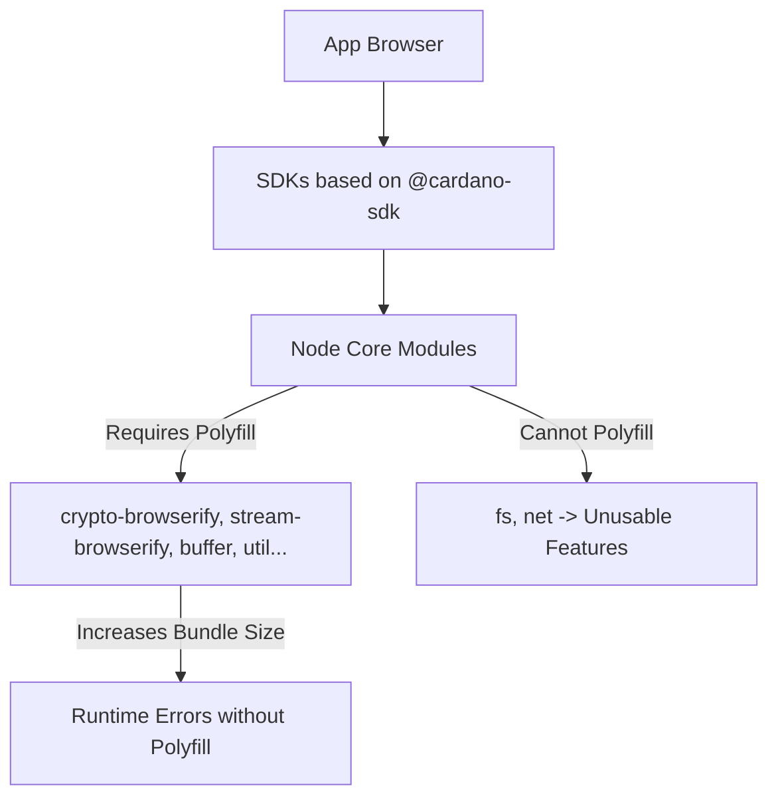
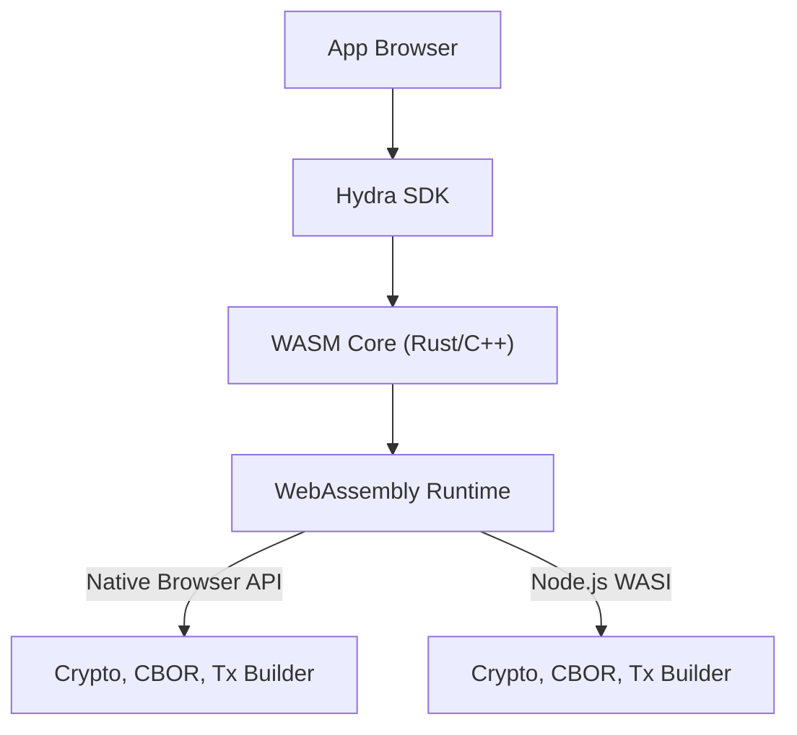

## Hydra SDK が WASM を採用する理由

Hydra SDK は **WebAssembly (WASM)** を活用し、`@cardano-sdk` のような従来の JavaScript ベース SDK の制約を克服します。WASM が最適な選択である理由は次のとおりです。

### WASM の主な利点

1. **Node.js コアモジュールへの依存を排除**:
   - WASM により、重要な機能（暗号処理、CBOR パース、トランザクション構築など）を、`crypto`、`stream`、`fs` といった Node.js のコアモジュールに依存せず、サンドボックス化された環境で実行できます。
   - これにより、ブラウザと Node.js の両環境で互換性が確保されます。

2. **バンドルサイズを削減**:
   - WASM は必要な関数のみを読み込み、`crypto-browserify` や `stream-browserify` のようなポリフィルを不要にします。
   - その結果、Node.js モジュールに依存する SDK と比べて、大幅に小さいバンドルが実現します。

3. **パフォーマンスを向上**:
   - WASM は暗号処理やトランザクションのパースをネイティブに近い速度で実行し、JavaScript ランタイムのオーバーヘッドを削減します。

4. **クロスプラットフォーム互換性**:
   - 単一の WASM バイナリで、ブラウザ、Node.js（WASI 経由）、モバイルプラットフォーム（ブリッジ経由）をシームレスに実行できます。
   - これにより、CommonJS と ESM モジュール間の複雑な相互運用が不要になります。

---

## Cardano SDK ソリューションの比較

### 詳細な比較表

| 基準                            | **@cardano-sdk ベースの SDK**            | **Hydra SDK**（WASM ベース） |
|---------------------------------|-------------------------------------------|-----------------------------------|
| **ブラウザ互換性**              | Node.js コアモジュール用のポリフィルが必要。一部の API（`fs`、`net` など）は利用不可。 | ネイティブなブラウザ対応。ポリフィル不要。 |
| **バンドルサイズ**              | ポリフィルにより非常に大きい（数百 KB～1MB 超）。 | コンパクト（WASM と最小限の JS グルーコードのみ読み込む）。 |
| **Node.js 依存**                | 高い。Node.js コアモジュールを直接インポート。 | なし。すべてのコアロジックは WASM 内に存在。 |
| **相互運用（ESM/CJS）**         | エラーが発生しやすい（`exports is not defined`、`.default is not a function`）。 | 問題なし。純粋な ESM JavaScript。 |
| **暗号/CBOR パフォーマンス**    | 中程度（純粋な JS で、低性能なポリフィルに依存）。 | 高い（WASM のネイティブに近い速度）。 |
| **クロスプラットフォーム対応**  | Node.js には良好だが、ブラウザには限定的。 | 優秀。ブラウザ、Node.js、モバイルで動作。 |
| **Tree-Shaking**                | 限定的。Node.js のインポートが分散し、未使用コードがバンドルに含まれる。 | 優秀。必要な WASM 関数のみバンドルされる。 |
| **保守性と拡張性**              | 複雑。Node.js API の変更やポリフィルの追跡が必要。 | 保守が容易。コアロジックは Rust/C++ で実装され、WASM 経由で公開される。 |

---

## 依存関係フロー図

### `@cardano-sdk` ベースの SDK の課題



### Hydra SDK（WASM ベース）



---

## まとめ

Hydra SDK の WASM ベースのアーキテクチャは、現代の Cardano DApp に対して堅牢で効率的、かつクロスプラットフォームなソリューションを提供します。Node.js への依存を排除し、バンドルサイズを削減し、パフォーマンスを向上させることで、`@cardano-sdk` ベースの SDK が抱える制約を解決します。

---

## インメモリスナップショットキャッシュ（v1.3.0 以降）

`@hydra-sdk/bridge` は、スナップショットイベントごとに一度だけ再構築され、リクエストごとに O(1) で読み取れる 2 段階のインメモリキャッシュを追加します。

### アーキテクチャ

```
Hydra Node (WebSocket)
  │
  ├── Greetings { snapshotUtxo }
  │     └── updateSnapshot() ← O(n) one-time rebuild
  │
  └── SnapshotConfirmed { snapshot.utxo }
        └── updateSnapshot() ← O(n) one-time rebuild, only if snapNum advances

GET balance / query UTxO
  └── Map.get(address) ← O(1), no I/O, no WASM call
```

### パフォーマンスへの影響

| 操作 | v1.3.0 より前 | v1.3.0 以降 |
|---|---|---|
| `getAddressBalance()` | 利用不可 | O(1) のマップルックアップ、I/O なし |
| `queryAddressUTxO(address)` | 全 UTxO に対する O(n) フィルタ | O(1) のインデックスルックアップ |
| `addressesInHead()` | O(n) + HTTP 呼び出し | O(1) の `Map.keys()` |
| 100 件の同時残高読み取り | 100 × スキャン + 割り当て | 100 × O(1) |
| スナップショット到着 | O(1)（参照を保存） | O(n) の再構築 — スナップショットごとに一度 |

### メモリ使用量

平均 2 アセットを持つ 2,000 個のユニークアドレスからなる 5,000 個の UTxO スナップショットの場合:

```
addressUtxoIndex: ~200 KB (2000 Map entries)
balanceCache:     ~256 KB (4000 inner Map entries)
────────────────────────────────────────────────
Total overhead:   ~500 KB
```

### 使い方

```typescript
import { HydraBridge } from '@hydra-sdk/bridge'

const bridge = new HydraBridge({ url: 'ws://localhost:4001' })
await bridge.connect()

// After Greetings arrives, cache is seeded automatically

const balance = bridge.getAddressBalance('addr_test1...')
if (balance === null) {
	// Cold start — cache not yet seeded
} else {
	const lovelace = balance.get('lovelace') ?? 0n
	console.log('Balance:', Number(lovelace) / 1_000_000, 'ADA')
}
```

### 上限付き Datum キャッシュ（`@hydra-sdk/core`）

`convertUTxOObjectToUTxOWithOptions` は `maxDatumCacheSize` を受け取り、メモリに保持するデシリアライズ済みインライン datum の数に上限を設定します:

```typescript
import { Converter } from '@hydra-sdk/core'

const utxos = Converter.convertUTxOObjectToUTxOWithOptions(snapshotUtxo, {
	maxDatumCacheSize: 1024  // default; set to 0 to disable
})
```

上限に達すると、エントリは挿入順（古いものから先に）に破棄されます。
