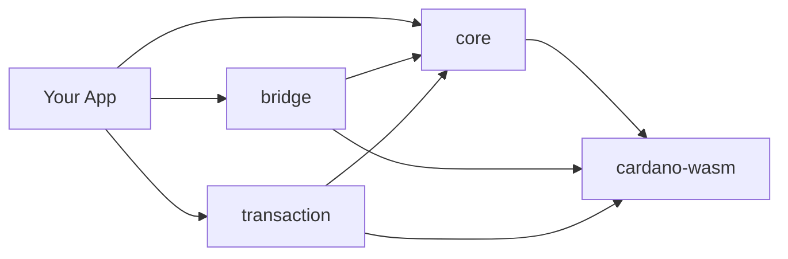

Hydra SDK là một bộ công cụ TypeScript để xây dựng các ứng dụng ví Cardano tích hợp Hydra Layer 2. Nó bao bọc các binding WASM của `cardano-serialization-lib` và giao thức Hydra Head sau một API mô-đun, an toàn về kiểu — mang lại hiệu năng ở mức gốc trong trình duyệt trong khi vẫn tương thích với các công cụ build hiện đại như Vite và Rollup.

## Tại sao chọn Hydra SDK?

- **Chạy bằng WASM** — phần lõi chạy trên `cardano-serialization-lib` được biên dịch sang WebAssembly, nhanh hơn tới 10× so với các SDK dựa trên JavaScript.
- **Không vấn đề đóng gói** — không cần polyfill cho `util`, `stream`, hay `crypto`. Hoạt động ngay lập tức với Vite, Rollup, Nuxt 3, React + Vite, và Next.js.
- **Ưu tiên trình duyệt** — được thiết kế cho các DApp, với bộ nạp WASM nhận biết môi trường và cũng chạy được trên Node.js.
- **Mô-đun** — chỉ cài những package bạn cần; mỗi package đều xuất bản ESM + CJS.
- **An toàn về kiểu** — định nghĩa TypeScript toàn diện trên mọi namespace và builder.

::note
Đang tìm ghi chú phát hành mới nhất? Xem [Changelog](/resources/changelog).
::

## Điều kiện tiên quyết

Trước khi bắt đầu, hãy chắc chắn bạn có:

- **Node.js 18.20.0 trở lên**
- Một trình quản lý package — **npm**, **pnpm**, hoặc **yarn**
- Kiến thức cơ bản về **TypeScript / JavaScript**
- Quen thuộc với các khái niệm cốt lõi của **Cardano** (địa chỉ, UTxO, giao dịch)

## Kiến trúc

SDK là một monorepo gồm bốn package xây dựng dựa trên nhau:

| Package | Trách nhiệm |
| --- | --- |
| [`@hydra-sdk/core`](/api/core) | Tạo & quản lý ví HD, các kiểu UTxO, tiện ích Cardano |
| [`@hydra-sdk/bridge`](/api/bridge) | Vòng đời Hydra Head qua WebSocket + REST |
| [`@hydra-sdk/transaction`](/api/transaction) | TxBuilder cấp thấp cho Layer 1 và Hydra |
| [`@hydra-sdk/cardano-wasm`](/api/cardano-wasm) | Các binding WASM nhận biết môi trường |

Tất cả các package đều import các primitive của Cardano thông qua `@hydra-sdk/cardano-wasm` — đừng bao giờ import `@emurgo/cardano-serialization-lib` trực tiếp.

## Quy trình phát triển

Một luồng làm việc điển hình khi xây dựng với SDK:

::steps{level="3"}
### Cài đặt các package

Thêm các package SDK mà ứng dụng của bạn cần.

### Tạo một ví

Khởi tạo một instance `AppWallet` (hoặc `EmbeddedWallet` / `CardanoCLIWallet`).

### Kết nối tới một mạng

Kết nối tới một mạng Cardano và/hoặc một Hydra Node.

### Xây dựng & ký giao dịch

Soạn giao dịch với `TxBuilder` và ký chúng bằng ví.

### Gửi

Gửi lên mạng Cardano hoặc vào một Hydra Head đang mở.
::

## Các bước tiếp theo

::card-group
  ::card{title="Cài đặt" icon="i-lucide-download" to="/getting-started/installation"}
  Cài đặt các package SDK và cấu hình bộ đóng gói của bạn.
  ::

  ::card{title="Bắt đầu nhanh" icon="i-lucide-rocket" to="/getting-started/quick-start"}
  Tạo ví đầu tiên của bạn và chạy một giao dịch.
  ::

  ::card{title="Cấu hình" icon="i-lucide-settings-2" to="/getting-started/configuration"}
  Tinh chỉnh SDK cho framework và môi trường của bạn.
  ::

  ::card{title="Hướng dẫn" icon="i-lucide-book-open" to="/guides"}
  Xây dựng ứng dụng ví, đúc token, và làm việc với các tiện ích.
  ::
::

Cần trợ giúp? Báo cáo vấn đề trên [GitHub](https://github.com/Vtechcom/hydra-sdk/issues) hoặc bắt đầu một [thảo luận](https://github.com/Vtechcom/hydra-sdk/discussions).
