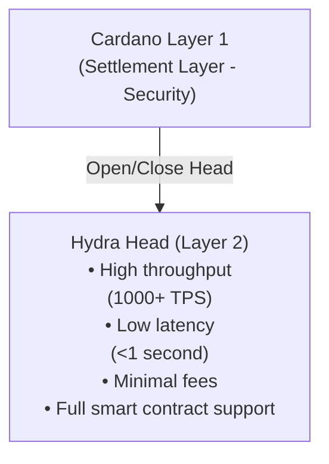

Hydra là giải pháp mở rộng Layer 2 của Cardano, giải quyết bài toán tam nan (trilemma) của blockchain bằng cách mang lại thông lượng cao, độ trễ thấp và chi phí giao dịch tối thiểu trong khi vẫn duy trì tính bảo mật và phi tập trung.

## Thách thức về khả năng mở rộng

Các mạng lưới blockchain đối mặt với những giới hạn cơ bản về khả năng mở rộng:

- **Thông lượng hạn chế** - Blockchain Layer 1 xử lý giao dịch chậm (Cardano mainnet: ~250 TPS về lý thuyết)
- **Độ trễ cao** - Thời gian xác nhận khối tạo ra sự chậm trễ (hơn 20 giây trên Cardano)
- **Phí ngày càng tăng** - Tình trạng tắc nghẽn mạng đẩy chi phí giao dịch lên cao
- **Giới hạn tài nguyên** - Mọi node đều phải xử lý mọi giao dịch

Những giới hạn này khiến một số ứng dụng trở nên bất khả thi trên Layer 1:

- Game thời gian thực
- Thanh toán vi mô (micropayments)
- Giao dịch tần suất cao
- DApp tương tác

## Hydra giải quyết vấn đề này như thế nào

### Kênh trạng thái đẳng cấu (isomorphic state channels)

Hydra tạo ra các **kênh trạng thái đẳng cấu (isomorphic state channels)** - môi trường off-chain phản chiếu năng lực của Layer 1:



### Lợi ích chính

#### 1. **Tăng thông lượng vượt bậc**

- **Layer 1**: ~250 TPS về lý thuyết, ~50-100 TPS trên thực tế
- **Hydra Head**: 1.000+ TPS mỗi head
- **Nhiều Head**: Mở rộng tuyến tính theo số lượng head

```typescript
// Example: Processing multiple transactions rapidly
for (let i = 0; i < 1000; i++) {
  await bridge.submitTx(tx)
  // Each transaction confirms in <1 second
}
```

#### 2. **Hoàn tất gần như tức thì**

Giao dịch được xác nhận trong chưa đầy 1 giây bên trong một Hydra Head:

| Chỉ số | Layer 1 | Hydra Head |
|--------|---------|------------|
| Thời gian xác nhận | hơn 20 giây | <1 giây |
| Thời gian tạo khối | 20 giây | ~100ms |
| Tính hoàn tất | 2-3 phút | Tức thì |

#### 3. **Chi phí giao dịch tối thiểu**

- **Layer 1**: phí trung bình ~0.17 ADA
- **Hydra Head**: phí không đáng kể (chỉ có chi phí đồng thuận)
- **Tiết kiệm chi phí**: giảm 99%+ đối với các thao tác tần suất cao

```typescript
// Cost comparison
const layer1Cost = 1000 * 0.17 // 170 ADA for 1000 txs
const hydraCost = 2 * 0.17 + 0.001 * 1000 // ~1.4 ADA total
// Savings: ~99.2%
```

#### 4. **Hỗ trợ smart contract đầy đủ**

Hydra Head hỗ trợ các smart contract Plutus giống hệt như Layer 1:

- ✅ Native token và NFT
- ✅ Validator tùy chỉnh
- ✅ Giao thức DeFi phức tạp
- ✅ Máy trạng thái (state machine)
- ✅ Logic đa chữ ký

#### 5. **Hiệu năng có thể dự đoán**

Khác với Layer 1, hiệu năng của Hydra Head không bị ảnh hưởng bởi:

- Tắc nghẽn mạng
- Giới hạn kích thước khối
- Cạnh tranh trong mempool
- Hoạt động của người dùng khác

## Các trường hợp sử dụng

### 1. Game & Metaverse

**Yêu cầu**: Tương tác thời gian thực, cập nhật trạng thái thường xuyên, chi phí thấp

```typescript
// In-game item transfer
const transferItem = async (from, to, itemNFT) => {
  // Instant, low-cost transfer within Hydra Head
  const tx = await builder.transferNFT({
    from: from.address,
    to: to.address,
    policyId: itemNFT.policy,
    assetName: itemNFT.name
  })
  
  await bridge.submitTx(tx)
  // Confirmed in <1 second
}
```

**Ví dụ**:
- Giao dịch giữa người chơi với người chơi
- Bảng xếp hạng thời gian thực
- Giao dịch tiền tệ trong game
- Phân phối phần thưởng giải đấu

### 2. Thanh toán vi mô & Streaming

**Yêu cầu**: Số tiền giao dịch nhỏ, tần suất cao, phí tối thiểu

```typescript
// Content streaming payment (per second)
const streamingPayment = async () => {
  const perSecondCost = 0.001 // ADA
  
  setInterval(async () => {
    await bridge.submitTx(
      buildPayment(creator, perSecondCost)
    )
  }, 1000) // Pay every second
}
```

**Ví dụ**:
- Streaming nội dung tính phí theo giây
- Tiền tip vi mô
- Thanh toán API theo mức sử dụng
- Thanh toán giữa các thiết bị IoT

### 3. Giao dịch DeFi

**Yêu cầu**: Thực thi nhanh, độ trễ thấp, chống MEV

```typescript
// High-frequency DEX trades
const executeTrade = async (tokenA, tokenB, amount) => {
  const tx = await dex.swap({
    from: tokenA,
    to: tokenB,
    amount: amount
  })
  
  await bridge.submitTx(tx)
  // Trade executes in <1 second with minimal slippage
}
```

**Ví dụ**:
- Sổ lệnh DEX
- Nhà tạo lập thị trường tự động (AMM)
- Cơ hội arbitrage
- Cơ chế thanh lý

### 4. Chợ NFT

**Yêu cầu**: Đấu giá nhanh, thao tác theo lô, chi phí niêm yết thấp

```typescript
// Real-time NFT auction
const placeBid = async (auctionId, bidAmount) => {
  const tx = await marketplace.bid({
    auction: auctionId,
    amount: bidAmount,
    bidder: wallet.address
  })
  
  await bridge.submitTx(tx)
  // Bid placed instantly, outbidding is real-time
}
```

**Ví dụ**:
- Đấu giá NFT trực tiếp
- Mint bộ sưu tập theo lô
- Giao dịch nhanh
- Phân phối tiền bản quyền

### 5. Mạng xã hội & Quản trị

**Yêu cầu**: Tương tác người dùng cao, bỏ phiếu, kiểm duyệt nội dung

```typescript
// Real-time governance voting
const vote = async (proposalId, choice) => {
  const tx = await governance.castVote({
    proposal: proposalId,
    vote: choice,
    voter: wallet.address
  })
  
  await bridge.submitTx(tx)
  // Vote recorded instantly
}
```

**Ví dụ**:
- Bỏ phiếu DAO
- Tương tác mạng xã hội
- Tip nội dung
- Hệ thống danh tiếng

## So sánh Hydra với các giải pháp khác

### Hydra so với Layer 1 truyền thống

| Tính năng | Cardano L1 | Hydra Head |
|---------|-----------|------------|
| Thông lượng | ~100 TPS | 1.000+ TPS |
| Độ trễ | hơn 20 giây | <1 giây |
| Phí | ~0.17 ADA | ~0.001 ADA |
| Smart Contract | Plutus đầy đủ | Plutus đầy đủ |
| Bảo mật | Layer 1 | Đồng thuận của người tham gia |
| Tính hoàn tất | 2-3 phút | Tức thì |

### Hydra so với các giải pháp L2 khác

**Ưu điểm của Hydra**:
- ✅ Hỗ trợ smart contract đầy đủ (đẳng cấu)
- ✅ Không cần máy ảo riêng biệt
- ✅ Hỗ trợ đa tài sản (multi-asset) gốc
- ✅ Hoàn tất tức thì bên trong head
- ✅ Hiệu năng có thể dự đoán

**Đánh đổi**:
- ⚠️ Yêu cầu sự hợp tác của người tham gia
- ⚠️ Giới hạn trong phạm vi những người tham gia head
- ⚠️ Việc mở/đóng có chi phí trên Layer 1

## Khi nào nên dùng Hydra

### ✅ Trường hợp lý tưởng

- **Khối lượng giao dịch cao**: Nhiều giao dịch giữa các bên đã biết
- **Yêu cầu độ trễ thấp**: Tương tác thời gian thực hoặc gần thời gian thực
- **Nhạy cảm về chi phí**: Phí là yếu tố quan trọng
- **Người tham gia đã biết**: Các bên tin cậy hoặc bán tin cậy
- **Dựa trên phiên**: Các tương tác tạm thời, có giới hạn

### ❌ Không lý tưởng cho

- **Giao dịch một lần**: Các giao dịch đơn lẻ, biệt lập
- **Bên không xác định**: Không có mối quan hệ hoặc sự tin cậy
- **Lưu trữ dài hạn**: Trạng thái vĩnh viễn mà không có tương tác
- **Truy cập công khai**: Tham gia mở không giới hạn

## Bắt đầu

Sẵn sàng tích hợp Hydra vào ứng dụng của bạn?

1. **[Thiết lập Hydra SDK](/getting-started/installation)** - Cài đặt các gói cần thiết
2. **[Làm theo hướng dẫn tích hợp](/guides/hydra-integration)** - Tích hợp từng bước
3. **[Khám phá Commit/Decommit](/concepts/commit-to-hydra)** - Quản lý UTxO trong head
4. **[Xây dựng giao dịch](/concepts/transactions-in-hydra)** - Tạo giao dịch Hydra

## Tìm hiểu thêm

- [Tài liệu chính thức của Hydra](https://hydra.family/head-protocol/)
- [Các bài nghiên cứu về Hydra](https://iohk.io/en/research/library/)
- [Các giải pháp mở rộng của Cardano](https://docs.cardano.org/scaling-solutions/)

---

> **Tiếp theo**: Tìm hiểu cách [Commit UTxO vào Hydra](/concepts/commit-to-hydra) để bắt đầu sử dụng Hydra Head
