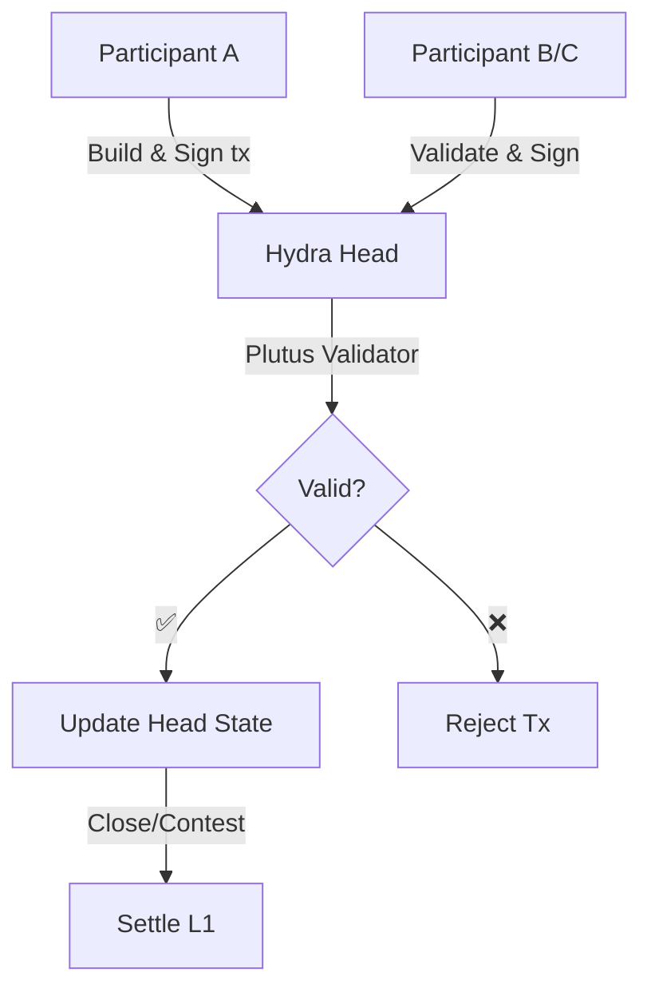

Hydra Head hỗ trợ các hợp đồng thông minh **isomorphic** (đẳng cấu) — cùng các script Plutus chạy trên Layer 1 hoạt động y hệt trong Layer 2. Điều này cho phép các giao thức DeFi phức tạp, cơ chế NFT và logic DApp với tính chung cuộc tức thời và mức phí tối thiểu.

## Hợp đồng thông minh isomorphic

### Isomorphic nghĩa là gì?

**Isomorphic** nghĩa là Hydra Head sử dụng cùng một môi trường thực thi như Layer 1:

- ✅ Cùng các script validator
- ✅ Cùng logic xác thực
- ✅ Cùng cấu trúc datum/redeemer
- ✅ Cùng hỗ trợ native asset
- ✅ Không cần thay đổi code

```
┌──────────────────────────────┐
│    Your validator script     │
│                              │
│  validator :: Datum ->       │
│              Redeemer ->     │
│              ScriptContext ->│
│              Bool            │
└──────────┬─────────┬─────────┘
           │         │
     ┌─────▼─────┐   │
     │ Layer 1   │   │
     │ Mainnet   │   │
     └───────────┘   │
                     │
              ┌──────▼──────┐
              │ Hydra Head  │
              │  (Layer 2)  │
              └─────────────┘
```

## Sử dụng hợp đồng thông minh trong Hydra
Các hợp đồng thông minh Plutus hoạt động bên trong một Hydra Head giống như cách chúng hoạt động trên Cardano Layer 1. Điều đó có nghĩa là bạn có thể tái sử dụng validator, datum và redeemer mà không cần thay đổi logic on-chain, đồng thời hưởng lợi từ giao dịch nhanh, phí thấp và tính chung cuộc tức thời bên trong Head.

### Tóm tắt nhanh quy trình

- Viết validator Layer 1 của bạn như thường lệ — giữ cho định dạng datum/redeemer nhất quán.
- Khóa một script UTxO trên Layer 1 (ví dụ, commit nó vào một Head hoặc tham chiếu tới một script UTxO hiện có).
- Trong Hydra Head, xây dựng một giao dịch (off-chain) sử dụng cùng script, datum và redeemer.
- Giao dịch được các thành viên của Head xác thực theo các quy tắc của validator; nếu hợp lệ, trạng thái của Head sẽ cập nhật.
- Khi Head được đóng/quyết toán, trạng thái cuối cùng được đăng lên L1 và các thay đổi được áp dụng bởi script validator.

### Ví dụ: validator (Aiken, Always True)

```sh
# always-true.ak (apps/nodejs-playground/src/contract/always-true.ak)

use cardano/transaction.{ OutputReference, Transaction}
validator always_true {
    spend (
        _datum: Option<Data>,
        _redeemer: Data,
        _output_ref: OutputReference,
        _tx: Transaction,
    ) {
        True
    }

    else(_) {
        fail
    }
}
```
Sau khi biên dịch bạn sẽ nhận được tệp:

`always-true.json`: [nodejs-playground/src/contract/always-true.json](https://github.com/Vtechcom/hydra-sdk/blob/master/apps/nodejs-playground/src/contract/always-true.json)


### Ví dụ: sử dụng SDK (TypeScript)

Các script mẫu trong `apps/nodejs-playground/src/contract/` minh họa các luồng lock/unlock:

- **Lock**: tạo một script UTxO → `npx tsx src/contract/hydra-lock.ts`

```ts
import contract from './always-true.json'
import { DatumUtils, Deserializer, TimeUtils, SLOT_CONFIG_NETWORK } from '@hydra-sdk/core'
import { buildRedeemer, emptyRedeemer, TxBuilder } from '@hydra-sdk/transaction'

// Build datum
const { paymentCredentialHash: pubKeyHash } = Deserializer.deserializeAddress(walletAddress)
const system_unlocked_at = Date.now() + 1 * 60 * 1000 // now + 1 minute

const datum = DatumUtils.mkConstr(0, [
      DatumUtils.mkBytes(pubKeyHash!),
      DatumUtils.mkInt(system_unlocked_at),
])

const txBuilder = new TxBuilder({
      isHydra: true,
      params: {
            minFeeA: 0,
            minFeeB: 0
      }
})
const txLock = await txBuilder
      .setInputs(addressUTxO)
      .addOutput({
            address: contract.address,
            amount: [{ unit: 'lovelace', quantity: String(2_000_000) }]
      })
      .txOutInlineDatumValue(datum)
      .changeAddress(walletAddress)
      .complete()

```

- **Unlock**: tiêu thụ script UTxO → `npx tsx src/contract/hydra-unlock.ts <txHash#index>`


```ts
import contract from './always-true.json'
import { DatumUtils, Deserializer, TimeUtils, SLOT_CONFIG_NETWORK } from '@hydra-sdk/core'
import { buildRedeemer, emptyRedeemer, TxBuilder } from '@hydra-sdk/transaction'

const txBuilder = new TxBuilder({
      isHydra: true,
      params: {
            minFeeA: 0,
            minFeeB: 0
      }
})

const SLOT_CONFIG: (typeof SLOT_CONFIG_NETWORK)['PREPROD'] = {
      zeroTime: 1762267312000, // Timestamp in ms when start hydra head network
      zeroSlot: 0,
      slotLength: 1000,
      epochLength: 432000,
      startEpoch: 0,
} as const;

const txUnlock = await txBuilder
      .setInputs(inputUTxOs)
      .txIn(
            scriptUTxO.input.txHash, 
            scriptUTxO.input.outputIndex, 
            scriptUTxO.output.amount, 
            scriptUTxO.output.address
      )
      .txInScript(contract.cborHex)
      .txInInlineDatum(scriptUTxO.output.inlineDatum!)
      .txInRedeemerValue(
            emptyRedeemer({ type: 'int', exUnits: { mem: '100000', steps: '25000000' } })
      )
      .txInCollateral(
            collateralUTxO.input.txHash,
            collateralUTxO.input.outputIndex,
            collateralUTxO.output.amount,
            collateralUTxO.output.address
      )
      .addOutput({
            address: walletAddress,
            amount: scriptUTxO.output.amount // send all assets back to myself
      })
      .changeAddress(walletAddress)
      .invalidBefore(TimeUtils.unixTimeToEnclosingSlot(Date.now(), SLOT_CONFIG)) // must be after current slot
      .invalidAfter(TimeUtils.unixTimeToEnclosingSlot(Date.now() + 60 * 60 * 1000, SLOT_CONFIG)) // must be within 1 hour
      .complete()
```


### Luồng tương tác (Mermaid)




### Ghi chú & Thực hành tốt nhất

- Collateral: Việc tiêu thụ script trên L1 vẫn yêu cầu collateral; bên trong một Head, các quy tắc về bonding/collateral phụ thuộc vào cách bạn xây dựng gói giao dịch (transaction bundle) và chính sách bảo mật của Head.
- Tính nhất quán: Luôn serialize datum/redeemer theo cùng một định dạng giữa L1 và Head.
- Code off-chain: Logic off-chain (backend hoặc dApp) chịu trách nhiệm điều phối các chữ ký, giao tiếp với Hydra node và đính kèm các giá trị datum/redeemer chính xác.
- Kiểm thử: Xác thực validator của bạn trên một L1 testnet và kiểm thử các kịch bản Head nhiều thành viên để đảm bảo hành vi giống hệt nhau.
- Minting/Burning: Các luồng mint/burn sử dụng chính sách minting Plutus vẫn hoạt động trong một Head nếu chính sách không phụ thuộc vào dữ liệu hoặc thời gian đặc thù của L1; hãy giữ cho ngữ nghĩa của chính sách tương thích.

### Hạn chế & Cảnh báo

- Việc mở/đóng một Head vẫn là một giao dịch L1 — chi phí quyết toán và phí L1 vẫn áp dụng cho các hành động đó.
- Một số validator phụ thuộc vào dữ liệu đặc thù của L1 (ví dụ, các ràng buộc thời gian hoặc kiểm tra dựa trên slot) có thể cần xử lý đặc biệt khi được thực thi trong một Head — hãy kiểm chứng ngữ nghĩa trong ngữ cảnh.
- Tính sẵn có của dữ liệu: Đảm bảo các thành viên duy trì dữ liệu off-chain cần thiết để tái tạo trạng thái cho các luồng tranh chấp hoặc đóng.

### Tài liệu tham khảo

- [Commit tới Hydra](/concepts/commit-to-hydra)
- [Giao dịch trong Hydra](/concepts/transactions-in-hydra)
- [Hydra Head Protocol](https://hydra.family/head-protocol/)
- [Hydra Known Issues](https://hydra.family/head-protocol/docs/known-issues)
