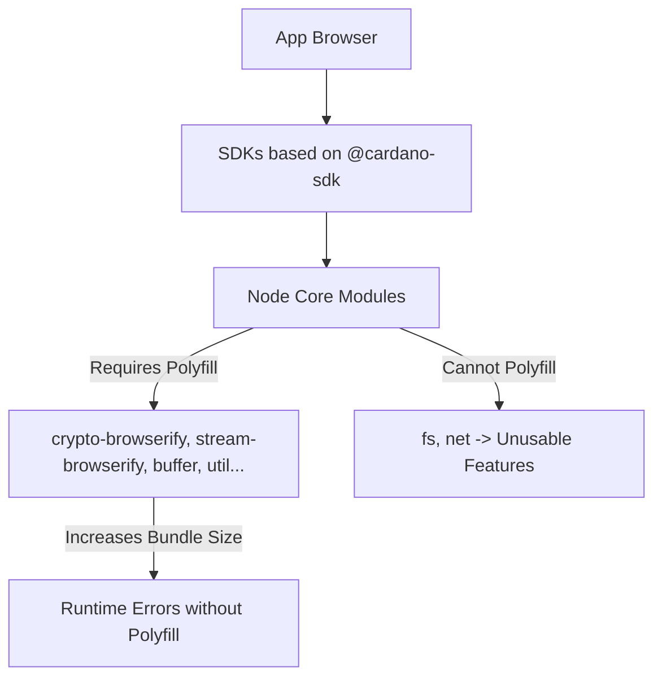
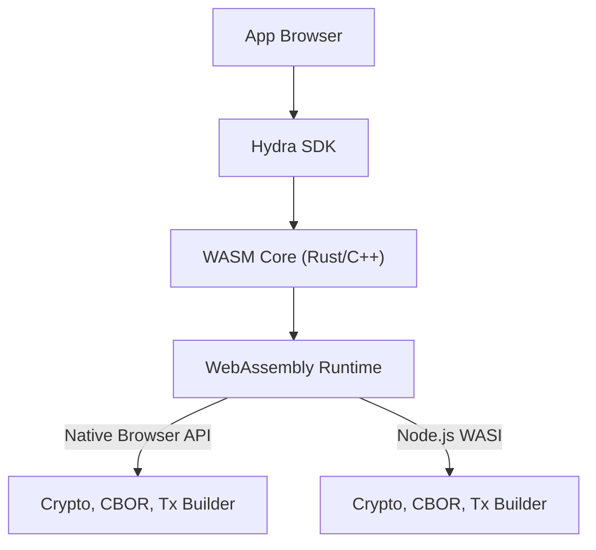

## Vì sao Hydra SDK chọn WASM?

Hydra SDK tận dụng **WebAssembly (WASM)** để vượt qua các giới hạn của những SDK truyền thống dựa trên JavaScript như `@cardano-sdk`. Dưới đây là lý do WASM là lựa chọn tối ưu:

### Những ưu điểm chính của WASM

1. **Loại bỏ phụ thuộc vào các core module của Node.js**:
   - WASM cho phép các chức năng quan trọng (ví dụ: mã hóa, phân tích CBOR, dựng giao dịch) chạy trong môi trường sandbox mà không cần dựa vào các core module của Node.js như `crypto`, `stream`, hay `fs`.
   - Điều này đảm bảo tương thích trên cả môi trường trình duyệt và Node.js.

2. **Giảm kích thước bundle**:
   - WASM chỉ nạp những hàm cần thiết, tránh phải dùng các polyfill như `crypto-browserify` hay `stream-browserify`.
   - Nhờ đó bundle nhỏ hơn đáng kể so với các SDK phụ thuộc vào các module của Node.js.

3. **Tăng hiệu năng**:
   - WASM thực thi các thao tác mã hóa và phân tích giao dịch ở tốc độ gần như native, giảm chi phí phát sinh của runtime JavaScript.

4. **Tương thích đa nền tảng**:
   - Một binary WASM duy nhất có thể chạy mượt mà trên trình duyệt, Node.js (qua WASI) và nền tảng di động (qua bridge).
   - Điều này loại bỏ nhu cầu interop phức tạp giữa module CommonJS và ESM.

---

## So sánh các giải pháp SDK cho Cardano

### Bảng so sánh chi tiết

| Tiêu chí                        | **SDK dựa trên @cardano-sdk**            | **Hydra SDK** (dựa trên WASM) |
|---------------------------------|-------------------------------------------|-----------------------------------|
| **Tương thích trình duyệt**       | Cần polyfill cho các core module của Node.js; một số API (ví dụ: `fs`, `net`) không khả dụng. | Hỗ trợ trình duyệt native; không cần polyfill. |
| **Kích thước bundle**                 | Rất lớn (hàng trăm KB đến >1MB) do polyfill. | Gọn nhẹ (chỉ nạp WASM + lớp JS glue tối thiểu). |
| **Phụ thuộc Node.js**          | Cao, với việc import trực tiếp các core module của Node.js. | Không; toàn bộ logic lõi nằm trong WASM. |
| **Interop (ESM/CJS)**           | Dễ phát sinh lỗi (`exports is not defined`, `.default is not a function`). | Không gặp vấn đề; JavaScript ESM thuần. |
| **Hiệu năng Crypto/CBOR**     | Trung bình (JS thuần, phụ thuộc vào polyfill hiệu năng thấp). | Cao (WASM tốc độ gần native). |
| **Hỗ trợ đa nền tảng**      | Tốt cho Node.js, hạn chế với trình duyệt. | Xuất sắc; hoạt động trên trình duyệt, Node.js và di động. |
| **Tree-Shaking**                | Hạn chế, vì các import của Node.js nằm rải rác, dẫn đến code không dùng bị đưa vào bundle. | Xuất sắc; chỉ những hàm WASM cần thiết mới được bundle. |
| **Bảo trì & khả năng mở rộng**   | Phức tạp, vì cần theo dõi thay đổi API của Node.js và polyfill. | Dễ bảo trì; logic lõi được viết bằng Rust/C++ và expose qua WASM. |

---

## Sơ đồ luồng phụ thuộc

### Vấn đề với các SDK dựa trên `@cardano-sdk`



### Hydra SDK (dựa trên WASM)



---

## Kết luận

Kiến trúc dựa trên WASM của Hydra SDK mang lại một giải pháp mạnh mẽ, hiệu quả và đa nền tảng cho các DApp Cardano hiện đại. Bằng cách loại bỏ phụ thuộc vào Node.js, giảm kích thước bundle và tăng hiệu năng, nó giải quyết được những giới hạn của các SDK dựa trên `@cardano-sdk`.

---

## Bộ nhớ đệm snapshot trong bộ nhớ (v1.3.0+)

`@hydra-sdk/bridge` bổ sung một bộ nhớ đệm hai cấp trong bộ nhớ, được dựng lại một lần cho mỗi sự kiện snapshot và đọc O(1) trên mỗi request.

### Kiến trúc

```
Hydra Node (WebSocket)
  │
  ├── Greetings { snapshotUtxo }
  │     └── updateSnapshot() ← O(n) one-time rebuild
  │
  └── SnapshotConfirmed { snapshot.utxo }
        └── updateSnapshot() ← O(n) one-time rebuild, only if snapNum advances

GET balance / query UTxO
  └── Map.get(address) ← O(1), no I/O, no WASM call
```

### Tác động đến hiệu năng

| Thao tác | Trước v1.3.0 | v1.3.0+ |
|---|---|---|
| `getAddressBalance()` | Không khả dụng | Tra cứu map O(1), không I/O |
| `queryAddressUTxO(address)` | O(n) filter trên toàn bộ UTxO | Tra cứu index O(1) |
| `addressesInHead()` | O(n) + HTTP call | O(1) `Map.keys()` |
| 100 lần đọc balance đồng thời | 100 × scan + alloc | 100 × O(1) |
| Snapshot đến | O(1) (lưu ref) | O(n) rebuild — một lần mỗi snapshot |

### Mức sử dụng bộ nhớ

Với một snapshot 5 000 UTxO có 2 000 address duy nhất, trung bình mỗi address 2 asset:

```
addressUtxoIndex: ~200 KB (2000 Map entries)
balanceCache:     ~256 KB (4000 inner Map entries)
────────────────────────────────────────────────
Total overhead:   ~500 KB
```

### Cách dùng

```typescript
import { HydraBridge } from '@hydra-sdk/bridge'

const bridge = new HydraBridge({ url: 'ws://localhost:4001' })
await bridge.connect()

// After Greetings arrives, cache is seeded automatically

const balance = bridge.getAddressBalance('addr_test1...')
if (balance === null) {
	// Cold start — cache not yet seeded
} else {
	const lovelace = balance.get('lovelace') ?? 0n
	console.log('Balance:', Number(lovelace) / 1_000_000, 'ADA')
}
```

### Bộ nhớ đệm datum có giới hạn (`@hydra-sdk/core`)

`convertUTxOObjectToUTxOWithOptions` nhận tham số `maxDatumCacheSize` để giới hạn số lượng inline datum đã deserialize được giữ trong bộ nhớ:

```typescript
import { Converter } from '@hydra-sdk/core'

const utxos = Converter.convertUTxOObjectToUTxOWithOptions(snapshotUtxo, {
	maxDatumCacheSize: 1024  // default; set to 0 to disable
})
```

Các entry sẽ bị loại bỏ theo thứ tự chèn vào (cũ nhất trước) khi đạt giới hạn.

---

## Bộ nhớ WASM của TxBuilder (v1.2.0+)

Mọi đối tượng `@emurgo/cardano-serialization-lib` đều nằm trong **WASM linear memory** và chỉ được thu hồi khi bạn gọi `.free()`. CSL dựa vào một `FinalizationRegistry` để dọn dẹp tự động, nhưng cơ chế đó chạy non-deterministic và tụt lại rất xa so với một vòng lặp build dày đặc. Trước v1.2.0, việc xây dựng hàng nghìn giao dịch liên tiếp (ví dụ spike-building bên trong một Hydra Head) làm rò rỉ WASM heap và khiến mỗi lần `build_tx()` kế tiếp chậm hơn.

### Điều gì đã thay đổi

`@hydra-sdk/transaction@1.2.0` giải phóng các đối tượng WASM mà nó cấp phát một cách **deterministic**:

- Mọi đối tượng CSL được cấp phát nội bộ trong `complete()` đều được theo dõi và giải phóng trong một khối `finally` sau `build_tx()`. `Transaction` được trả về là một struct độc lập và không bị ảnh hưởng; các đối tượng do caller cung cấp (datum / redeemer / script) không bao giờ bị giải phóng.
- `reset()`, `changeAddress()`, và `updateProtocolParams()` giải phóng các đối tượng trạng thái mà chúng thay thế.
- `dispose()` (và `[Symbol.dispose]`) giải phóng mọi thứ mà builder vẫn đang giữ.

### Tác động đo được

| Chỉ số | Trước v1.2.0 | v1.2.0+ |
|---|---|---|
| WASM heap qua 10,000 lần build | Tăng trưởng không giới hạn | Phẳng (~0 KB/iter) |
| Thời gian build mỗi giao dịch | Suy giảm đều đặn | Ổn định |
| Bộ test hiện có | — | 280 test không thay đổi |

### Các mẫu cho workload khối lượng lớn

Chọn đường dẫn tự giải phóng bộ nhớ cho bạn:

```typescript
import { TxBuilder } from '@hydra-sdk/transaction'

// 1. completeCbor() — you only need the bytes; the Transaction is freed for you
const cbor = await new TxBuilder()
  .setInputs(utxos)
  .txOut(addr, [{ unit: 'lovelace', quantity: '1000000' }])
  .changeAddress(addr)
  .completeCbor()

// 2. `using` — builder disposed automatically at end of scope (TS 5.2+)
{
  using builder = new TxBuilder()
  const bytes = await builder.setInputs(utxos)./* … */.completeCbor()
}

// 3. Reuse one builder across a spike, then dispose once
const builder = new TxBuilder()
for (const job of jobs) {
  const bytes = await builder.reset().setInputs(job.utxos)./* … */.completeCbor()
}
builder.dispose()
```

::warning
Nếu bạn giữ lại `Transaction` còn sống từ `complete()` (ví dụ `complete()` + `.to_hex()`), **bạn** sở hữu nó — hãy gọi `tx.free()` khi xong. Dưới khối lượng lớn, hãy ưu tiên `completeCbor()`.
::
