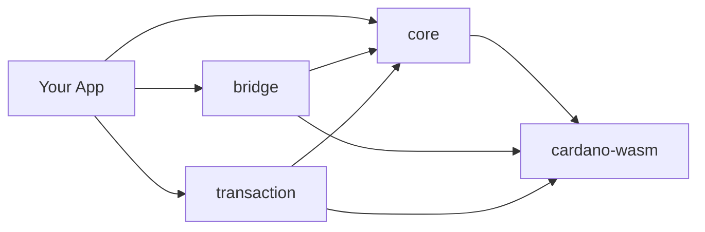

# Getting Started

Welcome to Hydra SDK! This guide will help you get up and running with the fastest and most reliable Cardano wallet SDK designed for modern web development.

## Overview

Hydra SDK is a next-generation toolkit that makes Cardano wallet development and Hydra Layer 2 integration incredibly fast and simple. Built with **WebAssembly (WASM)** at its core, the SDK delivers **native-level performance** in the browser while providing seamless integration with modern build tools like **Vite** and **Rollup**.

**Latest Version: v1.1.5** - Added Keys Utility functions for key generation and management.
[View Changelog](/getting-started/change-logs)

### Why Choose Hydra SDK?

- **⚡ Lightning Fast**: WASM-powered core delivers up to 10x faster performance than traditional JavaScript SDKs (e.g., cardano-js)
- **🔧 Zero Bundle Issues**: Out-of-the-box support for Vite and Rollup, with detailed configuration guides for Nuxt 3, React + Vite, and Next.js
- **📦 Modern Architecture**: Modular package design allows you to install only what you need
- **🌐 Browser-First**: Highly compatible with browser-based DApps
- **🔒 Type-Safe**: Full TypeScript support with comprehensive type definitions
- **🛠️ Rich Utilities**: Comprehensive collection of utility functions for Cardano development

## What's New in v1.1.x

- **Enhanced Utilities System**: Organized namespaces for data parsing, datum creation, policy management, and time calculations
- **Improved Developer Experience**: Better type safety and cleaner API design
- **Provider Abstractions**: Unified interfaces for different blockchain data sources
- **Advanced Examples**: Real-world implementation patterns and best practices

## What You'll Learn

In this getting started section, you'll learn how to:

- [Install and set up](/getting-started/installation) the SDK in your project
- [Create your first wallet](/getting-started/quick-start) and perform basic operations
- [Configure the SDK](/getting-started/configuration) for your specific needs
- [Migrate from older versions](/getting-started/migration-v1.1.0) to v1.1.0 (if applicable)

## Prerequisites

Before you begin, make sure you have:

- **Node.js 18.20.0 or higher** - [Download Node.js](https://nodejs.org/)
- **Package manager** - npm, pnpm, or yarn
- **Basic TypeScript/JavaScript knowledge**
- **Understanding of Cardano concepts** (addresses, UTxOs, transactions)

## Architecture Overview

The SDK consists of four main packages:

### Core Packages

1. **@hydra-sdk/core** - Wallet management and Cardano operations
2. **@hydra-sdk/bridge** - Hydra Layer 2 integration
3. **@hydra-sdk/transaction** - Transaction building utilities
4. **@hydra-sdk/cardano-wasm** - Cardano WASM bindings

### Package Dependencies

## Development Workflow

Here's the typical workflow when working with the SDK:

1. **Install packages** - Add the required SDK packages to your project
2. **Create wallet** - Initialize a wallet instance for your application
3. **Connect to network** - Connect to Cardano network and/or Hydra Node
4. **Build transactions** - Create and sign transactions
5. **Submit transactions** - Submit to network or Hydra Head

## Next Steps

Ready to start? Follow these guides in order:

1. **[Installation](/getting-started/installation)** - Install the SDK packages
2. **[Quick Start](/getting-started/quick-start)** - Create your first wallet
3. **[Configuration](/getting-started/configuration)** - Configure for production

## Need Help?

If you run into any issues:

- Check the [API Reference](/api/) for detailed documentation
- Browse [Examples](/examples/) for practical code samples
- Visit [GitHub Issues](https://github.com/Vtechcom/hydra-sdk/issues) to report bugs
- Join [GitHub Discussions](https://github.com/Vtechcom/hydra-sdk/discussions) for community support
- **[Full Examples Repository](https://github.com/Vtechcom/hydra-sdk-examples)** - Complete working applications

## What's Next?

After completing the getting started guide, you might want to explore:

- **[Building a Wallet App](/guides/building-wallet-app)** - Complete wallet application guide
- **[Hydra Head Management](/guides/hydra-head-management)** - Advanced Hydra integration
- **[Testing Strategies](/guides/testing-strategies)** - Testing your applications
- **[Deployment](/guides/deployment)** - Deploying to production

## Comparison with JavaScript-based SDKs

### Advantages of Hydra SDK

- **No Polyfill Setup Required**: Many JavaScript-based SDKs, built on traditional libraries, require polyfills for browser compatibility, which can complicate setup, especially with modern tools like Vite and Rollup. Hydra SDK, leveraging `cardano-serialization-lib` (WASM), eliminates the need for polyfills, ensuring seamless integration with modern build tools.
- **Cross-Environment Compatibility**: Hydra SDK is designed to work efficiently across Node.js, browsers, and even mobile platforms like React Native, providing greater flexibility for developers.
- **Modern DApp Support**: Hydra SDK is optimized for modern DApps, ensuring compatibility with cutting-edge frameworks like Nuxt 3, React + Vite, and Next.js.
- **Vite and Rollup Compatibility**: Unlike many JavaScript-based SDKs, which face bundling issues with Vite and Rollup due to missing polyfills for Node.js core modules (e.g., `util`, `stream`, `crypto`), Hydra SDK avoids these issues entirely by using WASM-based implementations.

