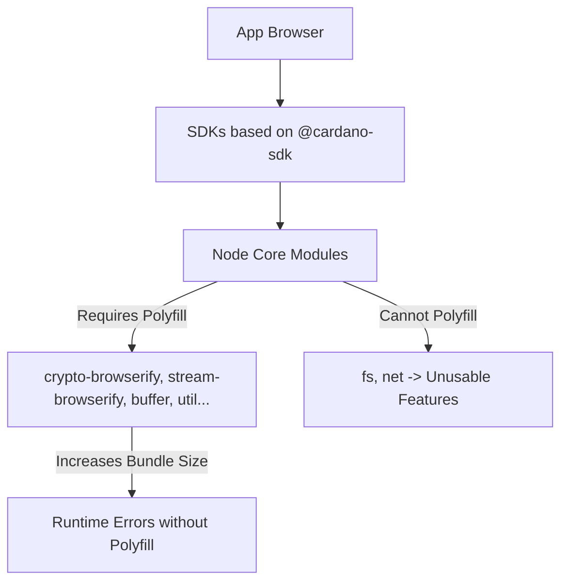
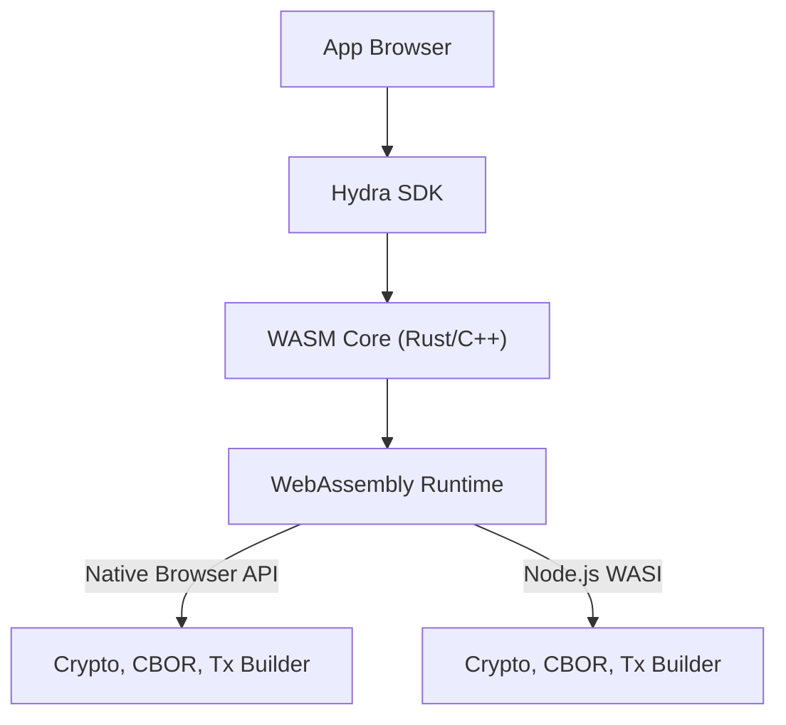

# Performance and Comparison

## Why WASM for Hydra SDK?

Hydra SDK leverages **WebAssembly (WASM)** to overcome the limitations of traditional JavaScript-based SDKs like `@cardano-sdk`. Here’s why WASM is the optimal choice:

### Key Advantages of WASM

1. **Eliminates Node.js Core Module Dependencies**:
   - WASM allows critical functionalities (e.g., cryptography, CBOR parsing, transaction building) to run in a sandboxed environment without relying on Node.js core modules like `crypto`, `stream`, or `fs`.
   - This ensures compatibility across both browser and Node.js environments.

2. **Reduces Bundle Size**:
   - WASM loads only the required functions, avoiding the need for polyfills like `crypto-browserify` or `stream-browserify`.
   - This results in significantly smaller bundles compared to SDKs that rely on Node.js modules.

3. **Boosts Performance**:
   - WASM executes cryptographic operations and transaction parsing at near-native speeds, reducing the overhead of JavaScript runtime.

4. **Cross-Platform Compatibility**:
   - A single WASM binary can run seamlessly on browsers, Node.js (via WASI), and mobile platforms (via bridges).
   - This eliminates the need for complex interop between CommonJS and ESM modules.

---

## Comparison of Cardano SDK Solutions

### Detailed Comparison Table

| Criteria                        | **SDKs based on @cardano-sdk**            | **Hydra SDK** (WASM-based) |
|---------------------------------|-------------------------------------------|-----------------------------------|
| **Browser Compatibility**       | Requires polyfills for Node.js core modules; some APIs (e.g., `fs`, `net`) are unavailable. | Native browser support; no polyfills needed. |
| **Bundle Size**                 | Very large (hundreds of KB to >1MB) due to polyfills. | Compact (only loads WASM + minimal JS glue code). |
| **Node.js Dependency**          | High, with direct imports of Node.js core modules. | None; all core logic resides in WASM. |
| **Interop (ESM/CJS)**           | Prone to errors (`exports is not defined`, `.default is not a function`). | No issues; pure ESM JavaScript. |
| **Crypto/CBOR Performance**     | Moderate (pure JS, dependent on low-performance polyfills). | High (WASM near-native speed). |
| **Cross-Platform Support**      | Good for Node.js, limited for browsers. | Excellent; works on browsers, Node.js, and mobile. |
| **Tree-Shaking**                | Limited, as Node.js imports are scattered, leading to unused code in bundles. | Excellent; only required WASM functions are bundled. |
| **Maintenance & Scalability**   | Complex, as it requires tracking Node.js API changes and polyfills. | Easy to maintain; core logic is implemented in Rust/C++ and exposed via WASM. |

---

## Dependency Flow Diagrams

### Issues with SDKs based on `@cardano-sdk`



### Hydra SDK (WASM-based)



---

## Conclusion

Hydra SDK’s WASM-based architecture provides a robust, efficient, and cross-platform solution for modern Cardano DApps. By eliminating Node.js dependencies, reducing bundle size, and boosting performance, it addresses the limitations of SDKs based on `@cardano-sdk`.

---

## In-Memory Snapshot Cache (v1.3.0+)

`@hydra-sdk/bridge` adds a two-level in-memory cache that is rebuilt once per snapshot event and read O(1) per request.

### Architecture

```
Hydra Node (WebSocket)
  │
  ├── Greetings { snapshotUtxo }
  │     └── updateSnapshot() ← O(n) one-time rebuild
  │
  └── SnapshotConfirmed { snapshot.utxo }
        └── updateSnapshot() ← O(n) one-time rebuild, only if snapNum advances

GET balance / query UTxO
  └── Map.get(address) ← O(1), no I/O, no WASM call
```

### Performance Impact

| Operation | Before v1.3.0 | v1.3.0+ |
|---|---|---|
| `getAddressBalance()` | Not available | O(1) map lookup, no I/O |
| `queryAddressUTxO(address)` | O(n) filter over all UTxOs | O(1) index lookup |
| `addressesInHead()` | O(n) + HTTP call | O(1) `Map.keys()` |
| 100 concurrent balance reads | 100 × scan + alloc | 100 × O(1) |
| Snapshot arrival | O(1) (store ref) | O(n) rebuild — once per snapshot |

### Memory Usage

For a 5 000-UTxO snapshot with 2 000 unique addresses averaging 2 assets each:

```
addressUtxoIndex: ~200 KB (2000 Map entries)
balanceCache:     ~256 KB (4000 inner Map entries)
────────────────────────────────────────────────
Total overhead:   ~500 KB
```

### Usage

```typescript
import { HydraBridge } from ‘@hydra-sdk/bridge’

const bridge = new HydraBridge({ url: ‘ws://localhost:4001’ })
await bridge.connect()

// After Greetings arrives, cache is seeded automatically

const balance = bridge.getAddressBalance(‘addr_test1...’)
if (balance === null) {
	// Cold start — cache not yet seeded
} else {
	const lovelace = balance.get(‘lovelace’) ?? 0n
	console.log(‘Balance:’, Number(lovelace) / 1_000_000, ‘ADA’)
}
```

### Bounded Datum Cache (`@hydra-sdk/core`)

`convertUTxOObjectToUTxOWithOptions` accepts `maxDatumCacheSize` to cap the number of deserialized inline datums kept in memory:

```typescript
import { Converter } from ‘@hydra-sdk/core’

const utxos = Converter.convertUTxOObjectToUTxOWithOptions(snapshotUtxo, {
	maxDatumCacheSize: 1024  // default; set to 0 to disable
})
```

Entries are evicted in insertion order (oldest first) when the limit is reached.
