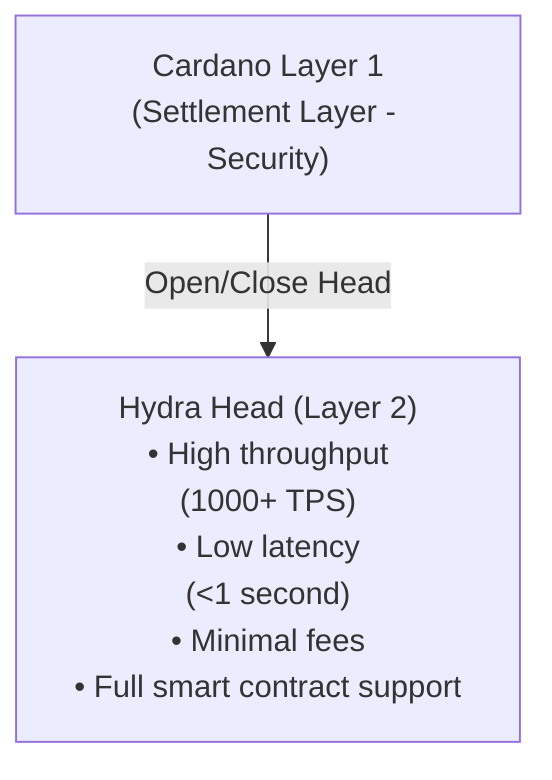

# Why Hydra?

Hydra is Cardano's Layer 2 scaling solution that addresses the blockchain trilemma by providing high throughput, low latency, and minimal transaction costs while maintaining security and decentralization.

## The Scalability Challenge

Blockchain networks face fundamental scalability limitations:

- **Limited Throughput** - Layer 1 blockchains process transactions slowly (Cardano mainnet: ~250 TPS theoretical)
- **High Latency** - Block confirmation times create delays (20+ seconds on Cardano)
- **Increasing Fees** - Network congestion drives up transaction costs
- **Resource Constraints** - Every node must process every transaction

These limitations make certain applications impractical on Layer 1:

- Real-time gaming
- Micropayments
- High-frequency trading
- Interactive DApps

## How Hydra Solves This

### Isomorphic State Channels

Hydra creates **isomorphic state channels** - off-chain environments that mirror Layer 1 capabilities:



### Key Benefits

#### 1. **Massive Throughput Increase**

- **Layer 1**: ~250 TPS theoretical, ~50-100 TPS practical
- **Hydra Head**: 1,000+ TPS per head
- **Multiple Heads**: Linear scaling with number of heads

```typescript
// Example: Processing multiple transactions rapidly
for (let i = 0; i < 1000; i++) {
  await bridge.submitTx(tx)
  // Each transaction confirms in <1 second
}
```

#### 2. **Near-Instant Finality**

Transactions confirm in under 1 second within a Hydra Head:

| Metric | Layer 1 | Hydra Head |
|--------|---------|------------|
| Confirmation Time | 20+ seconds | <1 second |
| Block Time | 20 seconds | ~100ms |
| Finality | 2-3 minutes | Instant |

#### 3. **Minimal Transaction Costs**

- **Layer 1**: ~0.17 ADA average fee
- **Hydra Head**: Negligible fees (only consensus overhead)
- **Cost Savings**: 99%+ reduction for high-frequency operations

```typescript
// Cost comparison
const layer1Cost = 1000 * 0.17 // 170 ADA for 1000 txs
const hydraCost = 2 * 0.17 + 0.001 * 1000 // ~1.4 ADA total
// Savings: ~99.2%
```

#### 4. **Full Smart Contract Support**

Hydra Heads support the same Plutus smart contracts as Layer 1:

- ✅ Native tokens and NFTs
- ✅ Custom validators
- ✅ Complex DeFi protocols
- ✅ State machines
- ✅ Multi-signature logic

#### 5. **Predictable Performance**

Unlike Layer 1, Hydra Head performance is unaffected by:

- Network congestion
- Block size limits
- Mempool competition
- Other users' activities

## Use Cases

### 1. Gaming & Metaverse

**Requirements**: Real-time interactions, frequent state updates, low costs

```typescript
// In-game item transfer
const transferItem = async (from, to, itemNFT) => {
  // Instant, low-cost transfer within Hydra Head
  const tx = await builder.transferNFT({
    from: from.address,
    to: to.address,
    policyId: itemNFT.policy,
    assetName: itemNFT.name
  })
  
  await bridge.submitTx(tx)
  // Confirmed in <1 second
}
```

**Examples**:
- Player-to-player trading
- Real-time leaderboards
- In-game currency transactions
- Tournament prize distribution

### 2. Micropayments & Streaming

**Requirements**: Tiny transaction amounts, high frequency, minimal fees

```typescript
// Content streaming payment (per second)
const streamingPayment = async () => {
  const perSecondCost = 0.001 // ADA
  
  setInterval(async () => {
    await bridge.submitTx(
      buildPayment(creator, perSecondCost)
    )
  }, 1000) // Pay every second
}
```

**Examples**:
- Pay-per-second content streaming
- Micropayment tips
- Usage-based API payments
- IoT device settlements

### 3. DeFi Trading

**Requirements**: Fast execution, low latency, MEV resistance

```typescript
// High-frequency DEX trades
const executeTrade = async (tokenA, tokenB, amount) => {
  const tx = await dex.swap({
    from: tokenA,
    to: tokenB,
    amount: amount
  })
  
  await bridge.submitTx(tx)
  // Trade executes in <1 second with minimal slippage
}
```

**Examples**:
- DEX order books
- Automated market makers
- Arbitrage opportunities
- Liquidation mechanisms

### 4. NFT Marketplaces

**Requirements**: Fast auctions, batch operations, low listing costs

```typescript
// Real-time NFT auction
const placeBid = async (auctionId, bidAmount) => {
  const tx = await marketplace.bid({
    auction: auctionId,
    amount: bidAmount,
    bidder: wallet.address
  })
  
  await bridge.submitTx(tx)
  // Bid placed instantly, outbidding is real-time
}
```

**Examples**:
- Live NFT auctions
- Batch minting collections
- Rapid trading
- Royalty distributions

### 5. Social & Governance

**Requirements**: High user interaction, voting, content moderation

```typescript
// Real-time governance voting
const vote = async (proposalId, choice) => {
  const tx = await governance.castVote({
    proposal: proposalId,
    vote: choice,
    voter: wallet.address
  })
  
  await bridge.submitTx(tx)
  // Vote recorded instantly
}
```

**Examples**:
- DAO voting
- Social media interactions
- Content tipping
- Reputation systems

## Comparing Hydra with Other Solutions

### Hydra vs Traditional Layer 1

| Feature | Cardano L1 | Hydra Head |
|---------|-----------|------------|
| Throughput | ~100 TPS | 1,000+ TPS |
| Latency | 20+ seconds | <1 second |
| Fees | ~0.17 ADA | ~0.001 ADA |
| Smart Contracts | Full Plutus | Full Plutus |
| Security | Layer 1 | Participant consensus |
| Finality | 2-3 minutes | Instant |

### Hydra vs Other L2 Solutions

**Hydra Advantages**:
- ✅ Full smart contract support (isomorphic)
- ✅ No separate virtual machine
- ✅ Native multi-asset support
- ✅ Instant finality within head
- ✅ Predictable performance

**Trade-offs**:
- ⚠️ Requires participant cooperation
- ⚠️ Limited to participants in head
- ⚠️ Opening/closing has Layer 1 costs

## When to Use Hydra

### ✅ Ideal Use Cases

- **High Transaction Volume**: Many transactions between known parties
- **Low Latency Requirements**: Real-time or near-real-time interactions
- **Cost Sensitivity**: Fees are a significant factor
- **Known Participants**: Trusted or semi-trusted parties
- **Session-Based**: Temporary, bounded interactions

### ❌ Not Ideal For

- **One-Time Transactions**: Single, isolated transactions
- **Unknown Parties**: No relationship or trust
- **Long-Term Storage**: Permanent state without interaction
- **Public Access**: Unrestricted open participation

## Getting Started

Ready to integrate Hydra into your application?

1. **[Set up Hydra SDK](/getting-started/installation)** - Install required packages
2. **[Follow Integration Guide](/examples/hydra-integration)** - Step-by-step integration
3. **[Explore Commit/Decommit](/hydra-concept/commit-to-hydra)** - Manage UTxOs in heads
4. **[Build Transactions](/hydra-concept/transactions-in-hydra)** - Create Hydra transactions

## Learn More

- [Hydra Official Documentation](https://hydra.family/head-protocol/)
- [Hydra Research Papers](https://iohk.io/en/research/library/)
- [Cardano Scaling Solutions](https://docs.cardano.org/scaling-solutions/)

---

> **Next**: Learn how to [Commit UTxOs to Hydra](/hydra-concept/commit-to-hydra) to start using Hydra Heads
