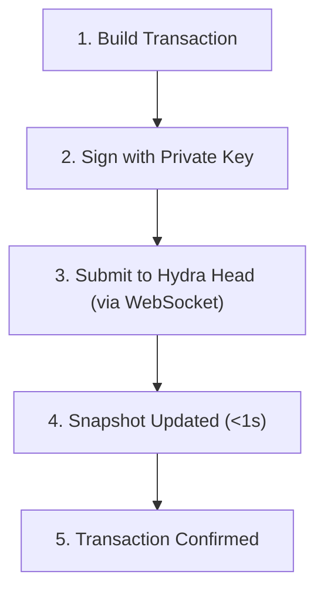

# Transactions in Hydra

Transactions within a Hydra Head operate similarly to Layer 1 but execute much faster with minimal fees. This guide explains how to build, submit, and track transactions in Hydra.

## understanding hydra transactions

### key differences from Layer 1

| Aspect | Layer 1 | Hydra Head |
|--------|---------|------------|
| Confirmation Time | 20+ seconds | <1 second |
| Transaction Fee | ~0.17 ADA | Negligible |
| Throughput | ~100 TPS | 1,000+ TPS |
| Smart Contracts | Full Plutus | Full Plutus (isomorphic) |
| Finality | 2-3 minutes | Instant |

### transaction lifecycle in hydra

> Updating...

