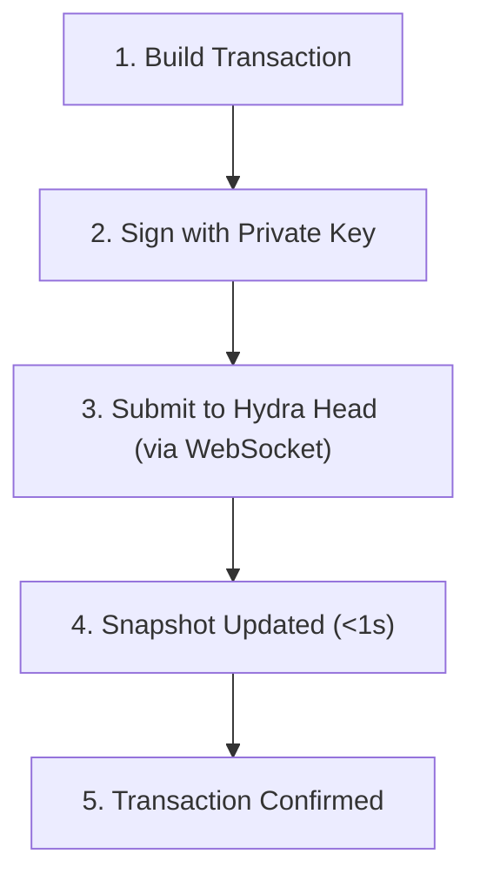

# Transactions in Hydra

Transactions within a Hydra Head operate similarly to Layer 1 but execute much faster with minimal fees. This guide explains how to build, submit, and track transactions in Hydra.

# Understanding Hydra Transactions

### Key differences from Layer 1

| Aspect | Layer 1 | Hydra Head |
|--------|---------|------------|
| Confirmation Time | 20+ seconds | <1 second |
| Transaction Fee | ~0.17 ADA | Negligible |
| Throughput | ~100 TPS | 1,000+ TPS |
| Smart Contracts | Full Plutus | Full Plutus (isomorphic) |
| Finality | 2-3 minutes | Instant |

### Transaction lifecycle in Hydra


## Building and submitting transactions in Hydra

### 1. Prerequisites
To submit a transaction to a Hydra Head, you must have a Head running and be connected to the Hydra node (via WebSocket in the NodeJS playground examples).

### 2. Check UTxO / assets in the Head

```ts
// src/start-bridge.ts
import { HydraBridge } from '@hydra-sdk/bridge'
async function main() {
  const bridge = new HydraBridge({
    url: 'ws://localhost:4001'
  })
  const connected = await bridge.connect()
  if (!connected) {
    throw new Error('Failed to connect to Hydra node')
  }
  console.log('>>> Connected to Hydra node')

  const utxoObj = await bridge.querySnapshotUtxo()
  console.log('>>> Snapshot UTxO:', utxoObj)
}
main()
```

```bash
npx tsx src/start-bridge.ts
```

Example snapshot output:

```plaintext
>>> Connected to Hydra node
>>> Snapshot UTxO: {
  'fa1e2b6eb32b555201dd42140802c49dd56a8093838f3976071281276b93369f#0': {
    address: 'addr_test1qpxsf0x8xypuhq5k408f9kh0meyy6jv2lxgqw2fefvjlte0u06dugtmxuhhw8hschdn4q59g64q5s9z42ax6qyg7ewsqt6e548',
    datum: null,
    datumhash: null,
    inlineDatum: null,
    inlineDatumRaw: null,
    referenceScript: null,
    value: { lovelace: 18000000 }
  }
}
```

### 3. Build transaction

```ts
// src/build-tx.ts
import { HydraBridge } from '@hydra-sdk/bridge'
import { Resolver } from '@hydra-sdk/core'
import { TxBuilder } from '@hydra-sdk/transaction'

async function main() {
  const bridge = new HydraBridge({
    url: 'ws://localhost:4001'
  })
  const connected = await bridge.connect()
  if (!connected) {
    throw new Error('Failed to connect to Hydra node')
  }
  console.log('>>> Connected to Hydra node')

  const utxoObj = await bridge.querySnapshotUtxo()
  console.log('>>> Snapshot UTxO:', utxoObj)

  const addrUtxos = await bridge.queryAddressUTxO(walletAddress)
  const txBuilder = new TxBuilder({
    isHydra: true,
    params: {
      minFeeA: 0,
      minFeeB: 0
    }
  })
  const tx = await txBuilder
    .setInputs(addrUtxos)
    .addOutput({
      address: walletAddress, // destination address
      amount: [{ unit: 'lovelace', quantity: String(2_000_000) }]
    })
    .changeAddress(walletAddress)
    .complete()

  const signedCbor = await wallet.signTx(tx.to_hex())
  const txId = Resolver.resolveTxHash(signedCbor)

  const rs = await bridge.submitTxSync({
    cborHex: signedCbor,
    type: 'Witnessed Tx ConwayEra',
    description: 'Test Hydra tx from NodeJS Playground',
    txId: txId
  })
  console.log('>>> Submit tx result:', rs)
}
main()
```

### 4. Run the code

```bash
npx tsx src/build-tx.ts
```

Example output:

```plaintext
>>> Connected to Hydra node
>>> Snapshot UTxO: {
  'fa1e2b6eb32b555201dd42140802c49dd56a8093838f3976071281276b93369f#0': {
    address: 'addr_test1qpxsf0x8xypuhq5k408f9kh0meyy6jv2lxgqw2fefvjlte0u06dugtmxuhhw8hschdn4q59g64q5s9z42ax6qyg7ewsqt6e548',
    datum: null,
    datumhash: null,
    inlineDatum: null,
    inlineDatumRaw: null,
    referenceScript: null,
    value: { lovelace: 18000000 }
  }
}
>>> Submit tx result: {
  txId: 'dee1097738688441b2bcf90d9a20ad8eca859375ffdb8f1fde0f78f461345435',
  isValid: true,
  isConfirmed: true,
  result: {
    headId: '7489fdc412ff71a7831ed508e73b2872482099fd4d97ed73663c70f8',
    seq: 227108,
    signatures: { multiSignature: [Array] },
    snapshot: {
      confirmed: [Array],
      headId: '7489fdc412ff71a7831ed508e73b2872482099fd4d97ed73663c70f8',
      number: 1,
      utxo: [Object],
      utxoToCommit: null,
      utxoToDecommit: null,
      version: 0
    },
    tag: 'SnapshotConfirmed',
    timestamp: '2025-11-26T08:01:02.238499906Z'
  }
}
```

