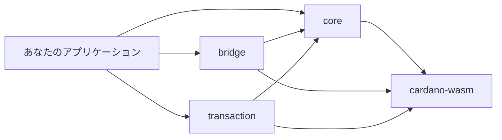

# はじめに

Hydra SDK へようこそ。このガイドでは、モダンなWeb開発向けに設計された、高速かつ安定したCardanoウォレット SDK のセットアップ方法を説明します。

## 概要

Hydra SDK は、Cardano ウォレット開発と Hydra Layer 2 統合を、シンプルかつ高速に行うための次世代ツールキットです。コアには **WebAssembly (WASM)** を採用しており、ブラウザ上で **ネイティブレベルのパフォーマンス** を実現しつつ、**Vite** や **Rollup** といったモダンなビルドツールとシームレスに連携できます。

**最新バージョン: v1.1.5** – Keys Utility 関数が追加され、鍵生成と管理が強化されています。[変更履歴を見る](/getting-started/change-logs)

### なぜ Hydra SDK を選ぶのか

- **⚡ 高速**: WASM ベースのコアにより、従来の JavaScript SDK（例: cardano-js）と比較して最大 10 倍のパフォーマンス
- **🔧 バンドル問題ゼロ**: Vite と Rollup を標準サポートし、Nuxt 3、React + Vite、Next.js 向けの詳細な設定ガイドを提供
- **📦 モダンなアーキテクチャ**: 必要なパッケージだけをインストールできるモジュラー構成
- **🌐 ブラウザファースト**: ブラウザベースの DApp と高い互換性
- **🔒 型安全**: 充実した TypeScript 型定義
- **🛠️ 豊富なユーティリティ**: Cardano 開発向けのユーティリティ関数を多数提供

## v1.1.x の変更点

- **Utilities System 強化**: data parsing、datum creation、policy management、time calculations 用の namespace を整理
- **Developer Experience 向上**: 型安全性の向上と API デザインの改善
- **Provider 抽象化**: 複数のブロックチェーンデータソースを共通インターフェースで扱えるよう統一
- **高度なサンプル**: 実運用に近い実装パターンとベストプラクティスを提供

## このセクションで学べること

この「はじめに」セクションでは、次の内容を学びます。

- SDK をプロジェクトに [インストール・セットアップ](/getting-started/installation) する方法
- [最初のウォレットを作成](/getting-started/quick-start) し、基本操作を行う方法
- プロジェクト要件に合わせて SDK を [設定](/getting-started/configuration) する方法
- 旧バージョンから v1.1.0 へ [マイグレーション](/getting-started/migration-v1.1.0) する際のポイント

## 事前準備

始める前に、以下の環境が整っていることを確認してください。

- **Node.js 18.20.0 以上** – [Node.js をダウンロード](https://nodejs.org/)
- **パッケージマネージャ** – npm、pnpm、または yarn
- **TypeScript / JavaScript の基礎知識**
- **Cardano の基本概念の理解**（アドレス、UTxO、トランザクションなど）

## アーキテクチャ概要

SDK は次の 4 つの主要パッケージで構成されています。

### コアパッケージ

1. **@hydra-sdk/core** – ウォレット管理と Cardano 操作
2. **@hydra-sdk/bridge** – Hydra Layer 2 統合
3. **@hydra-sdk/transaction** – トランザクション構築ユーティリティ
4. **@hydra-sdk/cardano-wasm** – Cardano WASM バインディング

### パッケージ依存関係

## 開発ワークフロー

Hydra SDK を使った一般的なワークフローは次の通りです。

1. **パッケージをインストール** – プロジェクトに必要な SDK パッケージを追加
2. **ウォレットを作成** – アプリケーション用のウォレットインスタンスを初期化
3. **ネットワークへ接続** – Cardano ネットワークや Hydra Node に接続
4. **トランザクションを構築** – トランザクションを作成・署名
5. **トランザクションを送信** – ネットワークまたは Hydra Head へ送信

## 次のステップ

準備ができたら、次のガイドから読み進めてください。

1. **[インストール](/getting-started/installation)** – SDK パッケージをインストール
2. **[クイックスタート](/getting-started/quick-start)** – 最初のウォレットを作成
3. **[設定ガイド](/getting-started/configuration)** – 本番環境向けの設定

## ヘルプが必要な場合

問題が発生した場合は、次を参照してください。

- 詳細な API 情報は [API Reference](/api/) を参照
- 実践的なコードサンプルは [Examples](/examples/) を参照
- 不具合報告は [GitHub Issues](https://github.com/Vtechcom/hydra-sdk/issues)
- コミュニティでの相談は [GitHub Discussions](https://github.com/Vtechcom/hydra-sdk/discussions)
- **[完全なサンプル集](https://github.com/Vtechcom/hydra-sdk-examples)** – 実際に動作するサンプルアプリケーション

## さらに学ぶには

「はじめに」セクションを終えたら、次のトピックもおすすめです。

- **[ウォレットアプリの構築](/guides/building-wallet-app)** – フル機能のウォレットアプリ構築ガイド
- **[Hydra Head 管理](/guides/hydra-head-management)** – Hydra 統合の詳細
- **[テスト戦略](/guides/testing-strategies)** – アプリケーションのテスト方法
- **[デプロイ](/guides/deployment)** – 本番環境へのデプロイ手順

## JavaScript ベース SDK との比較

### Hydra SDK の優位性

- **Polyfill 不要**: 多くの従来型 JavaScript SDK はブラウザ対応のために polyfill を必要とし、特に Vite / Rollup との組み合わせでセットアップが複雑になりがちです。Hydra SDK は `cardano-serialization-lib`（WASM）を利用することで polyfill を不要にし、モダンなビルドツールとの統合をシンプルにします。
- **マルチプラットフォーム対応**: Hydra SDK は Node.js・ブラウザ・React Native などで効率的に動作するよう設計されており、開発者に高い柔軟性を提供します。
- **モダン DApp への最適化**: Nuxt 3、React + Vite、Next.js などの最新フレームワークとの互換性を重視して設計されています。
- **Vite / Rollup との相性**: 多くの JavaScript ベース SDK が `util`、`stream`、`crypto` といった Node.js コアモジュールを polyfill できずバンドルエラーを起こすのに対し、Hydra SDK は WASM ベース実装によりこれらの問題を根本的に回避します。
