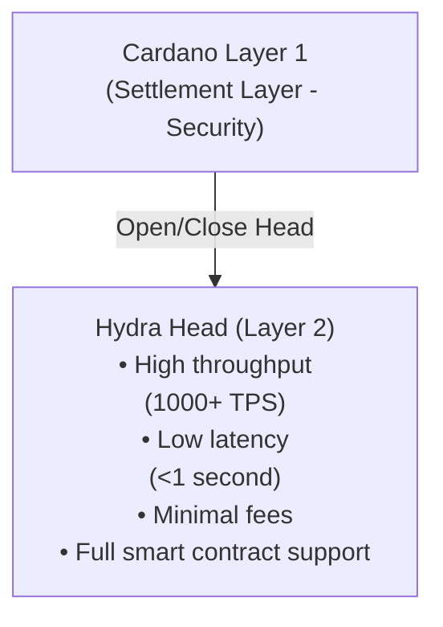

# なぜ Hydra？

Hydra は Cardano の Layer 2 スケーリングソリューションで、セキュリティと分散化を維持しながら、高スループット、低レイテンシ、最小限のトランザクションコストを提供することで、ブロックチェーントリレンマに対処します。

## スケーラビリティの課題

ブロックチェーンネットワークは基本的なスケーラビリティの制限に直面しています：

- **限られたスループット** - Layer 1 ブロックチェーンはトランザクション処理が遅い（Cardano メインネット：理論上 ~250 TPS）
- **高レイテンシ** - ブロック確認時間が遅延を生む（Cardano で 20 秒以上）
- **増加する手数料** - ネットワークの混雑がトランザクションコストを押し上げる
- **リソース制約** - すべてのノードがすべてのトランザクションを処理する必要がある

これらの制限により、特定のアプリケーションは Layer 1 では実用的ではありません：

- リアルタイムゲーミング
- マイクロペイメント
- 高頻度取引
- インタラクティブな DApps

## Hydra がこれをどのように解決するか

### アイソモーフィックな State Channels

Hydra は **アイソモーフィックな state channels** を作成します - Layer 1 の機能を反映するオフチェーン環境：



### 主なメリット

#### 1. **大幅なスループット向上**

- **Layer 1**: ~250 TPS theoretical, ~50-100 TPS practical
- **Hydra Head**: 1,000+ TPS per head
- **Multiple Heads**: Linear scaling with number of heads

```typescript
// Example: Processing multiple transactions rapidly
for (let i = 0; i < 1000; i++) {
	await bridge.submitTransaction(tx)
	// Each transaction confirms in <1 second
}
```

#### 2. **ほぼ瞬時の確定性**

Hydra Head 内のトランザクションは 1 秒未満で確認されます：

| Metric            | Layer 1     | Hydra Head |
| ----------------- | ----------- | ---------- |
| Confirmation Time | 20+ seconds | <1 second  |
| Block Time        | 20 seconds  | ~100ms     |
| Finality          | 2-3 minutes | Instant    |

#### 3. **最小限のトランザクションコスト**

- **Layer 1**: 平均約 0.17 ADA の手数料
- **Hydra Head**: 無視できる手数料（コンセンサスオーバーヘッドのみ）
- **コスト削減**: 高頻度操作で 99%+ の削減

```typescript
// Cost comparison
const layer1Cost = 1000 * 0.17 // 170 ADA for 1000 txs
const hydraCost = 2 * 0.17 + 0.001 * 1000 // ~1.4 ADA total
// Savings: ~99.2%
```

#### 4. **完全なスマートコントラクトサポート**

Hydra Head は Layer 1 と同じ Plutus スマートコントラクトをサポートします：

- ✅ Native tokens and NFTs
- ✅ Custom validators
- ✅ Complex DeFi protocols
- ✅ State machines
- ✅ Multi-signature logic

#### 5. **予測可能なパフォーマンス**

Layer 1 とは異なり、Hydra Head のパフォーマンスは次の影響を受けません：

- Network congestion
- Block size limits
- Mempool competition
- Other users' activities

## ユースケース

### 1. ゲーミング & メタバース

**Requirements**: Real-time interactions, frequent state updates, low costs

```typescript
// In-game item transfer
const transferItem = async (from, to, itemNFT) => {
	// Instant, low-cost transfer within Hydra Head
	const tx = await builder.transferNFT({
		from: from.address,
		to: to.address,
		policyId: itemNFT.policy,
		assetName: itemNFT.name
	})

	await bridge.submitTransaction(tx)
	// Confirmed in <1 second
}
```

**Examples**:

- Player-to-player trading
- Real-time leaderboards
- In-game currency transactions
- Tournament prize distribution

### 2. マイクロペイメント & ストリーミング

**Requirements**: Tiny transaction amounts, high frequency, minimal fees

```typescript
// Content streaming payment (per second)
const streamingPayment = async () => {
	const perSecondCost = 0.001 // ADA

	setInterval(async () => {
		await bridge.submitTransaction(buildPayment(creator, perSecondCost))
	}, 1000) // Pay every second
}
```

**Examples**:

- Pay-per-second content streaming
- Micropayment tips
- Usage-based API payments
- IoT device settlements

### 3. DeFi 取引

**Requirements**: Fast execution, low latency, MEV resistance

```typescript
// High-frequency DEX trades
const executeTrade = async (tokenA, tokenB, amount) => {
	const tx = await dex.swap({
		from: tokenA,
		to: tokenB,
		amount: amount
	})

	await bridge.submitTransaction(tx)
	// Trade executes in <1 second with minimal slippage
}
```

**Examples**:

- DEX order books
- Automated market makers
- Arbitrage opportunities
- Liquidation mechanisms

### 4. NFT マーケットプレイス

**Requirements**: Fast auctions, batch operations, low listing costs

```typescript
// Real-time NFT auction
const placeBid = async (auctionId, bidAmount) => {
	const tx = await marketplace.bid({
		auction: auctionId,
		amount: bidAmount,
		bidder: wallet.address
	})

	await bridge.submitTransaction(tx)
	// Bid placed instantly, outbidding is real-time
}
```

**Examples**:

- Live NFT auctions
- Batch minting collections
- Rapid trading
- Royalty distributions

### 5. ソーシャル & ガバナンス

**Requirements**: High user interaction, voting, content moderation

```typescript
// Real-time governance voting
const vote = async (proposalId, choice) => {
	const tx = await governance.castVote({
		proposal: proposalId,
		vote: choice,
		voter: wallet.address
	})

	await bridge.submitTransaction(tx)
	// Vote recorded instantly
}
```

**Examples**:

- DAO voting
- Social media interactions
- Content tipping
- Reputation systems

## Hydra と他のソリューションの比較

### Hydra vs 従来の Layer 1

| Feature         | Cardano L1  | Hydra Head            |
| --------------- | ----------- | --------------------- |
| Throughput      | ~100 TPS    | 1,000+ TPS            |
| Latency         | 20+ seconds | <1 second             |
| Fees            | ~0.17 ADA   | ~0.001 ADA            |
| Smart Contracts | Full Plutus | Full Plutus           |
| Security        | Layer 1     | Participant consensus |
| Finality        | 2-3 minutes | Instant               |

### Hydra vs 他の L2 ソリューション

**Hydra Advantages**:

- ✅ Full smart contract support (isomorphic)
- ✅ No separate virtual machine
- ✅ Native multi-asset support
- ✅ Instant finality within head
- ✅ Predictable performance

**Trade-offs**:

- ⚠️ Requires participant cooperation
- ⚠️ Limited to participants in head
- ⚠️ Opening/closing has Layer 1 costs

## Hydra をいつ使用するか

### ✅ 理想的なユースケース

- **High Transaction Volume**: Many transactions between known parties
- **Low Latency Requirements**: Real-time or near-real-time interactions
- **Cost Sensitivity**: Fees are a significant factor
- **Known Participants**: Trusted or semi-trusted parties
- **Session-Based**: Temporary, bounded interactions

### ❌ 適していないケース

- **One-Time Transactions**: Single, isolated transactions
- **Unknown Parties**: No relationship or trust
- **Long-Term Storage**: Permanent state without interaction
- **Public Access**: Unrestricted open participation

## Getting Started

Ready to integrate Hydra into your application?

1. **[Set up Hydra SDK](/getting-started/installation)** - Install required packages
2. **[Follow Integration Guide](/examples/hydra-integration)** - Step-by-step integration
3. **[Explore Commit/Decommit](/hydra-concept/commit-to-hydra)** - Manage UTxOs in heads
4. **[Build Transactions](/hydra-concept/transactions-in-hydra)** - Create Hydra transactions

## Learn More

- [Hydra Official Documentation](https://hydra.family/head-protocol/)
- [Hydra Research Papers](https://iohk.io/en/research/library/)
- [Cardano Scaling Solutions](https://docs.cardano.org/scaling-solutions/)

---

> **Next**: Learn how to [Commit UTxOs to Hydra](/hydra-concept/commit-to-hydra) to start using Hydra Heads
