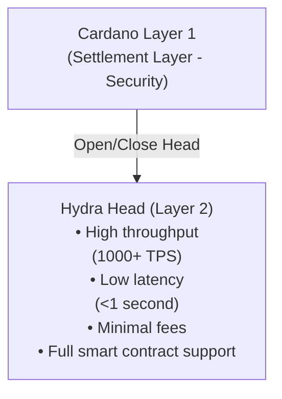

# Why Hydra?

Hydra は、スループット、レイテンシ、手数料を大幅に改善しつつ、セキュリティと分散性を維持するために設計された Cardano の Layer 2 スケーリングソリューションです。

## スケーラビリティの課題

ブロックチェーンネットワークは、次のような根本的なスケーラビリティ制約を抱えています。

- **スループットの制限** – Layer 1 チェーンはトランザクション処理能力に上限があり（Cardano mainnet: 理論値 ~250 TPS）、高頻度トラフィックに向きません。
- **高いレイテンシ** – ブロック確定までの時間が長く（Cardano では 20 秒以上）、ユーザー体験に影響します。
- **手数料の増加** – ネットワーク混雑によりトランザクションフィーが高騰します。
- **リソース制約** – すべてのノードがすべてのトランザクションを処理する必要があります。

その結果、以下のようなユースケースは Layer 1 だけでは実現が難しくなります。

- リアルタイムゲーム
- マイクロペイメント
- 高頻度取引
- 双方向にインタラクティブな DApp

## Hydra が解決すること

### Isomorphic State Channels

Hydra は **isomorphic state channels** という、Layer 1 の機能をそのままオフチェーン環境に写像した仕組みを用います。



### 主な利点

#### 1. **大幅なスループット向上**

- **Layer 1**: 理論値 ~250 TPS、実効 ~50–100 TPS
- **Hydra Head**: 1,000+ TPS / Head
- **複数 Head**: Head の数に応じてほぼ線形にスケール

```typescript
// 高頻度トランザクションの送信例
for (let i = 0; i < 1000; i++) {
  await bridge.submitTransaction(tx)
  // 各トランザクションは 1 秒未満で確定
}
```

#### 2. **ほぼ即時のファイナリティ**

Hydra Head 内では、トランザクションは 1 秒未満で確定します。

| Metric | Layer 1 | Hydra Head |
|--------|---------|------------|
| Confirmation Time | 20+ seconds | <1 second |
| Block Time | 20 seconds | ~100ms |
| Finality | 2-3 minutes | Instant |

#### 3. **極めて低いトランザクションコスト**

- **Layer 1**: 平均 ~0.17 ADA 程度の手数料
- **Hydra Head**: コンセンサスオーバーヘッドのみでほぼゼロに近いコスト
- **コスト削減**: 高頻度トラフィックでは 99% 以上の手数料削減が可能

```typescript
// コスト比較のイメージ
const layer1Cost = 1000 * 0.17 // 1000 tx で約 170 ADA
const hydraCost = 2 * 0.17 + 0.001 * 1000 // 合計 ~1.4 ADA 程度
// 削減率: 約 99.2%
```

#### 4. **フルスマートコントラクト対応**

Hydra Head は Layer 1 と同等の Plutus smart contracts をサポートします。

- ✅ Native token / NFT
- ✅ カスタムバリデータ
- ✅ DeFi プロトコル
- ✅ ステートマシン
- ✅ マルチシグロジック

#### 5. **予測可能なパフォーマンス**

Layer 1 と異なり、Hydra Head 内のパフォーマンスは以下の要因に影響されません。

- ネットワーク混雑
- ブロックサイズ制限
- Mempool 競合
- 他ユーザーのトラフィック

## ユースケース

### 1. Gaming / Metaverse

**要件**: リアルタイム性、高頻度の状態更新、低コスト

```typescript
// ゲーム内アイテム転送
const transferItem = async (from, to, itemNFT) => {
  const tx = await builder.transferNFT({
    from: from.address,
    to: to.address,
    policyId: itemNFT.policy,
    assetName: itemNFT.name
  })
  
  await bridge.submitTransaction(tx)
  // 1 秒未満で確定
}
```

### 2. Micropayments / Streaming

**要件**: 少額・高頻度・手数料極小

```typescript
// コンテンツストリーミングの秒単位課金
const streamingPayment = async () => {
  const perSecondCost = 0.001 // ADA
  
  setInterval(async () => {
    await bridge.submitTransaction(
      buildPayment(creator, perSecondCost)
    )
  }, 1000)
}
```

### 3. DeFi Trading

**要件**: 高速実行、低レイテンシ、MEV 耐性

```typescript
// 高頻度 DEX トレード
const executeTrade = async (tokenA, tokenB, amount) => {
  const tx = await dex.swap({
    from: tokenA,
    to: tokenB,
    amount: amount
  })
  
  await bridge.submitTransaction(tx)
}
```

### 4. NFT Marketplaces

**要件**: 高速オークション、バッチ操作、低い出品コスト

```typescript
// リアルタイム NFT オークション
const placeBid = async (auctionId, bidAmount) => {
  const tx = await marketplace.bid({
    auction: auctionId,
    amount: bidAmount,
    bidder: wallet.address
  })
  
  await bridge.submitTransaction(tx)
}
```

### 5. Social / Governance

**要件**: 高いユーザーインタラクション、投票、コンテンツモデレーション

```typescript
// ガバナンス投票
const vote = async (proposalId, choice) => {
  const tx = await governance.castVote({
    proposal: proposalId,
    vote: choice,
    voter: wallet.address
  })
  
  await bridge.submitTransaction(tx)
}
```

## Hydra の比較

### Hydra vs Layer 1

| Feature | Cardano L1 | Hydra Head |
|---------|-----------|------------|
| Throughput | ~100 TPS | 1,000+ TPS |
| Latency | 20+ seconds | <1 second |
| Fees | ~0.17 ADA | ~0.001 ADA |
| Smart Contracts | Full Plutus | Full Plutus |
| Security | Layer 1 | Head 参加者の合意 |
| Finality | 2-3 minutes | Instant |

### Hydra vs 他の L2

**Hydra の強み**:

- ✅ Isomorphic で Layer 1 と同等の smart contracts
- ✅ 別 VM 不要
- ✅ Native multi-asset サポート
- ✅ Head 内で即時ファイナリティ
- ✅ パフォーマンスが予測可能

**トレードオフ**:

- ⚠️ 参加者間の協調が前提
- ⚠️ Head 内の参加者に限定される
- ⚠️ Open / Close 時に Layer 1 コストが発生

## Hydra を使うべき場面

### ✅ 向いているユースケース

- **高トランザクションボリューム** – 既知の参加者間で大量のトランザクションが発生する場合
- **低レイテンシ要件** – リアルタイムまたはそれに近い応答性が必要な場合
- **コストに敏感** – 手数料がビジネスモデルに大きく影響する場合
- **既知の参加者** – ある程度の関係性や信頼がある参加者間
- **セッション型** – 期間限定・セッションベースのインタラクション

### ❌ 不向きなユースケース

- **単発トランザクション** – 一度きりのやり取り
- **完全に未知の相手** – 事前関係のない不特定多数
- **長期保存のみが目的** – ほぼ更新のないストレージ用途
- **完全公開アクセス** – 完全にオープンで誰でも参加できる用途

## 次のステップ

Hydra をアプリケーションに統合したい場合:

1. **[Hydra SDK のセットアップ](/ja/1.getting-started/2.installation)** – 必要なパッケージをインストール
2. **[Hydra 統合ガイド](/ja/3.examples/2.hydra-integration)** – ステップバイステップで統合
3. **[Commit / Decommit を学ぶ](/ja/6.hydra-concept/2.commit-to-hydra)** – UTxO を Hydra Head に出し入れする方法
4. **[Hydra でのトランザクション](/ja/6.hydra-concept/4.transactions-in-hydra)** – Hydra 特有のトランザクション設計

## 参考情報

- [Hydra Official Documentation](https://hydra.family/head-protocol/)
- [Hydra Research Papers](https://iohk.io/en/research/library/)
- [Cardano Scaling Solutions](https://docs.cardano.org/scaling-solutions/)

---

> **Next**: [Commit to Hydra](/ja/6.hydra-concept/2.commit-to-hydra) に進み、UTxO を Hydra Head に commit する方法を学びましょう。
