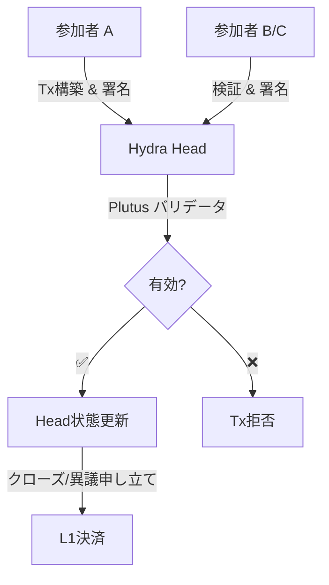

>---
title: Hydraでのスマートコントラクト
description: 複雑なDeFiやDAppロジックのためにHydra HeadでPlutusスマートコントラクトを使用する方法を学びます
author: Ania
date: 2025-11-26
---

# Hydraでのスマートコントラクト

Hydra Headは**同型（isomorphic）**スマートコントラクトをサポートしています。つまり、レイヤー1で実行されるのと同じPlutusスクリプトがレイヤー2でも全く同じように動作します。これにより、即時のファイナリティと最小限の手数料で、複雑なDeFiプロトコル、NFTメカニズム、DAppロジックが可能になります。

## 同型スマートコントラクト

### 同型（Isomorphic）とはどういう意味ですか？

**同型**とは、Hydra Headがレイヤー1と同じ実行環境を使用することを意味します：

- ✅ 同じバリデータスクリプト
- ✅ 同じ検証ロジック
- ✅ 同じデータム/リディーマー構造
- ✅ 同じネイティブアセットサポート
- ✅ コード変更不要

```
┌──────────────────────────────┐
│    Your validator script     │
│                              │
│  validator :: Datum ->       │
│              Redeemer ->     │
│              ScriptContext ->│
│              Bool            │
└──────────┬─────────┬─────────┘
           │         │
     ┌─────▼─────┐   │
     │ Layer 1   │   │
     │ Mainnet   │   │
     └───────────┘   │
                     │
              ┌──────▼──────┐
              │ Hydra Head  │
              │  (Layer 2)  │
              └─────────────┘
```

## Hydraでのスマートコントラクトの使用
Plutusスマートコントラクトは、Cardanoレイヤー1で動作するのと同様に、Hydra Head内でも動作します。つまり、オンチェーンロジックを変更することなく、バリデータ、データム、リディーマーを再利用でき、Head内での高速なトランザクション、低手数料、即時ファイナリティの恩恵を受けることができます。

### プロセスの概要

- レイヤー1のバリデータを通常通り作成します — データム/リディーマーの形式を一貫させます。
- レイヤー1でスクリプトUTxOをロックします（例：Headにコミットするか、既存のスクリプトUTxOを参照します）。
- Hydra Head内で、同じスクリプト、データム、リディーマーを使用する（オフチェーン）トランザクションを構築します。
- トランザクションはHead参加者によってバリデータルールに対して検証されます。有効であれば、Headの状態が更新されます。
- Headがクローズ/決済されると、最終状態がL1に投稿され、変更がスクリプトバリデータによって適用されます。

### 例: バリデータ (Aiken, Always True)

```sh
# always-true.ak (apps/nodejs-playground/src/contract/always-true.ak)

use cardano/transaction.{ OutputReference, Transaction}
validator always_true {
    spend (
        _datum: Option<Data>,
        _redeemer: Data,
        _output_ref: OutputReference,
        _tx: Transaction,
    ) {
        True
    }

    else(_) {
        fail
    }
}
```
コンパイル後、以下のファイルが得られます：

`always-true.json`: [nodejs-playground/src/contract/always-true.json](https://github.com/Vtechcom/hydra-sdk/blob/master/apps/nodejs-playground/src/contract/always-true.json)


### 例: SDKの使用 (TypeScript)

`apps/nodejs-playground/src/contract/` のサンプルスクリプトは、ロック/アンロックのフローを示しています：

- **ロック**: スクリプトUTxOを作成 → `npx tsx src/contract/hydra-lock.ts`

```ts
import contract from './always-true.json'
import { DatumUtils, Deserializer, TimeUtils, SLOT_CONFIG_NETWORK } from '@hydra-sdk/core'
import { buildRedeemer, emptyRedeemer, TxBuilder } from '@hydra-sdk/transaction'

// Build datum
const { paymentCredentialHash: pubKeyHash } = Deserializer.deserializeAddress(walletAddress)
const system_unlocked_at = Date.now() + 1 * 60 * 1000 // now + 1 minute

const datum = DatumUtils.mkConstr(0, [
      DatumUtils.mkBytes(pubKeyHash!),
      DatumUtils.mkInt(system_unlocked_at),
])

const txBuilder = new TxBuilder({
      isHydra: true,
      params: {
            minFeeA: 0,
            minFeeB: 0
      }
})
const txLock = await txBuilder
      .setInputs(addressUTxO)
      .addOutput({
            address: contract.address,
            amount: [{ unit: 'lovelace', quantity: String(2_000_000) }]
      })
      .txOutInlineDatumValue(datum)
      .changeAddress(walletAddress)
      .complete()

```

- **アンロック**: スクリプトUTxOを消費 → `npx tsx src/contract/hydra-unlock.ts <txHash#index>`


```ts
import contract from './always-true.json'
import { DatumUtils, Deserializer, TimeUtils, SLOT_CONFIG_NETWORK } from '@hydra-sdk/core'
import { buildRedeemer, emptyRedeemer, TxBuilder } from '@hydra-sdk/transaction'

const txBuilder = new TxBuilder({
      isHydra: true,
      params: {
            minFeeA: 0,
            minFeeB: 0
      }
})

const SLOT_CONFIG: (typeof SLOT_CONFIG_NETWORK)['PREPROD'] = {
      zeroTime: 1762267312000, // Timestamp in ms when start hydra head network
      zeroSlot: 0,
      slotLength: 1000,
      epochLength: 432000,
      startEpoch: 0,
} as const;

const txUnlock = await txBuilder
      .setInputs(inputUTxOs)
      .txIn(
            scriptUTxO.input.txHash, 
            scriptUTxO.input.outputIndex, 
            scriptUTxO.output.amount, 
            scriptUTxO.output.address
      )
      .txInScript(contract.cborHex)
      .txInInlineDatum(scriptUTxO.output.inlineDatum!)
      .txInRedeemerValue(
            emptyRedeemer({ type: 'int', exUnits: { mem: '100000', steps: '25000000' } })
      )
      .txInCollateral(
            collateralUTxO.input.txHash,
            collateralUTxO.input.outputIndex,
            collateralUTxO.output.amount,
            collateralUTxO.output.address
      )
      .addOutput({
            address: walletAddress,
            amount: scriptUTxO.output.amount // send all assets back to myself
      })
      .changeAddress(walletAddress)
      .invalidBefore(TimeUtils.unixTimeToEnclosingSlot(Date.now(), SLOT_CONFIG)) // must be after current slot
      .invalidAfter(TimeUtils.unixTimeToEnclosingSlot(Date.now() + 60 * 60 * 1000, SLOT_CONFIG)) // must be within 1 hour
      .complete()
```


### インタラクションフロー (Mermaid)




### 注意点とベストプラクティス

- コラテラル（担保）: L1でスクリプトを消費するには依然としてコラテラルが必要です。Head内では、ボンディング/コラテラルのルールは、トランザクションバンドルの構築方法とHeadのセキュリティポリシーに依存します。
- 一貫性: L1とHeadの間で、常にデータム/リディーマーを同じ形式でシリアライズしてください。
- オフチェーンコード: オフチェーンロジック（バックエンドまたはdApp）は、署名の調整、Hydraノードとの通信、正しいデータム/リディーマー値の添付を担当します。
- テスト: バリデータをL1テストネットで検証し、複数の参加者がいるHeadシナリオでテストして、同一の動作を確認してください。
- ミント/バーン: Plutusミントポリシーを使用するミント/バーンフローは、ポリシーがL1固有のデータや時間に依存しない限り、Head内でも機能します。ポリシーのセマンティクスに互換性を持たせてください。

### 制限事項と警告

- Headのオープン/クローズは依然としてL1トランザクションです — これらのアクションには決済コストとL1手数料が適用されます。
- L1固有のデータ（例：時間的制約やスロットベースのチェック）に依存する一部のバリデータは、Headで実行する際に特別な処理が必要になる場合があります — コンテキスト内でセマンティクスを確認してください。
- データ可用性: 紛争やクローズフローのために状態を再構築できるよう、参加者が必要なオフチェーンデータを維持していることを確認してください。

### 参考文献

- [Hydraへのコミット](/hydra-concept/commit-to-hydra)
- [Hydraでのトランザクション](/hydra-concept/transactions-in-hydra)
- [Hydra Head プロトコル](https://hydra.family/head-protocol/)
- [Hydra 既知の問題](https://hydra.family/head-protocol/docs/known-issues)
