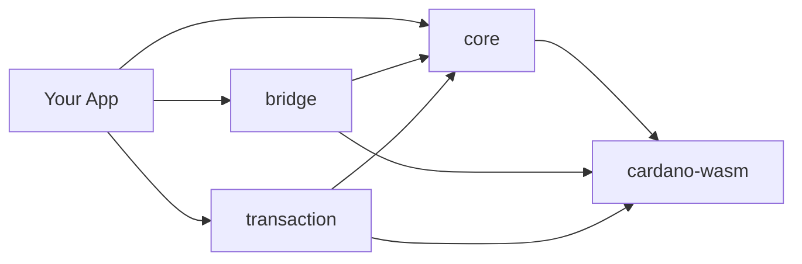

# Bắt Đầu

Chào mừng bạn đến với Hydra SDK! Hướng dẫn này sẽ giúp bạn thiết lập và bắt đầu với SDK ví Cardano nhanh nhất và đáng tin cậy nhất được thiết kế cho phát triển web hiện đại.

## Tổng quan

Hydra SDK là một bộ công cụ thế hệ mới giúp việc phát triển ví Cardano và tích hợp Hydra Layer 2 trở nên cực kỳ nhanh chóng và đơn giản. Được xây dựng với **WebAssembly (WASM)** làm nền tảng, SDK mang lại **hiệu suất ở mức native** trong trình duyệt đồng thời cung cấp khả năng tích hợp liền mạch với các build tool hiện đại như **Vite** và **Rollup**.

**Phiên Bản Mới Nhất: v1.1.0** - Được nâng cấp với các utility functions toàn diện và trải nghiệm developer được cải thiện.

**Hydra SDK Playground đã sẵn sàng** - Thử nghiệm các tính năng SDK trực tiếp trong trình duyệt của bạn mà không cần cài đặt gì! [Truy cập Playground](https://play.hydrasdk.com/)

### Tại sao chọn Hydra SDK?

- **⚡ Tốc Độ Siêu Nhanh**: Core được hỗ trợ bởi WASM mang lại hiệu suất nhanh hơn đến 10 lần so với các JavaScript SDK truyền thống (ví dụ: cardano-js)
- **🔧 Zero Bundle Issues**: Hỗ trợ sẵn sàng cho Vite và Rollup, với hướng dẫn cấu hình chi tiết cho Nuxt 3, React + Vite, và Next.js
- **📦 Kiến Trúc Hiện Đại**: Thiết kế package modular cho phép bạn chỉ cài đặt những gì cần thiết
- **🌐 Tối ưu với Browser**: Tương thích cao với các DApp chạy trên trình duyệt
- **🔒 Type-Safe**: Hỗ trợ đầy đủ TypeScript với định nghĩa type toàn diện
- **🛠️ Rich Utilities**: Bộ sưu tập toàn diện các utility functions cho phát triển Cardano

## Có Gì Mới trong v1.1.0

- **Enhanced Utilities System**: Organized namespaces cho data parsing, datum creation, policy management, và time calculations
- **Improved Developer Experience**: Type safety tốt hơn và thiết kế API sạch hơn
- **Provider Abstractions**: Unified interfaces cho các nguồn dữ liệu blockchain khác nhau
- **Advanced Examples**: Real-world implementation patterns và best practices

## Bạn sẽ học được gì

Trong phần bắt đầu này, bạn sẽ học cách:

- [Cài đặt và thiết lập](/vi/getting-started/installation) SDK trong dự án của bạn
- [Tạo ví đầu tiên](/vi/getting-started/quick-start) và thực hiện các thao tác cơ bản
- [Cấu hình SDK](/vi/getting-started/configuration) theo nhu cầu cụ thể của bạn
- [Nâng cấp từ phiên bản cũ](/vi/getting-started/migration-v1.1.0) lên v1.1.0 (nếu áp dụng)

## Yêu cầu hệ thống

Trước khi bắt đầu, hãy đảm bảo bạn có:

- **Node.js 18.20.0 trở lên** - [Tải Node.js](https://nodejs.org/)
- **Package manager** - npm, pnpm, hoặc yarn
- **Kiến thức cơ bản về TypeScript/JavaScript**
- **Hiểu biết về các khái niệm Cardano** (address, UTxO, transaction)

## Tổng quan kiến trúc

SDK bao gồm bốn package chính:

### Core Packages

1. **@hydra-sdk/core** - Quản lý ví và các thao tác Cardano
2. **@hydra-sdk/bridge** - Tích hợp Hydra Layer 2
3. **@hydra-sdk/transaction** - Tiện ích xây dựng transaction
4. **@hydra-sdk/cardano-wasm** - Binding Cardano WASM

### Package Dependencies

## Quy trình phát triển

Đây là quy trình điển hình khi làm việc với SDK:

1. **Cài đặt packages** - Thêm các package SDK cần thiết vào dự án
2. **Tạo ví** - Khởi tạo instance ví cho ứng dụng của bạn
3. **Kết nối network** - Kết nối đến mạng Cardano và/hoặc Hydra Node
4. **Xây dựng transaction** - Tạo và ký transaction
5. **Gửi transaction** - Gửi lên network hoặc Hydra Head

## Bước tiếp theo

Sẵn sàng bắt đầu? Làm theo các hướng dẫn này theo thứ tự:

1. **[Cài Đặt](/vi/getting-started/installation)** - Cài đặt các package SDK
2. **[Khởi Động Nhanh](/vi/getting-started/quick-start)** - Tạo ví đầu tiên của bạn
3. **[Cấu Hình](/vi/getting-started/configuration)** - Cấu hình cho production

## Cần trợ giúp?

Nếu bạn gặp vấn đề gì:

- Kiểm tra [API Reference](/vi/api/) để xem tài liệu chi tiết
- Xem [Examples](/vi/examples/) để có các mẫu code thực tế
- Truy cập [GitHub Issues](https://github.com/Vtechcom/hydra-sdk/issues) để báo cáo bug
- Tham gia [GitHub Discussions](https://github.com/Vtechcom/hydra-sdk/discussions) để được hỗ trợ từ cộng đồng
- **[Repository Ví Dụ Đầy Đủ](https://github.com/Vtechcom/hydra-sdk-examples)** - Các ứng dụng hoạt động hoàn chỉnh

## Tiếp theo là gì?

Sau khi hoàn thành hướng dẫn bắt đầu, bạn có thể muốn khám phá:

- **[Xây Dựng Ứng Dụng Ví](/vi/guides/building-wallet-app)** - Hướng dẫn ứng dụng ví hoàn chỉnh
- **[Quản Lý Hydra Head](/vi/guides/hydra-head-management)** - Tích hợp Hydra nâng cao
- **[Chiến Lược Testing](/vi/guides/testing-strategies)** - Test ứng dụng của bạn
- **[Deployment](/vi/guides/deployment)** - Deploy lên production

## So sánh với javascript-based SDK

### Ưu điểm của Hydra SDK

- **Không cần thiết lập polyfill**: Nhiều JavaScript-based SDK, được xây dựng trên các thư viện truyền thống, yêu cầu polyfill cho khả năng tương thích trình duyệt, điều này có thể làm phức tạp việc thiết lập, đặc biệt với các công cụ hiện đại như Vite và Rollup. Hydra SDK, tận dụng `cardano-serialization-lib` (WASM), loại bỏ nhu cầu polyfill, đảm bảo tích hợp liền mạch với các build tool hiện đại.
- **Tương thích đa môi trường**: Hydra SDK được thiết kế để hoạt động hiệu quả trên Node.js, trình duyệt, và thậm chí cả các nền tảng di động như React Native, mang lại sự linh hoạt lớn hơn cho các developer.
- **Hỗ trợ dapp hiện đại**: Hydra SDK được tối ưu hóa cho các DApp hiện đại, đảm bảo tương thích với các framework tiên tiến như Nuxt 3, React + Vite, và Next.js.
- **Tương thích vite và rollup**: Không giống như nhiều JavaScript-based SDK, gặp vấn đề bundling với Vite và Rollup do thiếu polyfill cho các Node.js core module (ví dụ: `util`, `stream`, `crypto`), Hydra SDK tránh hoàn toàn những vấn đề này bằng cách sử dụng implementation dựa trên WASM.

