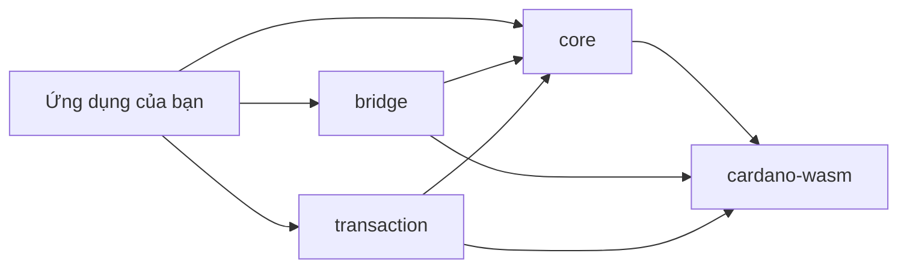

# Bắt đầu sử dụng

Chào mừng bạn đến với Hydra SDK! Hướng dẫn này sẽ giúp bạn thiết lập và sử dụng bộ SDK ví Cardano nhanh nhất, ổn định nhất dành cho phát triển web hiện đại.

## Tổng quan

Hydra SDK là một bộ công cụ thế hệ mới giúp việc phát triển ví Cardano và tích hợp Hydra Layer 2 trở nên cực kỳ nhanh chóng và đơn giản. Được xây dựng với **WebAssembly (WASM)** làm nền tảng, SDK mang lại **hiệu suất ở mức native** trong trình duyệt đồng thời cung cấp khả năng tích hợp liền mạch với các build tool hiện đại như **Vite** và **Rollup**.

**Phiên bản mới nhất: v1.4.0** – Bổ sung namespace RedeemerUtils, các encoder DatumUtils mới, ValidationUtils, và hỗ trợ Cardano protocol v11. [Xem chi tiết](/vi/getting-started/change-logs)

### Vì sao chọn Hydra SDK?

- **⚡ Tốc Độ Siêu Nhanh**: Core được hỗ trợ bởi WASM mang lại hiệu suất nhanh hơn đến 10 lần so với các JavaScript SDK truyền thống (ví dụ: cardano-js)
- **🔧 Zero Bundle Issues**: Hỗ trợ sẵn sàng cho Vite và Rollup, với hướng dẫn cấu hình chi tiết cho Nuxt 3, React + Vite, và Next.js
- **📦 Kiến Trúc Hiện Đại**: Thiết kế package modular cho phép bạn chỉ cài đặt những gì cần thiết
- **🌐 Tối ưu với Browser**: Tương thích cao với các DApp chạy trên trình duyệt
- **🔒 Type-Safe**: Hỗ trợ đầy đủ TypeScript với định nghĩa type toàn diện
- **🛠️ Rich Utilities**: Bộ sưu tập toàn diện các utility functions cho phát triển Cardano

## Có gì mới ở v1.4.0

- **RedeemerUtils Namespace**: Các helper mới để xây dựng redeemer (`mkRedeemer`, `mkSpendRedeemer`, `mkMintRedeemer`, `mkUnitRedeemer`, `mkExUnits`)
- **Các encoder DatumUtils mới**: `mkBool`, `mkOption`, `mkBytesList`, `mkIntList`, `mkOutputRef`, `mkAddress`, và `parseAddress`
- **ValidationUtils**: `isValidTxOutput` được chuyển sang một namespace validation riêng
- **Hỗ trợ Protocol v11**: Cập nhật các default protocol parameter (ví dụ: `minPoolCost = 170000000`)

## Bạn sẽ học được gì?

Trong phần bắt đầu này, bạn sẽ học cách:

- [Cài đặt và thiết lập](/getting-started/installation) SDK vào dự án
- [Tạo ví đầu tiên](/getting-started/quick-start) và thực hiện các thao tác cơ bản
- [Cấu hình SDK](/getting-started/configuration) theo nhu cầu
- [Di chuyển từ phiên bản cũ](/getting-started/migration-v1.1.0) lên v1.1.0 (nếu cần)

## Yêu cầu trước khi bắt đầu

Trước khi bắt đầu, hãy đảm bảo bạn có:

- **Node.js 18.20.0 trở lên** – [Tải Node.js](https://nodejs.org/)
- **Trình quản lý package** – npm, pnpm hoặc yarn
- **Kiến thức cơ bản về TypeScript/JavaScript**
- **Hiểu các khái niệm Cardano** (địa chỉ, UTxO, giao dịch)

## Tổng quan kiến trúc

SDK gồm 4 package chính:

### Các package lõi

1. **@hydra-sdk/core** – Quản lý ví và thao tác Cardano
2. **@hydra-sdk/bridge** – Tích hợp Hydra Layer 2
3. **@hydra-sdk/transaction** – Tiện ích xây dựng giao dịch
4. **@hydra-sdk/cardano-wasm** – Liên kết WASM Cardano

### Phụ thuộc giữa các package

## Quy trình phát triển

Quy trình điển hình khi dùng SDK:

1. **Cài đặt package** – Thêm các package SDK cần thiết vào dự án
2. **Tạo ví** – Khởi tạo instance ví cho ứng dụng
3. **Kết nối mạng** – Kết nối mạng Cardano và/hoặc Hydra Node
4. **Xây dựng giao dịch** – Tạo và ký giao dịch
5. **Gửi giao dịch** – Gửi lên mạng hoặc Hydra Head

## Tiếp theo

Sẵn sàng bắt đầu? Làm theo các hướng dẫn sau:

1. **[Cài đặt](/getting-started/installation)** – Cài các package SDK
2. **[Khởi động nhanh](/getting-started/quick-start)** – Tạo ví đầu tiên
3. **[Cấu hình](/getting-started/configuration)** – Cấu hình cho môi trường production

## Cần hỗ trợ?

Nếu gặp vấn đề:

- Xem [API Reference](/api/) để tra cứu chi tiết
- Xem [Examples](/examples/) để tham khảo mẫu code
- Truy cập [GitHub Issues](https://github.com/Vtechcom/hydra-sdk/issues) để báo lỗi
- Tham gia [GitHub Discussions](https://github.com/Vtechcom/hydra-sdk/discussions) để trao đổi cộng đồng
- **[Repo ví dụ đầy đủ](https://github.com/Vtechcom/hydra-sdk-examples)** – Ứng dụng mẫu hoàn chỉnh

## Tiếp theo?

Sau khi hoàn thành hướng dẫn bắt đầu, bạn có thể tìm hiểu thêm:

- **[Xây dựng ứng dụng ví](/guides/building-wallet-app)** – Hướng dẫn xây dựng ví hoàn chỉnh
- **[Quản lý Hydra Head](/guides/hydra-head-management)** – Tích hợp Hydra nâng cao
- **[Chiến lược kiểm thử](/guides/testing-strategies)** – Kiểm thử ứng dụng
- **[Triển khai](/guides/deployment)** – Đưa ứng dụng lên production

## So sánh với SDK JavaScript truyền thống

### Ưu điểm của Hydra SDK

- **Không cần polyfill**: Nhiều SDK JavaScript truyền thống cần polyfill để chạy trên trình duyệt, gây phức tạp khi dùng với Vite/Rollup. Hydra SDK dùng `cardano-serialization-lib` (WASM) nên không cần polyfill, tích hợp mượt với các công cụ build hiện đại.
- **Tương thích đa nền tảng**: Hydra SDK hoạt động tốt trên Node.js, trình duyệt, cả React Native, linh hoạt cho lập trình viên.
- **Hỗ trợ DApp hiện đại**: Tối ưu cho DApp mới, tương thích Nuxt 3, React + Vite, Next.js.
- **Tương thích Vite/Rollup**: Không gặp lỗi bundle do thiếu polyfill các module Node.js (ví dụ: `util`, `stream`, `crypto`) nhờ dùng WASM.

