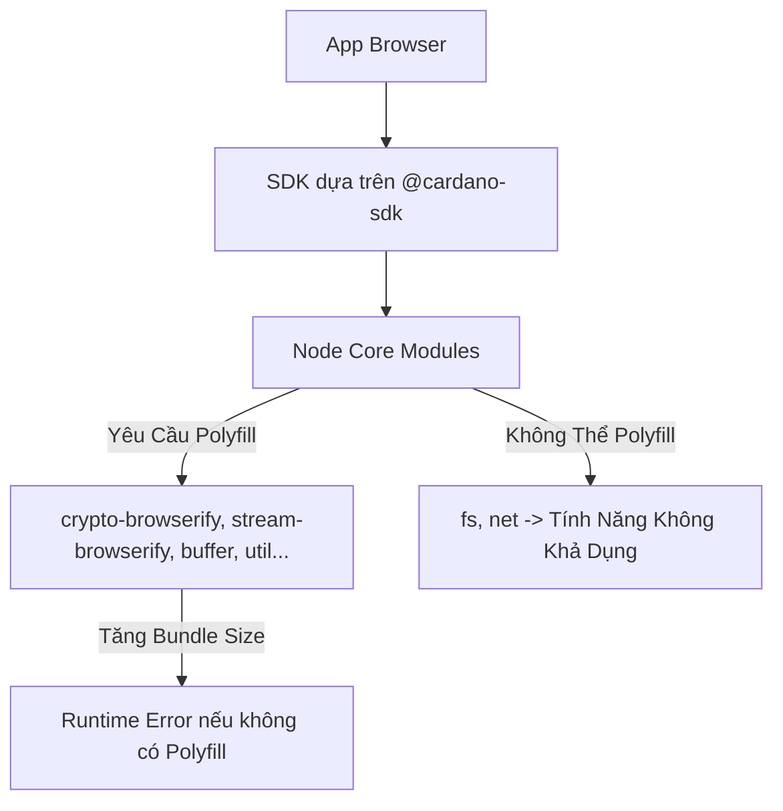
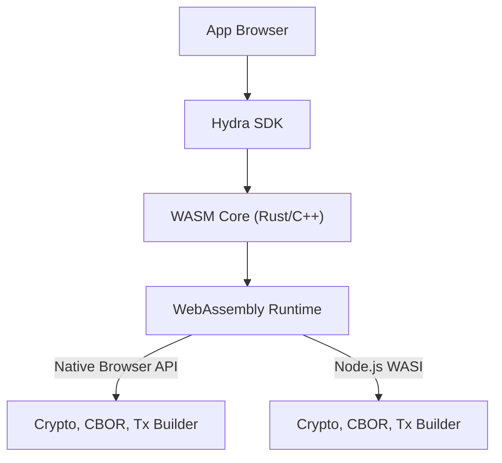

# Hiệu Suất và So Sánh

## Tại Sao WASM Cho Hydra SDK?

Hydra SDK tận dụng **WebAssembly (WASM)** để vượt qua những hạn chế của các JavaScript-based SDK truyền thống như `@cardano-sdk`. Đây là lý do tại sao WASM là sự lựa chọn tối ưu:

### Ưu Điểm Chính Của WASM

1. **Loại Bỏ Dependencies Node.js Core Module**:
   - WASM cho phép các chức năng quan trọng (ví dụ: cryptography, CBOR parsing, transaction building) chạy trong môi trường sandbox mà không cần dựa vào các Node.js core module như `crypto`, `stream`, hoặc `fs`.
   - Điều này đảm bảo tương thích trên cả môi trường browser và Node.js.

2. **Giảm Bundle Size**:
   - WASM chỉ load những function cần thiết, tránh việc cần polyfill như `crypto-browserify` hoặc `stream-browserify`.
   - Điều này dẫn đến bundle nhỏ hơn đáng kể so với các SDK dựa trên Node.js module.

3. **Tăng Hiệu Suất**:
   - WASM thực thi các thao tác cryptographic và parsing transaction ở tốc độ gần native, giảm overhead của JavaScript runtime.

4. **Tương Thích Đa Nền Tảng**:
   - Một WASM binary duy nhất có thể chạy liền mạch trên browser, Node.js (thông qua WASI), và các nền tảng mobile (thông qua bridge).
   - Điều này loại bỏ nhu cầu interop phức tạp giữa CommonJS và ESM module.

---

## So Sánh Các Giải Pháp Cardano SDK

### Bảng So Sánh Chi Tiết

| Tiêu Chí                        | **SDK dựa trên @cardano-sdk**            | **Hydra SDK** (dựa trên WASM) |
|---------------------------------|-------------------------------------------|-----------------------------------|
| **Tương Thích Browser**       | Yêu cầu polyfill cho Node.js core module; một số API (ví dụ: `fs`, `net`) không khả dụng. | Hỗ trợ browser native; không cần polyfill. |
| **Bundle Size**                 | Rất lớn (hàng trăm KB đến >1MB) do polyfill. | Compact (chỉ load WASM + minimal JS glue code). |
| **Node.js Dependency**          | Cao, với import trực tiếp các Node.js core module. | Không có; tất cả logic core nằm trong WASM. |
| **Interop (ESM/CJS)**           | Dễ gặp lỗi (`exports is not defined`, `.default is not a function`). | Không có vấn đề; JavaScript ESM thuần túy. |
| **Hiệu Suất Crypto/CBOR**     | Trung bình (JavaScript thuần, phụ thuộc vào polyfill hiệu suất thấp). | Cao (WASM tốc độ gần native). |
| **Hỗ Trợ Đa Nền Tảng**      | Tốt cho Node.js, hạn chế cho browser. | Tuyệt vời; hoạt động trên browser, Node.js, và mobile. |
| **Tree-Shaking**                | Hạn chế, vì Node.js import rải rác, dẫn đến unused code trong bundle. | Tuyệt vời; chỉ các WASM function cần thiết được bundle. |
| **Bảo Trì & Khả Năng Mở Rộng**| Phức tạp, vì cần theo dõi thay đổi Node.js API và polyfill. | Dễ bảo trì; logic core được implement trong Rust/C++ và expose qua WASM. |

---

## Sơ Đồ Dependency Flow

### Vấn Đề Với SDK Dựa Trên `@cardano-sdk`

### Hydra SDK (Dựa Trên WASM)

---

## Kết Luận

Kiến trúc dựa trên WASM của Hydra SDK cung cấp một giải pháp mạnh mẽ, hiệu quả và đa nền tảng cho các DApp Cardano hiện đại. Bằng cách loại bỏ Node.js dependency, giảm bundle size và tăng hiệu suất, nó giải quyết những hạn chế của các SDK dựa trên `@cardano-sdk`.
