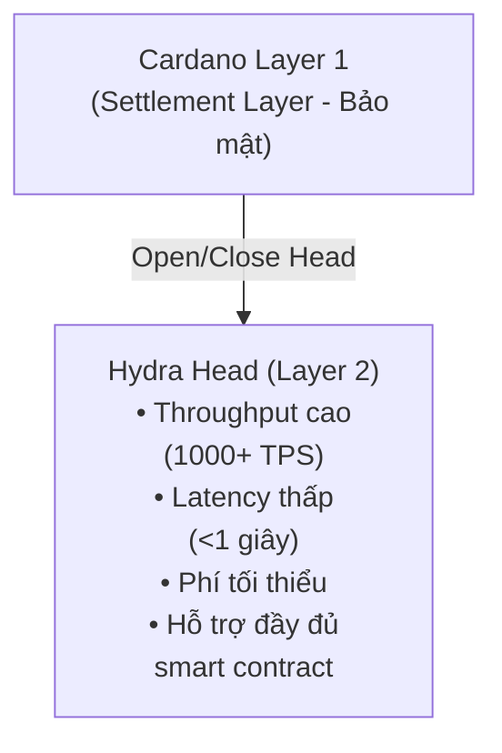

# Tại sao chọn Hydra?

Hydra là giải pháp mở rộng Layer 2 của Cardano giải quyết bài toán tam giác blockchain bằng cách cung cấp throughput cao, latency thấp, và chi phí transaction tối thiểu trong khi vẫn duy trì tính bảo mật và phi tập trung.

## Thách Thức Về Khả Năng Mở Rộng

Các mạng blockchain đối mặt với những hạn chế mở rộng cơ bản:

- **Throughput Giới Hạn** - Blockchains Layer 1 xử lý transactions chậm (Cardano mainnet: ~250 TPS lý thuyết)
- **Latency Cao** - Thời gian xác nhận block tạo ra độ trễ (20+ giây trên Cardano)
- **Phí Tăng Cao** - Tắc nghẽn mạng làm tăng chi phí transaction
- **Ràng Buộc Tài Nguyên** - Mọi node phải xử lý mọi transaction

Những hạn chế này khiến một số ứng dụng không thể thực hiện được trên Layer 1:

- Gaming thời gian thực
- Micropayments
- Giao dịch tần suất cao
- DApps tương tác

## Cách Hydra Giải Quyết

### Isomorphic State Channels

Hydra tạo ra **isomorphic state channels** - môi trường off-chain phản ánh khả năng của Layer 1:



### Lợi Ích Chính

#### 1. **Tăng Throughput Đáng Kể**

- **Layer 1**: ~250 TPS lý thuyết, ~50-100 TPS thực tế
- **Hydra Head**: 1,000+ TPS mỗi head
- **Nhiều Heads**: Mở rộng tuyến tính theo số lượng heads

```typescript
// Ví dụ: Xử lý nhiều transactions nhanh chóng
for (let i = 0; i < 1000; i++) {
  await bridge.submitTx(tx)
  // Mỗi transaction được xác nhận trong <1 giây
}
```

#### 2. **Finality Gần Như Tức Thì**

Transactions được xác nhận trong vòng dưới 1 giây trong Hydra Head:

| Chỉ số | Layer 1 | Hydra Head |
|--------|---------|------------|
| Thời gian xác nhận | 20+ giây | <1 giây |
| Block time | 20 giây | ~100ms |
| Finality | 2-3 phút | Tức thì |

#### 3. **Chi Phí Transaction Tối Thiểu**

- **Layer 1**: ~0.17 ADA phí trung bình
- **Hydra Head**: Phí không đáng kể (chỉ có overhead consensus)
- **Tiết Kiệm Chi Phí**: Giảm 99%+ cho các operations tần suất cao

```typescript
// So sánh chi phí
const layer1Cost = 1000 * 0.17 // 170 ADA cho 1000 txs
const hydraCost = 2 * 0.17 + 0.001 * 1000 // ~1.4 ADA tổng
// Tiết kiệm: ~99.2%
```

#### 4. **Hỗ Trợ Đầy Đủ Smart Contract**

Hydra Heads hỗ trợ các Plutus smart contracts giống như Layer 1:

- ✅ Native tokens và NFTs
- ✅ Custom validators
- ✅ Giao thức DeFi phức tạp
- ✅ State machines
- ✅ Logic multi-signature

#### 5. **Hiệu Năng Có Thể Dự Đoán**

Không giống Layer 1, hiệu năng của Hydra Head không bị ảnh hưởng bởi:

- Tắc nghẽn mạng
- Giới hạn kích thước block
- Cạnh tranh mempool
- Hoạt động của người dùng khác

## Các Use Cases

### 1. Gaming & Metaverse

**Yêu cầu**: Tương tác thời gian thực, cập nhật trạng thái thường xuyên, chi phí thấp

```typescript
// Chuyển item trong game
const transferItem = async (from, to, itemNFT) => {
  // Chuyển tức thì, chi phí thấp trong Hydra Head
  const tx = await builder.transferNFT({
    from: from.address,
    to: to.address,
    policyId: itemNFT.policy,
    assetName: itemNFT.name
  })
  
  await bridge.submitTx(tx)
  // Xác nhận trong <1 giây
}
```

**Ví dụ**:
- Trading giữa người chơi
- Bảng xếp hạng thời gian thực
- Giao dịch tiền tệ trong game
- Phân phối giải thưởng tournament

### 2. Micropayments & Streaming

**Yêu cầu**: Số tiền transaction nhỏ, tần suất cao, phí tối thiểu

```typescript
// Thanh toán streaming content (mỗi giây)
const streamingPayment = async () => {
  const perSecondCost = 0.001 // ADA
  
  setInterval(async () => {
    await bridge.submitTx(
      buildPayment(creator, perSecondCost)
    )
  }, 1000) // Trả mỗi giây
}
```

**Ví dụ**:
- Streaming nội dung theo giây
- Tips micropayment
- Thanh toán API theo usage
- Settlements cho thiết bị IoT

### 3. DeFi Trading

**Yêu cầu**: Thực thi nhanh, latency thấp, chống MEV

```typescript
// Giao dịch DEX tần suất cao
const executeTrade = async (tokenA, tokenB, amount) => {
  const tx = await dex.swap({
    from: tokenA,
    to: tokenB,
    amount: amount
  })
  
  await bridge.submitTx(tx)
  // Trade thực hiện trong <1 giây với slippage tối thiểu
}
```

**Ví dụ**:
- Order books DEX
- Automated market makers
- Cơ hội arbitrage
- Cơ chế liquidation

### 4. NFT Marketplaces

**Yêu cầu**: Đấu giá nhanh, batch operations, chi phí listing thấp

```typescript
// Đấu giá NFT thời gian thực
const placeBid = async (auctionId, bidAmount) => {
  const tx = await marketplace.bid({
    auction: auctionId,
    amount: bidAmount,
    bidder: wallet.address
  })
  
  await bridge.submitTx(tx)
  // Bid được đặt tức thì, việc đấu thầu cao hơn diễn ra real-time
}
```

**Ví dụ**:
- Đấu giá NFT trực tiếp
- Batch minting collections
- Trading nhanh
- Phân phối royalty

### 5. Social & Governance

**Yêu cầu**: Tương tác người dùng cao, bỏ phiếu, kiểm duyệt nội dung

```typescript
// Bỏ phiếu governance thời gian thực
const vote = async (proposalId, choice) => {
  const tx = await governance.castVote({
    proposal: proposalId,
    vote: choice,
    voter: wallet.address
  })
  
  await bridge.submitTx(tx)
  // Vote được ghi nhận tức thì
}
```

**Ví dụ**:
- Bỏ phiếu DAO
- Tương tác mạng xã hội
- Tips nội dung
- Hệ thống reputation

## So Sánh Hydra với Các Giải Pháp Khác

### Hydra vs Layer 1 Truyền Thống

| Tính năng | Cardano L1 | Hydra Head |
|---------|-----------|------------|
| Throughput | ~100 TPS | 1,000+ TPS |
| Latency | 20+ giây | <1 giây |
| Phí | ~0.17 ADA | ~0.001 ADA |
| Smart Contracts | Full Plutus | Full Plutus |
| Bảo mật | Layer 1 | Consensus participants |
| Finality | 2-3 phút | Tức thì |

### Hydra vs Các Giải Pháp L2 Khác

**Ưu điểm Hydra**:
- ✅ Hỗ trợ đầy đủ smart contract (isomorphic)
- ✅ Không cần virtual machine riêng
- ✅ Hỗ trợ native multi-asset
- ✅ Finality tức thì trong head
- ✅ Hiệu năng có thể dự đoán

**Trade-offs**:
- ⚠️ Yêu cầu sự hợp tác của participants
- ⚠️ Giới hạn ở participants trong head
- ⚠️ Opening/closing có chi phí Layer 1

## Khi Nào Nên Dùng Hydra

### ✅ Use Cases Lý Tưởng

- **Khối Lượng Transaction Cao**: Nhiều transactions giữa các bên đã biết
- **Yêu Cầu Latency Thấp**: Tương tác thời gian thực hoặc gần thời gian thực
- **Nhạy Cảm Chi Phí**: Phí là yếu tố quan trọng
- **Participants Đã Biết**: Các bên tin cậy hoặc bán tin cậy
- **Dựa Trên Session**: Tương tác tạm thời, có giới hạn

### ❌ Không Lý Tưởng Cho

- **Transactions Một Lần**: Transactions đơn lẻ, cô lập
- **Các Bên Không Quen**: Không có mối quan hệ hoặc tin cậy
- **Lưu Trữ Dài Hạn**: Trạng thái vĩnh viễn không có tương tác
- **Truy Cập Công Khai**: Tham gia mở không hạn chế

## Bắt Đầu

Sẵn sàng tích hợp Hydra vào ứng dụng của bạn?

1. **[Cài đặt Hydra SDK](/vi/getting-started/installation)** - Install các packages cần thiết
2. **[Làm theo Hướng Dẫn Tích Hợp](/vi/examples/hydra-integration)** - Tích hợp từng bước
3. **[Khám phá Commit/Decommit](/vi/hydra-concept/commit-to-hydra)** - Quản lý UTxOs trong heads
4. **[Xây Dựng Transactions](/vi/hydra-concept/transactions-in-hydra)** - Tạo Hydra transactions

## Tìm Hiểu Thêm

- [Hydra Official Documentation](https://hydra.family/head-protocol/)
- [Hydra Research Papers](https://iohk.io/en/research/library/)
- [Cardano Scaling Solutions](https://docs.cardano.org/scaling-solutions/)

---

> **Tiếp theo**: Tìm hiểu cách [Commit UTxOs vào Hydra](/vi/hydra-concept/commit-to-hydra) để bắt đầu sử dụng Hydra Heads
