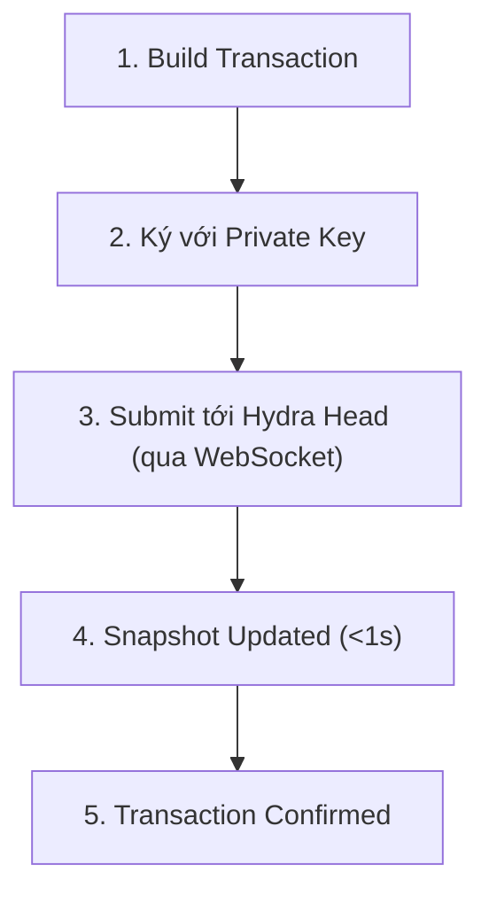

# Transactions trong Hydra

Transactions trong Hydra Head hoạt động tương tự như Layer 1 nhưng thực thi nhanh hơn nhiều và với phí tối thiểu. Hướng dẫn này chỉ cho bạn cách build, submit, và track transactions trong Hydra.

## Hiểu Về Hydra Transactions

### Sự Khác Biệt Chính so với Layer 1

| Khía cạnh | Layer 1 | Hydra Head |
|-----------|---------|------------|
| Thời gian xác nhận | 20+ giây | <1 giây |
| Transaction Fee | ~0.17 ADA | Không đáng kể |
| Throughput | ~100 TPS | 1,000+ TPS |
| Smart Contracts | Full Plutus | Full Plutus (isomorphic) |
| Finality | 2-3 phút | Tức thì |

### Vòng Đời Transaction trong Hydra

> Đang cập nhật...
