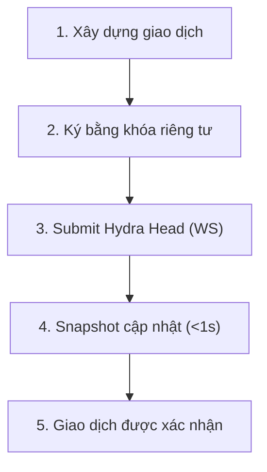

# Transactions trong Hydra

Giao dịch trong Hydra Head hoạt động tương tự như trên Layer 1 nhưng được thực thi nhanh hơn nhiều và với phí tối thiểu. Hướng dẫn này chỉ cho bạn cách xây dựng, gửi và theo dõi giao dịch trong Head.

## Hiểu về giao dịch trong Hydra

### Sự Khác Biệt Chính so với Layer 1

| Khía cạnh          | Layer 1     | Hydra Head               |
| ------------------ | ----------- | ------------------------ |
| Thời gian xác nhận | 20+ giây    | <1 giây                  |
| Phí giao dịch      | ~0.17 ADA   | Không đáng kể            |
| Thông lượng (TPS)  | ~100 TPS    | 1,000+ TPS               |
| Smart Contracts    | Full Plutus | Full Plutus (isomorphic) |
| Finality           | 2-3 phút    | Tức thì                  |

### Vòng đời giao dịch trong Hydra



## Xây dựng và gửi giao dịch trong Hydra

### 1. Điều kiện tiên quyết:

Để gửi giao dịch trong Hydra Head, bạn cần một Head đang hoạt động và kết nối tới Hydra node.

### 2. Kiểm tra UTxO/Tài sản trong Head:

```ts
// src/start-bridge.ts
import { HydraBridge } from '@hydra-sdk/bridge'
async function main() {
	const bridge = new HydraBridge({
		url: 'ws://localhost:4001'
	})
	const connected = await bridge.connect()
	if (!connected) {
		throw new Error('Failed to connect to Hydra node')
	}
	console.log('>>> Connected to Hydra node')

	const utxoObj = await bridge.querySnapshotUtxo()
	console.log('>>> Snapshot UTxO:', utxoObj)
}
main()
```

```bash
npx tsx src/start-bridge.ts
```

Ví dụ đầu ra snapshot:

```plaintext
>>> Connected to Hydra node
>>> Snapshot UTxO: {
  'fa1e2b6eb32b555201dd42140802c49dd56a8093838f3976071281276b93369f#0': {
    address: 'addr_test1qpxsf0x8xypuhq5k408f9kh0meyy6jv2lxgqw2fefvjlte0u06dugtmxuhhw8hschdn4q59g64q5s9z42ax6qyg7ewsqt6e548',
    datum: null,
    datumhash: null,
    inlineDatum: null,
    inlineDatumRaw: null,
    referenceScript: null,
    value: { lovelace: 18000000 }
  }
}
```

### 3. Xây dựng giao dịch

```ts
// src/build-tx.ts
import { HydraBridge } from '@hydra-sdk/bridge'
import { Resolver } from '@hydra-sdk/core'
import { TxBuilder } from '@hydra-sdk/transaction'

async function main() {
	const bridge = new HydraBridge({
		url: 'ws://localhost:4001'
	})
	const connected = await bridge.connect()
	if (!connected) {
		throw new Error('Failed to connect to Hydra node')
	}
	console.log('>>> Connected to Hydra node')

	const utxoObj = await bridge.querySnapshotUtxo()
	console.log('>>> Snapshot UTxO:', utxoObj)

	const addrUtxos = await bridge.queryAddressUTxO(walletAddress)
	const txBuilder = new TxBuilder({
		isHydra: true,
		params: {
			minFeeA: 0,
			minFeeB: 0
		}
	})
	const tx = await txBuilder
		.setInputs(addrUtxos)
		.addOutput({
			address: walletAddress, // địa chỉ đích
			amount: [{ unit: 'lovelace', quantity: String(2_000_000) }]
		})
		.changeAddress(walletAddress)
		.complete()

	const signedCbor = await wallet.signTx(tx.to_hex())
	const txId = Resolver.resolveTxHash(signedCbor)

	const rs = await bridge.submitTxSync({
		cborHex: signedCbor,
		type: 'Witnessed Tx ConwayEra',
		description: 'Test Hydra tx from NodeJS Playground',
		txId: txId
	})
	console.log('>>> Submit tx result:', rs)
}
main()
```

### Cách thay thế: submitTx callback (v1.3.0+)

`submitTx` là biến thể không chặn — hữu ích khi bạn không muốn `await` xác nhận:

```typescript
bridge.submitTx(
	signedTx,
	(error, result) => {
		if (error) {
			console.error('Bị từ chối:', error.reason)
			return
		}
		console.log('Snapshot #', result!.result?.snapshot?.number)
	}
)
```

### 4. Chạy mã

```bash
npx tsx src/build-tx.ts
```

Ví dụ đầu ra:

```plaintext
>>> Connected to Hydra node
>>> Snapshot UTxO: {
  'fa1e2b6eb32b555201dd42140802c49dd56a8093838f3976071281276b93369f#0': {
    address: 'addr_test1qpxsf0x8xypuhq5k408f9kh0meyy6jv2lxgqw2fefvjlte0u06dugtmxuhhw8hschdn4q59g64q5s9z42ax6qyg7ewsqt6e548',
    datum: null,
    datumhash: null,
    inlineDatum: null,
    inlineDatumRaw: null,
    referenceScript: null,
    value: { lovelace: 18000000 }
  }
}
>>> Submit tx result: {
  txId: 'dee1097738688441b2bcf90d9a20ad8eca859375ffdb8f1fde0f78f461345435',
  isValid: true,
  isConfirmed: true,
  result: {
    headId: '7489fdc412ff71a7831ed508e73b2872482099fd4d97ed73663c70f8',
    seq: 227108,
    signatures: { multiSignature: [Array] },
    snapshot: {
      confirmed: [Array],
      headId: '7489fdc412ff71a7831ed508e73b2872482099fd4d97ed73663c70f8',
      number: 1,
      utxo: [Object],
      utxoToCommit: null,
      utxoToDecommit: null,
      version: 0
    },
    tag: 'SnapshotConfirmed',
    timestamp: '2025-11-26T08:01:02.238499906Z'
  }
}
```
