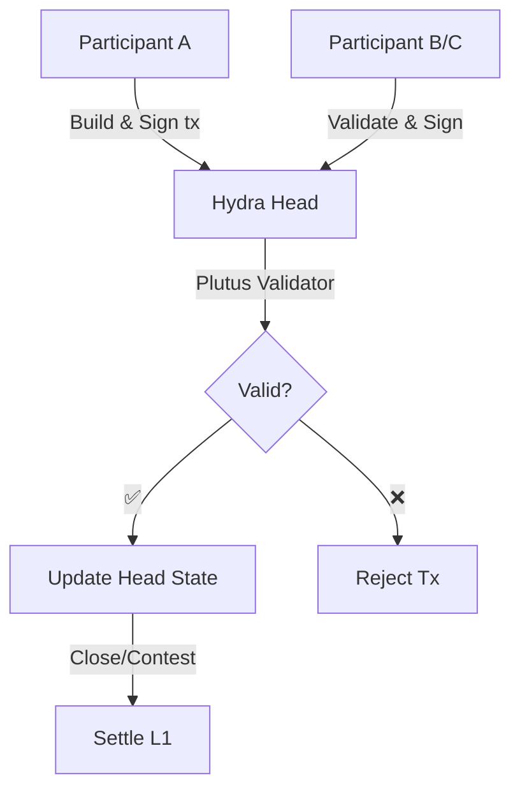

# Smart Contracts trong Hydra

Hydra Heads hỗ trợ **isomorphic** smart contracts - các Plutus scripts chạy trên Layer 1 hoạt động giống hệt trong Layer 2. Điều này cho phép các giao thức DeFi phức tạp, cơ chế NFT, và logic DApp với finality tức thì và phí tối thiểu.

## Isomorphic Smart Contracts

### Isomorphic có nghĩa là gì?

**Isomorphic** nghĩa là Hydra Heads sử dụng cùng một môi trường thực thi như Layer 1:

- ✅ Cùng scripts validator
- ✅ Cùng validation logic
- ✅ Cùng cấu trúc datum/redeemer
- ✅ Cùng hỗ trợ native asset
- ✅ Không cần thay đổi code

```
┌──────────────────────────────┐
│    Scripts validator của bạn │
│                              │
│  validator :: Datum ->       │
│              Redeemer ->     │
│              ScriptContext ->│
│              Bool            │
└──────────┬─────────┬─────────┘
           │         │
     ┌─────▼─────┐   │
     │ Layer 1   │   │
     │ Mainnet   │   │
     └───────────┘   │
                     │
              ┌──────▼──────┐
              │ Hydra Head  │
              │  (Layer 2)  │
              └─────────────┘
```

## Sử Dụng Smart Contracts trong Hydra
Các smart contract hoạt động trong Hydra Head giống hệt như trên Cardano Layer 1. Điều này có nghĩa là bạn có thể tái sử dụng validator, datum, và redeemer mà không phải sửa đổi logic on-chain, đồng thời tận dụng lợi ích của giao dịch nhanh, chi phí thấp và finality trong Head.

### Tóm tắt quy trình

- Viết validator (Layer 1) như bình thường — giữ đồng nhất datum/redeemer.
- Khóa UTxO có script trên Layer 1 (ví dụ commit vào Head hoặc đơn giản là một script UTxO được tham chiếu).
- Trong Hydra Head, xây dựng giao dịch (off-chain) sử dụng cùng script, datum và redeemer.
- Giao dịch được kiểm tra bởi các participant Head theo quy tắc validator; nếu hợp lệ, trạng thái Head được cập nhật.
- Khi Head được đóng/settle, trạng thái cuối cùng được ghi về L1 và áp dụng những thay đổi theo script validator.

### Ví dụ: validator (Aiken, Always True) 

```sh
# always-true.ak (apps/nodejs-playground/src/contract/always-true.ak)

use cardano/transaction.{ OutputReference, Transaction}
validator always_true {
    spend (
        _datum: Option<Data>,
        _redeemer: Data,
        _output_ref: OutputReference,
        _tx: Transaction,
    ) {
        True
    }

    else(_) {
        fail
    }
}
```
Sau khi biên dịch, bạn sẽ có file:

`always-true.json`: [nodejs-playground/src/contract/always-true.json](https://github.com/Vtechcom/hydra-sdk/blob/master/apps/nodejs-playground/src/contract/always-true.json)


### Ví dụ: sử dụng SDK (TypeScript)

Các script mẫu trong `apps/nodejs-playground/src/contract/` minh họa luồng lock/unlock:

- **Lock**: Tạo script UTxO → `npx tsx src/contract/hydra-lock.ts`

```ts
import contract from './always-true.json'
import { DatumUtils, Deserializer, TimeUtils, SLOT_CONFIG_NETWORK } from '@hydra-sdk/core'
import { buildRedeemer, emptyRedeemer, TxBuilder } from '@hydra-sdk/transaction'

// Build datum
const { paymentCredentialHash: pubKeyHash } = Deserializer.deserializeAddress(walletAddress)
const system_unlocked_at = Date.now() + 1 * 60 * 1000 // now + 1 minutes

const datum = DatumUtils.mkConstr(0, [
      DatumUtils.mkBytes(pubKeyHash!),
      DatumUtils.mkInt(system_unlocked_at),
])

const txBuilder = new TxBuilder({
      isHydra: true,
      params: {
            minFeeA: 0,
            minFeeB: 0
      }
})
const txLock = await txBuilder
      .setInputs(addressUTxO)
      .addOutput({
            address: contract.address,
            amount: [{ unit: 'lovelace', quantity: String(2_000_000) }]
      })
      .txOutInlineDatumValue(datum)
      .changeAddress(walletAddress)
      .complete()

```

- **Unlock**: Tiêu thụ script UTxO → `npx tsx src/contract/hydra-unlock.ts <txHash#index>`


```ts
import contract from './always-true.json'
import { DatumUtils, Deserializer, TimeUtils, SLOT_CONFIG_NETWORK } from '@hydra-sdk/core'
import { buildRedeemer, emptyRedeemer, TxBuilder } from '@hydra-sdk/transaction'

const txBuilder = new TxBuilder({
      isHydra: true,
      params: {
            minFeeA: 0,
            minFeeB: 0
      }
})
const txUnlock = await txBuilder
      .setInputs(inputUTxOs)
      .txIn(
            scriptUTxO.input.txHash, 
            scriptUTxO.input.outputIndex, 
            scriptUTxO.output.amount, 
            scriptUTxO.output.address
      )
      .txInScript(contract.cborHex)
      // .txInDatumHash(datum)
      .txInInlineDatum(scriptUTxO.output.inlineDatum!)
      .txInRedeemerValue(
            emptyRedeemer({ type: 'int', exUnits: { mem: '100000', steps: '25000000' } })
      )
      .txInCollateral(
            collateralUTxO.input.txHash,
            collateralUTxO.input.outputIndex,
            collateralUTxO.output.amount,
            collateralUTxO.output.address
      )
      .addOutput({
            address: walletAddress,
            amount: scriptUTxO.output.amount // send all assets back to myself
      })
      .changeAddress(walletAddress)
      .invalidBefore(TimeUtils.unixTimeToEnclosingSlot(Date.now(), SLOT_CONFIG_NETWORK.PREPROD)) // must be after current slot
      .invalidAfter(TimeUtils.unixTimeToEnclosingSlot(Date.now() + 60 * 60 * 1000, SLOT_CONFIG_NETWORK.PREPROD)) // must be within 1 hour
      .complete()
```


### Luồng tương tác (Mermaid)




### Lưu ý và best practices

- Collateral: Khi tiêu thụ script trên L1 vẫn cần collateral; trong Head, ràng buộc cấp bảo hiểm hoặc collateral phụ thuộc vào cách bạn xây dựng gói giao dịch và policy bảo mật của Head.
- Consistency: Luôn serialize datum/redeemer theo cùng một định dạng giữa L1 và Head.
- Off-chain code: Off-chain logic (backend hoặc dApp) phải chịu trách nhiệm phối hợp các signatures, giao tiếp với Hydra node, và đính kèm datum/redeemer chính xác.
- Testing: Kiểm tra validator trên testnet L1 và kiểm thử kịch bản Head (nhiều participant) để đảm bảo hành vi tương tự.
- Minting/Burning: Kịch bản mint/burn sử dụng Plutus minting policy vẫn hoạt động trong Head nếu policy không phụ thuộc vào L1-specific data hoặc thời gian (phải giữ compatible policy semantics).

### Hạn chế & Cảnh báo

- Mở/đóng Head vẫn là giao dịch L1 — chi phí settlement và tính phí L1 vẫn áp dụng cho các hành động trên chain.
- Một số validator có phụ thuộc L1 (temporal constraints, slot-based checks) có thể yêu cầu xử lý đặc biệt khi chạy trong Head: kiểm tra lại hợp lệ theo ngữ cảnh.
- Data availability: Ensure that all participants maintain necessary off-chain data to reconstruct state for dispute/close flows.

### Tài nguyên tham khảo

- [Commit to Hydra](/hydra-concept/commit-to-hydra)
- [Transactions in Hydra](/hydra-concept/transactions-in-hydra)
- [Hydra Head Protocol](https://hydra.family/head-protocol/)
- [Hydra Known Issues](https://hydra.family/head-protocol/docs/known-issues)

