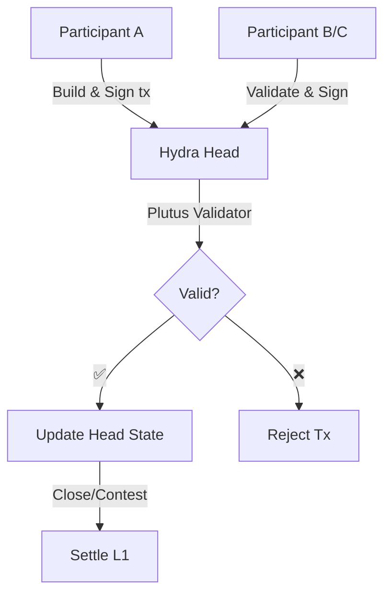

# Smart Contracts trong Hydra

Hydra Head hỗ trợ **isomorphic** smart contracts — các Plutus script chạy trên Layer 1 hoạt động giống hệt trên Layer 2. Điều này cho phép xây dựng các giao thức DeFi phức tạp, cơ chế NFT, và logic DApp với finality tức thì và phí cực thấp.

## Isomorphic Smart Contracts

### Isomorphic có nghĩa là gì?

**Isomorphic** nghĩa là Hydra Head sử dụng cùng môi trường thực thi như Layer 1:

- ✅ Cùng validator script
- ✅ Cùng validation logic
- ✅ Cùng cấu trúc datum/redeemer
- ✅ Cùng hỗ trợ native asset
- ✅ Không cần thay đổi code

```
┌──────────────────────────────┐
│    Validator script của bạn  │
│                              │
│  validator :: Datum ->       │
│              Redeemer ->     │
│              ScriptContext ->│
│              Bool            │
└──────────┬─────────┬─────────┘
           │         │
     ┌─────▼─────┐   │
     │ Layer 1   │   │
     │ Mainnet   │   │
     └───────────┘   │
                     │
              ┌──────▼──────┐
              │ Hydra Head  │
              │  (Layer 2)  │
              └─────────────┘
```

## Sử dụng Smart Contracts trong Hydra
Plutus smart contract hoạt động trong Hydra Head giống hệt như trên Cardano Layer 1. Bạn có thể tái sử dụng validator, datum, redeemer mà không cần thay đổi logic on-chain, đồng thời hưởng lợi từ giao dịch nhanh, phí thấp và finality tức thì trong Head.

### Tóm tắt quy trình

- Viết validator Layer 1 như bình thường — giữ định dạng datum/redeemer nhất quán.
- Khóa một script UTxO trên Layer 1 (ví dụ: commit vào Head hoặc tham chiếu script UTxO có sẵn).
- Trong Hydra Head, xây dựng giao dịch (off-chain) sử dụng cùng script, datum, redeemer.
- Giao dịch được xác thực bởi các participant Head theo quy tắc validator; nếu hợp lệ, trạng thái Head được cập nhật.
- Khi Head đóng/settle, trạng thái cuối cùng được ghi về L1 và script validator áp dụng thay đổi.

### Ví dụ: validator (Aiken, Always True)

```sh
# always-true.ak (apps/nodejs-playground/src/contract/always-true.ak)

use cardano/transaction.{ OutputReference, Transaction}
validator always_true {
    spend (
        _datum: Option<Data>,
        _redeemer: Data,
        _output_ref: OutputReference,
        _tx: Transaction,
    ) {
        True
    }

    else(_) {
        fail
    }
}
```
Sau khi biên dịch bạn sẽ nhận được file:

`always-true.json`: [nodejs-playground/src/contract/always-true.json](https://github.com/Vtechcom/hydra-sdk/blob/master/apps/nodejs-playground/src/contract/always-true.json)


### Ví dụ: sử dụng SDK (TypeScript)

Các script mẫu trong `apps/nodejs-playground/src/contract/` minh họa luồng lock/unlock:

- **Lock**: Tạo script UTxO → `npx tsx src/contract/hydra-lock.ts`

```ts
import contract from './always-true.json'
import { DatumUtils, Deserializer, TimeUtils, SLOT_CONFIG_NETWORK } from '@hydra-sdk/core'
import { buildRedeemer, emptyRedeemer, TxBuilder } from '@hydra-sdk/transaction'

// Build datum
const { paymentCredentialHash: pubKeyHash } = Deserializer.deserializeAddress(walletAddress)
const system_unlocked_at = Date.now() + 1 * 60 * 1000 // now + 1 minute

const datum = DatumUtils.mkConstr(0, [
      DatumUtils.mkBytes(pubKeyHash!),
      DatumUtils.mkInt(system_unlocked_at),
])

const txBuilder = new TxBuilder({
      isHydra: true,
      params: {
            minFeeA: 0,
            minFeeB: 0
      }
})
const txLock = await txBuilder
      .setInputs(addressUTxO)
      .addOutput({
            address: contract.address,
            amount: [{ unit: 'lovelace', quantity: String(2_000_000) }]
      })
      .txOutInlineDatumValue(datum)
      .changeAddress(walletAddress)
      .complete()

```

- **Unlock**: Tiêu thụ script UTxO → `npx tsx src/contract/hydra-unlock.ts <txHash#index>`


```ts
import contract from './always-true.json'
import { DatumUtils, Deserializer, TimeUtils, SLOT_CONFIG_NETWORK } from '@hydra-sdk/core'
import { buildRedeemer, emptyRedeemer, TxBuilder } from '@hydra-sdk/transaction'

const txBuilder = new TxBuilder({
      isHydra: true,
      params: {
            minFeeA: 0,
            minFeeB: 0
      }
})

const SLOT_CONFIG: (typeof SLOT_CONFIG_NETWORK)['PREPROD'] = {
      zeroTime: 1762267312000, // Thời gian khởi tạo Head
      zeroSlot: 0,
      slotLength: 1000,
      epochLength: 432000,
      startEpoch: 0,
} as const;

const txUnlock = await txBuilder
      .setInputs(inputUTxOs)
      .txIn(
            scriptUTxO.input.txHash, 
            scriptUTxO.input.outputIndex, 
            scriptUTxO.output.amount, 
            scriptUTxO.output.address
      )
      .txInScript(contract.cborHex)
      .txInInlineDatum(scriptUTxO.output.inlineDatum!)
      .txInRedeemerValue(
            emptyRedeemer({ type: 'int', exUnits: { mem: '100000', steps: '25000000' } })
      )
      .txInCollateral(
            collateralUTxO.input.txHash,
            collateralUTxO.input.outputIndex,
            collateralUTxO.output.amount,
            collateralUTxO.output.address
      )
      .addOutput({
            address: walletAddress,
            amount: scriptUTxO.output.amount // send all assets back to myself
      })
      .changeAddress(walletAddress)
      .invalidBefore(TimeUtils.unixTimeToEnclosingSlot(Date.now(), SLOT_CONFIG)) // phải sau slot hiện tại
      .invalidAfter(TimeUtils.unixTimeToEnclosingSlot(Date.now() + 60 * 60 * 1000, SLOT_CONFIG)) // phải trong vòng 1 giờ
      .complete()
```


### Luồng tương tác (Mermaid)




### Lưu ý & Best Practices

- Collateral: Tiêu thụ script trên L1 vẫn cần collateral; trong Head, quy tắc collateral/bonding phụ thuộc vào cách bạn xây dựng transaction bundle và policy bảo mật của Head.
- Consistency: Luôn serialize datum/redeemer cùng định dạng giữa L1 và Head.
- Off-chain code: Logic off-chain (backend hoặc dApp) chịu trách nhiệm phối hợp chữ ký, giao tiếp với Hydra node, và đính kèm datum/redeemer đúng.
- Testing: Kiểm thử validator trên testnet L1 và kiểm thử nhiều participant Head để đảm bảo hành vi giống nhau.
- Minting/Burning: Luồng mint/burn dùng Plutus minting policy vẫn hoạt động trong Head nếu policy không phụ thuộc dữ liệu/thời gian đặc thù L1; giữ semantics policy tương thích.

### Hạn chế & Cảnh báo

- Mở/đóng Head vẫn là giao dịch L1 — settlement và phí L1 vẫn áp dụng cho các hành động này.
- Một số validator phụ thuộc dữ liệu L1 (ràng buộc thời gian, kiểm tra slot) có thể cần xử lý đặc biệt khi chạy trong Head — kiểm tra lại semantics theo ngữ cảnh.
- Data availability: Đảm bảo các participant duy trì đủ dữ liệu off-chain để khôi phục trạng thái khi tranh chấp hoặc đóng Head.

### Tham khảo

- [Commit to Hydra](/hydra-concept/commit-to-hydra)
- [Transactions in Hydra](/hydra-concept/transactions-in-hydra)
- [Hydra Head Protocol](https://hydra.family/head-protocol/)
- [Hydra Known Issues](https://hydra.family/head-protocol/docs/known-issues)

