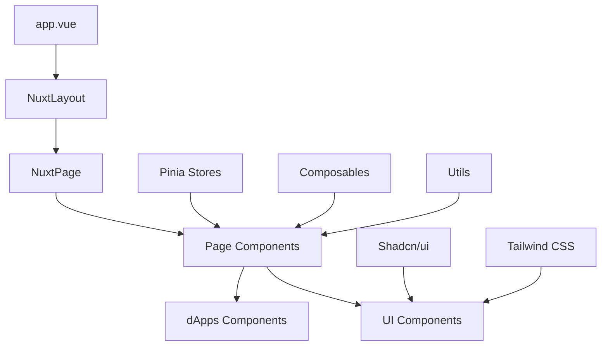

# Hydra Wallet Browser Client

Hydra Wallet Browser Client is a modern web frontend application for the Hydra Wallet SDK, built with Nuxt.js 3. The application provides an intuitive and modern user interface for managing Cardano wallets, executing transactions, and interacting with dApps on the Cardano network.

## 🚀 Key Features

- **Cardano Wallet Management**: Create, restore, and manage Cardano wallets
- **Modern Interface**: UI/UX designed with Tailwind CSS and Shadcn/ui
- **Hydra Layer2**: Integration with Hydra Protocol for fast transactions
- **Multi-language**: Support for multiple languages (Vietnamese, English)
- **dApps Integration**: Integration with decentralized applications
- **PWA Ready**: Progressive Web App support

## 🏗️ Application Architecture

### Tech Stack

```
Frontend Framework: Nuxt.js 3 (Vue.js)
├── UI Framework: Tailwind CSS + Shadcn/ui
├── State Management: Pinia
├── Icons: Nuxt Icon
├── Internationalization: @nuxtjs/i18n
├── Database: MongoDB (Nuxt Mongoose)
├── Testing: Vitest
└── Build Tool: Vite
```

### Directory Structure

```
apps/web/
├── assets/                     # Static resources
│   ├── css/                   # CSS files
│   │   └── tailwind.css       # Tailwind CSS configuration
│   ├── images/                # Images
│   └── scss/                  # SCSS files
├── components/                # Vue Components
│   ├── d-apps/               # dApps components
│   │   ├── hydra-fastpay/    # Hydra Fastpay dApp
│   │   └── rock-paper-scissors/ # Game components
│   ├── pages/                # Page-specific components
│   │   ├── home/             # Home page components
│   │   ├── shared/           # Shared components
│   │   └── auth/             # Authentication components
│   └── ui/                   # Shadcn/ui components
├── composables/              # Vue Composables
├── constants/                # Application constants
├── layouts/                  # Nuxt layouts
├── lib/                      # Utility libraries
├── locales/                  # i18n translation files
├── middleware/               # Nuxt middleware
├── pages/                    # Nuxt pages (routes)
├── plugins/                  # Nuxt plugins
├── public/                   # Public static files
├── server/                   # Server-side code
│   └── api/                  # API routes
├── stores/                   # Pinia stores
├── types/                    # TypeScript type definitions
├── utils/                    # Utility functions
├── app.vue                   # Root Vue component
├── nuxt.config.ts           # Nuxt configuration
└── package.json             # Dependencies
```

## 📁 Detailed Structure

### Components Architecture



### Core Components

#### 1. **Pages** (`/pages`)
- **index.vue**: Home page with wallet overview
- **auth/**: Authentication and login
- **cardano.vue**: Cardano assets management
- **transfer.vue**: Money transfer
- **dapps/**: dApps listing and management
- **settings/**: Application settings

#### 2. **Components** (`/components`)
- **ui/**: Shadcn/ui components (Button, Dialog, Card, etc.)
- **pages/home/**: Home page components
- **pages/shared/**: Shared components
- **d-apps/**: Integrated dApps components

#### 3. **Stores** (`/stores`)
- **wallet.store.ts**: Wallet state management
- **auth.store.ts**: Authentication management
- **app.store.ts**: Global application state

#### 4. **dApps Integration** (`/components/d-apps`)
- **hydra-fastpay/**: Hydra Layer2 wallet
- **rock-paper-scissors/**: Demo game
- Extensible architecture for additional dApps

## 🛠️ Technologies Used

### Frontend Technologies
- **Nuxt.js 3**: Meta-framework for Vue.js
- **Vue 3**: Progressive JavaScript framework
- **TypeScript**: Static type checking
- **Tailwind CSS**: Utility-first CSS framework
- **Shadcn/ui**: Modern component library

### State Management & Data
- **Pinia**: Vue state management
- **MongoDB**: Database (via Nuxt Mongoose)
- **Nuxt Icon**: Icon management
- **@nuxtjs/i18n**: Internationalization

### Development Tools
- **Vite**: Build tool and dev server
- **ESLint**: Code linting
- **Vitest**: Unit testing framework
- **WASM**: WebAssembly for Cardano operations

## 🚀 Installation and Development

### System Requirements
- Node.js >= 18.20.0
- PNPM >= 8.0.0

### Installation

```bash
# Navigate to web app directory
cd apps/web

# Install dependencies
pnpm install

# Run development server
pnpm dev
```

### Development Commands

```bash
# Development mode
pnpm dev

# Build production
pnpm build

# Preview production build
pnpm preview

# Generate static site
pnpm generate

# Lint code
pnpm lint

# Run tests
pnpm test
```

## ⚙️ Configuration

### Environment Variables

```bash
# Blockfrost API Keys
NUXT_PUBLIC_BLOCKFROST_IPFS_API_KEY=your_ipfs_api_key
NUXT_BLOCKFROST_API_KEY=your_blockfrost_api_key

# MongoDB Connection
MONGODB_URI=mongodb://localhost:27017/hydrawallet

# App Configuration
NUXT_PUBLIC_APP_URL=http://localhost:3001
NUXT_PUBLIC_APP_NAME="Hydra Wallet"
```

### Nuxt Configuration (`nuxt.config.ts`)

```typescript
export default defineNuxtConfig({
  // SSR Configuration
  ssr: false,
  
  // Modules
  modules: [
    '@nuxt/eslint',
    '@nuxt/fonts',
    '@nuxt/icon',
    'shadcn-nuxt',
    '@pinia/nuxt',
    '@nuxtjs/i18n'
  ],
  
  // CSS Framework
  css: ['~/assets/css/tailwind.css'],
  
  // Vite Plugins
  vite: {
    plugins: [
      wasm(),
      topLevelAwait(),
      nodePolyfills()
    ]
  }
})
```

## 🎨 UI/UX Design System

### Design Principles
- **Mobile-first**: Responsive design for all devices
- **Dark Theme**: Modern dark interface
- **Accessibility**: WCAG guidelines compliance
- **Performance**: Optimized loading speed

### Color Palette
```css
/* Primary Colors */
--primary: #3b82f6      /* Blue */
--secondary: #10b981    /* Green */
--accent: #f59e0b       /* Yellow */

/* Neutral Colors */
--background: #0f172a   /* Dark Blue */
--surface: #1e293b      /* Slate */
--text: #ffffff         /* White */
--muted: #94a3b8        /* Gray */
```

### Component Library
- Uses **Shadcn/ui** components
- Custom styling with **Tailwind CSS**
- Consistent spacing and typography
- Reusable component patterns

## 🔌 API Integration

### Cardano Integration
```typescript
// Wallet Management
import { AppWallet, NETWORK_ID } from '@hydra-sdk/core'

// Create wallet instance
const wallet = new AppWallet({
  networkId: NETWORK_ID.PREPROD,
  key: { type: 'mnemonic', words: mnemonic }
})
```

### Blockfrost API
```typescript
// Transaction queries
const api = new BlockfrostAPI({
  projectId: process.env.NUXT_BLOCKFROST_API_KEY
})
```

## 🧪 Testing Strategy

### Unit Testing
```bash
# Run all tests
pnpm test

# Run tests in watch mode
pnpm test:watch

# Coverage report
pnpm test:coverage
```

### Testing Structure
```
tests/
├── components/        # Component tests
├── composables/       # Composable tests
├── stores/           # Store tests
└── utils/            # Utility tests
```

## 📱 Progressive Web App (PWA)

### PWA Features
- **Offline Support**: Cache critical resources
- **Install Prompt**: Add to home screen
- **Push Notifications**: Transaction alerts
- **Background Sync**: Sync when online

### Service Worker
```javascript
// Auto-generated by Nuxt PWA module
// Handles caching and offline functionality
```

## 🌐 Internationalization (i18n)

### Supported Languages
- **Vietnamese (vi)**: Primary language
- **English (en)**: Secondary language

### Translation Files
```
locales/
├── vi.json           # Vietnamese translations
└── en.json           # English translations
```

### Usage
```vue
<template>
  <h1>{{ $t('welcome.title') }}</h1>
  <p>{{ $t('welcome.description') }}</p>
</template>
```

## 🔒 Security Considerations

### Client-side Security
- **Private Key Management**: No private keys stored on client
- **HTTPS Only**: Mandatory HTTPS usage
- **CSP Headers**: Content Security Policy
- **Input Validation**: Validate all user inputs

### Wallet Security
- **Mnemonic Encryption**: Encrypted mnemonic phrases
- **Session Management**: Secure session handling
- **Transaction Signing**: Client-side transaction signing

## 📈 Performance Optimization

### Build Optimization
- **Code Splitting**: Automatic route-based splitting
- **Tree Shaking**: Remove unused code
- **Asset Optimization**: Image and font optimization
- **Bundle Analysis**: Analyze bundle size

### Runtime Performance
- **Lazy Loading**: Components and routes
- **Virtual Scrolling**: For long lists
- **Caching Strategy**: API response caching
- **Web Workers**: Heavy computations

## 🚀 Deployment

### Build Process
```bash
# Production build
pnpm build

# Static generation
pnpm generate
```

### Deployment Targets
- **Vercel**: Recommended platform
- **Netlify**: Alternative platform
- **Static Hosting**: Any static file server

### Environment Setup
```bash
# Production environment variables
NODE_ENV=production
NUXT_PUBLIC_APP_URL=https://your-domain.com
```

## 🤝 Contributing

### Development Workflow
1. Fork repository
2. Create feature branch
3. Implement changes
4. Write tests
5. Submit pull request

### Code Standards
- **ESLint**: Follow configured rules
- **TypeScript**: Use strict typing
- **Vue Style Guide**: Follow Vue.js style guide
- **Commit Convention**: Use conventional commits

## 📄 License

Apache 2.0 License - see [LICENSE](../../LICENSE) file for details.

## 🔗 Related Links

- [Hydra Wallet SDK](../../README.md)
- [Nuxt.js Documentation](https://nuxt.com/docs)
- [Tailwind CSS](https://tailwindcss.com/docs)
- [Shadcn/ui](https://ui.shadcn.com/)
- [Cardano Developer Portal](https://developers.cardano.org/)

---

**Hydra Wallet Browser Client** - Modern web interface for Hydra Wallet SDK
