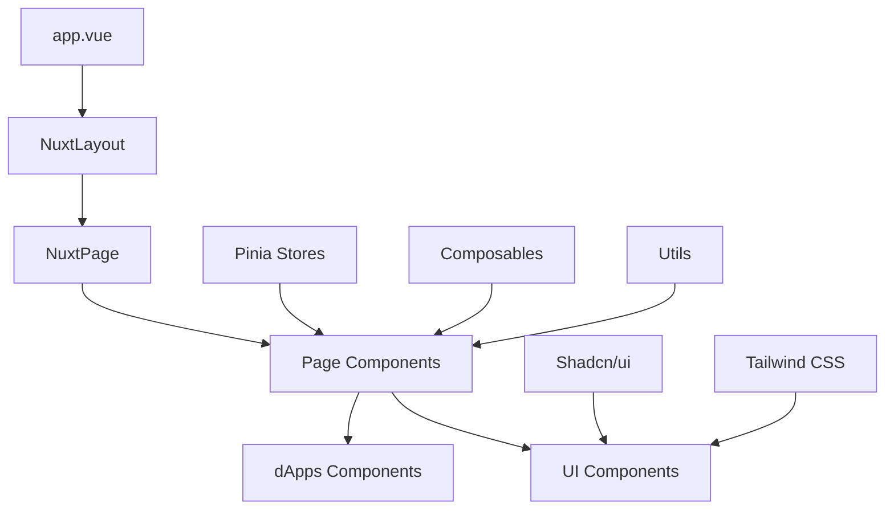

# Hydra Wallet Browser Client

Hydra Wallet Browser Client là ứng dụng web frontend cho Hydra Wallet SDK, được xây dựng với Nuxt.js 3. Ứng dụng cung cấp giao diện người dùng hiện đại và trực quan để quản lý ví Cardano, thực hiện giao dịch và tương tác với các dApps trên mạng Cardano.

## 🚀 Tính năng chính

- **Quản lý ví Cardano**: Tạo, khôi phục và quản lý ví Cardano
- **Giao diện hiện đại**: UI/UX được thiết kế với Tailwind CSS và Shadcn/ui
- **Hydra Layer2**: Tích hợp với Hydra Protocol cho giao dịch nhanh chóng
- **Multi-language**: Hỗ trợ đa ngôn ngữ (Tiếng Việt, Tiếng Anh)
- **dApps Integration**: Tích hợp các ứng dụng phi tập trung
- **PWA Ready**: Hỗ trợ Progressive Web App

## 🏗️ Kiến trúc ứng dụng

### Tech Stack

```
Frontend Framework: Nuxt.js 3 (Vue.js)
├── UI Framework: Tailwind CSS + Shadcn/ui
├── State Management: Pinia
├── Icons: Nuxt Icon
├── Internationalization: @nuxtjs/i18n
├── Database: MongoDB (Nuxt Mongoose)
├── Testing: Vitest
└── Build Tool: Vite
```

### Kiến trúc thư mục

```
apps/web/
├── assets/                     # Tài nguyên tĩnh
│   ├── css/                   # CSS files
│   │   └── tailwind.css       # Tailwind CSS configuration
│   ├── images/                # Hình ảnh
│   └── scss/                  # SCSS files
├── components/                # Vue Components
│   ├── d-apps/               # dApps components
│   │   ├── hydra-fastpay/    # Hydra Fastpay dApp
│   │   └── rock-paper-scissors/ # Game components
│   ├── pages/                # Page-specific components
│   │   ├── home/             # Home page components
│   │   ├── shared/           # Shared components
│   │   └── auth/             # Authentication components
│   └── ui/                   # Shadcn/ui components
├── composables/              # Vue Composables
├── constants/                # Application constants
├── layouts/                  # Nuxt layouts
├── lib/                      # Utility libraries
├── locales/                  # i18n translation files
├── middleware/               # Nuxt middleware
├── pages/                    # Nuxt pages (routes)
├── plugins/                  # Nuxt plugins
├── public/                   # Public static files
├── server/                   # Server-side code
│   └── api/                  # API routes
├── stores/                   # Pinia stores
├── types/                    # TypeScript type definitions
├── utils/                    # Utility functions
├── app.vue                   # Root Vue component
├── nuxt.config.ts           # Nuxt configuration
└── package.json             # Dependencies
```

## 📁 Cấu trúc chi tiết

### Components Architecture



### Core Components

#### 1. **Pages** (`/pages`)
- **index.vue**: Trang chủ với tổng quan ví
- **auth/**: Xác thực và đăng nhập
- **cardano.vue**: Quản lý Cardano assets
- **transfer.vue**: Chuyển tiền
- **dapps/**: Danh sách và quản lý dApps
- **settings/**: Cài đặt ứng dụng

#### 2. **Components** (`/components`)
- **ui/**: Shadcn/ui components (Button, Dialog, Card, etc.)
- **pages/home/**: Components cho trang chủ
- **pages/shared/**: Components dùng chung
- **d-apps/**: Components cho các dApps tích hợp

#### 3. **Stores** (`/stores`)
- **wallet.store.ts**: Quản lý trạng thái ví
- **auth.store.ts**: Quản lý xác thực
- **app.store.ts**: Trạng thái ứng dụng chung

#### 4. **dApps Integration** (`/components/d-apps`)
- **hydra-fastpay/**: Ví Hydra Layer2
- **rock-paper-scissors/**: Game demo
- Extensible architecture cho thêm dApps

## 🛠️ Công nghệ sử dụng

### Frontend Technologies
- **Nuxt.js 3**: Meta-framework cho Vue.js
- **Vue 3**: Progressive JavaScript framework
- **TypeScript**: Static type checking
- **Tailwind CSS**: Utility-first CSS framework
- **Shadcn/ui**: Modern component library

### State Management & Data
- **Pinia**: Vue state management
- **MongoDB**: Database (via Nuxt Mongoose)
- **Nuxt Icon**: Icon management
- **@nuxtjs/i18n**: Internationalization

### Development Tools
- **Vite**: Build tool và dev server
- **ESLint**: Code linting
- **Vitest**: Unit testing framework
- **WASM**: WebAssembly cho Cardano operations

## 🚀 Cài đặt và phát triển

### Yêu cầu hệ thống
- Node.js >= 18.20.0
- PNPM >= 8.0.0

### Cài đặt

```bash
# Di chuyển vào thư mục web app
cd apps/web

# Cài đặt dependencies
pnpm install

# Chạy development server
pnpm dev
```

### Development Commands

```bash
# Development mode
pnpm dev

# Build production
pnpm build

# Preview production build
pnpm preview

# Generate static site
pnpm generate

# Lint code
pnpm lint

# Run tests
pnpm test
```

## ⚙️ Configuration

### Environment Variables

```bash
# Blockfrost API Keys
NUXT_PUBLIC_BLOCKFROST_IPFS_API_KEY=your_ipfs_api_key
NUXT_BLOCKFROST_API_KEY=your_blockfrost_api_key

# MongoDB Connection
MONGODB_URI=mongodb://localhost:27017/hydrawallet

# App Configuration
NUXT_PUBLIC_APP_URL=http://localhost:3001
NUXT_PUBLIC_APP_NAME="Hydra Wallet"
```

### Nuxt Configuration (`nuxt.config.ts`)

```typescript
export default defineNuxtConfig({
  // SSR Configuration
  ssr: false,
  
  // Modules
  modules: [
    '@nuxt/eslint',
    '@nuxt/fonts',
    '@nuxt/icon',
    'shadcn-nuxt',
    '@pinia/nuxt',
    '@nuxtjs/i18n'
  ],
  
  // CSS Framework
  css: ['~/assets/css/tailwind.css'],
  
  // Vite Plugins
  vite: {
    plugins: [
      wasm(),
      topLevelAwait(),
      nodePolyfills()
    ]
  }
})
```

## 🎨 UI/UX Design System

### Design Principles
- **Mobile-first**: Responsive design cho mọi thiết bị
- **Dark Theme**: Giao diện tối hiện đại
- **Accessibility**: Tuân thủ WCAG guidelines
- **Performance**: Tối ưu hóa tốc độ tải

### Color Palette
```css
/* Primary Colors */
--primary: #3b82f6      /* Blue */
--secondary: #10b981    /* Green */
--accent: #f59e0b       /* Yellow */

/* Neutral Colors */
--background: #0f172a   /* Dark Blue */
--surface: #1e293b      /* Slate */
--text: #ffffff         /* White */
--muted: #94a3b8        /* Gray */
```

### Component Library
- Sử dụng **Shadcn/ui** components
- Custom styling với **Tailwind CSS**
- Consistent spacing và typography
- Reusable component patterns

## 🔌 API Integration

### Cardano Integration
```typescript
// Wallet Management
import { AppWallet, NETWORK_ID } from '@hydra-sdk/core'

// Create wallet instance
const wallet = new AppWallet({
  networkId: NETWORK_ID.PREPROD,
  key: { type: 'mnemonic', words: mnemonic }
})
```

### Blockfrost API
```typescript
// Transaction queries
const api = new BlockfrostAPI({
  projectId: process.env.NUXT_BLOCKFROST_API_KEY
})
```

## 🧪 Testing Strategy

### Unit Testing
```bash
# Run all tests
pnpm test

# Run tests in watch mode
pnpm test:watch

# Coverage report
pnpm test:coverage
```

### Testing Structure
```
tests/
├── components/        # Component tests
├── composables/       # Composable tests
├── stores/           # Store tests
└── utils/            # Utility tests
```

## 📱 Progressive Web App (PWA)

### PWA Features
- **Offline Support**: Cache critical resources
- **Install Prompt**: Add to home screen
- **Push Notifications**: Transaction alerts
- **Background Sync**: Sync when online

### Service Worker
```javascript
// Auto-generated by Nuxt PWA module
// Handles caching and offline functionality
```

## 🌐 Internationalization (i18n)

### Supported Languages
- **Vietnamese (vi)**: Ngôn ngữ chính
- **English (en)**: Ngôn ngữ phụ

### Translation Files
```
locales/
├── vi.json           # Vietnamese translations
└── en.json           # English translations
```

### Usage
```vue
<template>
  <h1>{{ $t('welcome.title') }}</h1>
  <p>{{ $t('welcome.description') }}</p>
</template>
```

## 🔒 Security Considerations

### Client-side Security
- **Private Key Management**: Không lưu private keys trên client
- **HTTPS Only**: Bắt buộc sử dụng HTTPS
- **CSP Headers**: Content Security Policy
- **Input Validation**: Validate tất cả user inputs

### Wallet Security
- **Mnemonic Encryption**: Mã hóa mnemonic phrases
- **Session Management**: Secure session handling
- **Transaction Signing**: Client-side transaction signing

## 📈 Performance Optimization

### Build Optimization
- **Code Splitting**: Automatic route-based splitting
- **Tree Shaking**: Remove unused code
- **Asset Optimization**: Image và font optimization
- **Bundle Analysis**: Analyze bundle size

### Runtime Performance
- **Lazy Loading**: Components và routes
- **Virtual Scrolling**: Cho danh sách dài
- **Caching Strategy**: API response caching
- **Web Workers**: Heavy computations

## 🚀 Deployment

### Build Process
```bash
# Production build
pnpm build

# Static generation
pnpm generate
```

### Deployment Targets
- **Vercel**: Recommended platform
- **Netlify**: Alternative platform
- **Static Hosting**: Any static file server

### Environment Setup
```bash
# Production environment variables
NODE_ENV=production
NUXT_PUBLIC_APP_URL=https://your-domain.com
```

## 🤝 Contributing

### Development Workflow
1. Fork repository
2. Create feature branch
3. Implement changes
4. Write tests
5. Submit pull request

### Code Standards
- **ESLint**: Follow configured rules
- **TypeScript**: Use strict typing
- **Vue Style Guide**: Follow Vue.js style guide
- **Commit Convention**: Use conventional commits

## 📄 License

Apache 2.0 License - xem file [LICENSE](../../LICENSE) để biết thêm chi tiết.

## 🔗 Related Links

- [Hydra Wallet SDK](../../README.md)
- [Nuxt.js Documentation](https://nuxt.com/docs)
- [Tailwind CSS](https://tailwindcss.com/docs)
- [Shadcn/ui](https://ui.shadcn.com/)
- [Cardano Developer Portal](https://developers.cardano.org/)

---

**Hydra Wallet Browser Client** - Giao diện web hiện đại cho Hydra Wallet SDK
