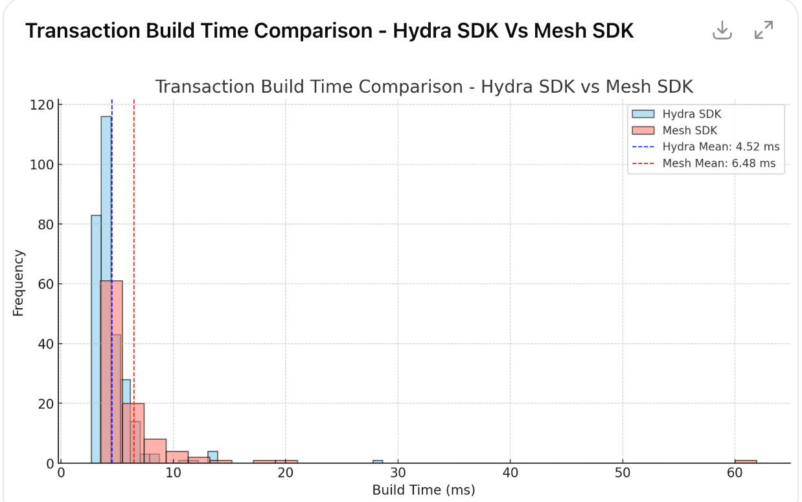

---
So sánh hiệu suất tạo giao dịch giữa Hydra SDK và Mesh SDK
---


### **Phân tích thời gian `build transaction` giữa Hydra SDK và Mesh SDK**

- **Hydra SDK (cardano-serialization-lib + Wasm)**
- **Mesh SDK (cardano-js-sdk + node polyfills)**

Mẫu 1: Tuần tự với 300 samples
### ➕ Tổng hợp dữ liệu:

- Mỗi SDK có 3 lần test (`t1`, `t2`, `t3`)
- Mỗi lần test gồm nhiều mẫu thời gian dạng `t: xxxms`
- Môi trường: `Nodejs v22.16.0`
- Code test:
    - MeshJS
        
        ```tsx
        import { MeshWallet, UTxO } from '@meshsdk/core';
        import { MeshTxBuilder } from '@meshsdk/transaction';
        
        async function runTest() {
            const wallet = new MeshWallet({
                key: {
                    type: 'mnemonic',
                    words: 'daughter silk uncover cheese split ribbon treat forum belt planet divert verify easily fabric shrimp'.split(
                        ' ',
                    ),
                },
                networkId: 1,
            });
            await wallet.init();
        
            let totalBuildTime = 0; // ms
            let avgBuildTime = 0; // ms
        
            for (let i = 0; i < 100; i++) {
                i > 0 && console.time('t');
                const utxos: UTxO[] = [
                    {
                        input: {
                            outputIndex: 0,
                            txHash: 'ffa13a74d1d0d014b88f8ff91d75038cb1e65c3188a995e98c9a64711283d400',
                        },
                        output: {
                            address:
                                'addr_test1qrsx72hrv8ens90hwkezg7ysyhwvcjmyzdveyf88ppq7a0lwu7gv0wuuf9lhzm7wclvj5ntgcfa53j0rqxmu237x20xsne56q3',
                            amount: [
                                {
                                    unit: 'lovelace',
                                    quantity: '5000000',
                                },
                            ],
                            dataHash: undefined,
                            plutusData: undefined,
                            scriptHash: undefined,
                            scriptRef: undefined,
                        },
                    },
                ];
                const txBuilder = new MeshTxBuilder({
                    isHydra: true,
                    params: {
                        minFeeA: 0,
                        minFeeB: 0,
                    },
                });
                const senderAddress =
                    'addr_test1qrsx72hrv8ens90hwkezg7ysyhwvcjmyzdveyf88ppq7a0lwu7gv0wuuf9lhzm7wclvj5ntgcfa53j0rqxmu237x20xsne56q3';
                const receiverAddress =
                    'addr_test1qqexe44l7cg5cng5a0erskyr4tzrcnnygahx53e3f7djqqmzfyq4rc0xr8q3fch3rlh5287uxrn4yduwzequayz94yuscwz6j0';
                const tx = await txBuilder
                    .selectUtxosFrom(utxos)
                    .txOut(receiverAddress, [{ unit: 'lovelace', quantity: `${1500000 + i * 100}` }])
                    .setFee('0')
                    .changeAddress(senderAddress)
                    .complete();
                // Ký giao dịch
                const signedTx = await wallet.signTx(tx);
                i > 0 && console.timeEnd('t');
                avgBuildTime = totalBuildTime / (i + 1);
            }
        }
        
        runTest();
        
        ```
        
    - Hydra SDK
        
        ```tsx
        import { CardanoWASM } from '@hydra-sdk/cardano-wasm';
        import { UTxO } from '@hydra-sdk/core';
        import { TxBuilder } from '@hydra-sdk/transaction';
        import { AppWallet } from '@meshsdk/core';
        
        async function runTest() {
            const wallet = new AppWallet({
                key: {
                    type: 'mnemonic',
                    words: 'daughter silk uncover cheese split ribbon treat forum belt planet divert verify easily fabric shrimp'.split(
                        ' ',
                    ),
                },
                networkId: 1,
            });
            await wallet.init();
        
            let totalBuildTime = 0; // ms
            let avgBuildTime = 0; // ms
        
            for (let i = 0; i < 100; i++) {
                i > 0 && console.time('t');
                const utxos: UTxO[] = [
                    {
                        input: {
                            outputIndex: 0,
                            txHash: 'ffa13a74d1d0d014b88f8ff91d75038cb1e65c3188a995e98c9a64711283d400',
                        },
                        output: {
                            address:
                                'addr_test1qrsx72hrv8ens90hwkezg7ysyhwvcjmyzdveyf88ppq7a0lwu7gv0wuuf9lhzm7wclvj5ntgcfa53j0rqxmu237x20xsne56q3',
                            amount: [
                                {
                                    unit: 'lovelace',
                                    quantity: '5000000',
                                },
                            ],
                        },
                    },
                ];
                const txBuilder = new TxBuilder({
                    isHydra: true,
                    params: {
                        minFeeA: 0,
                        minFeeB: 0,
                    },
                });
                const senderAddress =
                    'addr_test1qrsx72hrv8ens90hwkezg7ysyhwvcjmyzdveyf88ppq7a0lwu7gv0wuuf9lhzm7wclvj5ntgcfa53j0rqxmu237x20xsne56q3';
                const receiverAddress =
                    'addr_test1qqexe44l7cg5cng5a0erskyr4tzrcnnygahx53e3f7djqqmzfyq4rc0xr8q3fch3rlh5287uxrn4yduwzequayz94yuscwz6j0';
                const tx = await txBuilder
                    .setInputs(utxos)
                    .txOut(receiverAddress, [{ unit: 'lovelace', quantity: `${1500000 + i * 100}` }])
                    .setFee(CardanoWASM.BigNum.from_str('0'))
                    .changeAddress(senderAddress)
                    .complete();
                // Ký giao dịch
                const signedTx = await wallet.signTx(tx.to_hex());
                i > 0 && console.timeEnd('t');
                avgBuildTime = totalBuildTime / (i + 1);
            }
        }
        
        runTest();
        
        ```
        
- Tổng số mẫu:
    - Hydra SDK: 100 mẫu mỗi test × 3 = **300 mẫu**
    - Mesh SDK: ~100 mẫu mỗi test × 3 = **300 mẫu**
    - Samples tested
        
        ```
        Hydra SDK: t1: t: 5.644ms t: 5.039ms t: 5.995ms t: 7.014ms t: 4.737ms t: 4.889ms t: 5.746ms t: 6.24ms t: 5.104ms t: 6.552ms t: 5.491ms t: 4.651ms t: 4.918ms t: 5.371ms t: 4.026ms t: 4.558ms t: 5.197ms t: 4.282ms t: 3.955ms t: 3.668ms t: 4.636ms t: 3.599ms t: 4.856ms t: 3.822ms t: 6.842ms t: 3.573ms t: 4.75ms t: 4.388ms t: 4.264ms t: 3.305ms t: 13.366ms t: 3.274ms t: 4.613ms t: 4.426ms t: 4.105ms t: 5.008ms t: 3.949ms t: 5.056ms t: 3.544ms t: 3.3ms t: 4.091ms t: 4.687ms t: 3.99ms t: 5.793ms t: 5.663ms t: 3.48ms t: 3.458ms t: 3.95ms t: 5.371ms t: 3.435ms t: 3.161ms t: 3.713ms t: 4.071ms t: 2.954ms t: 3.854ms t: 3.755ms t: 4.186ms t: 3.155ms t: 3.762ms t: 2.856ms t: 4.514ms t: 4.119ms t: 3.696ms t: 3.048ms t: 4.018ms t: 3.885ms t: 4.365ms t: 11.79ms t: 3.288ms t: 2.98ms t: 3.059ms t: 3.936ms t: 4.394ms t: 5.822ms t: 3.275ms t: 3.898ms t: 3.456ms t: 3.732ms t: 2.937ms t: 3.424ms t: 3.966ms t: 4.064ms t: 3.428ms t: 3.46ms t: 3.485ms t: 4.063ms t: 2.975ms t: 3.043ms t: 3.365ms t: 3.486ms t: 3.834ms t: 3.766ms t: 2.819ms t: 4.027ms t: 3.783ms t: 3.342ms t: 3.063ms t: 4.311ms t: 3.769ms - t2: t: 5.975ms t: 5.151ms t: 6.128ms t: 6.633ms t: 4.775ms t: 6.071ms t: 5.491ms t: 6.35ms t: 6.326ms t: 4.415ms t: 5.305ms t: 6.112ms t: 3.646ms t: 4.299ms t: 4.367ms t: 5.262ms t: 3.733ms t: 4.792ms t: 3.897ms t: 4.248ms t: 3.726ms t: 5.32ms t: 5.673ms t: 3.832ms t: 5.374ms t: 4.342ms t: 4.467ms t: 3.75ms t: 4.35ms t: 4.791ms t: 13.745ms t: 5.328ms t: 3.625ms t: 3.727ms t: 3.996ms t: 5.535ms t: 3.51ms t: 4.099ms t: 4.328ms t: 3.815ms t: 4.926ms t: 4.757ms t: 4.931ms t: 6.647ms t: 6.952ms t: 3.33ms t: 3.592ms t: 3.316ms t: 5.394ms t: 3.361ms t: 3.309ms t: 3.201ms t: 4.952ms t: 3.799ms t: 3.785ms t: 3.201ms t: 4.287ms t: 4.042ms t: 3.438ms t: 3.202ms t: 3.588ms t: 4.451ms t: 3.861ms t: 3.137ms t: 4.064ms t: 4.826ms t: 3.855ms t: 13.1ms t: 3.377ms t: 3.19ms t: 2.707ms t: 4.432ms t: 3.311ms t: 6.462ms t: 3.698ms t: 4.168ms t: 3.139ms t: 3.311ms t: 3.054ms t: 3.986ms t: 3.868ms t: 4.199ms t: 3.454ms t: 2.949ms t: 3.511ms t: 4.316ms t: 3.031ms t: 3.065ms t: 4.087ms t: 4.326ms t: 3.254ms t: 3.089ms t: 2.863ms t: 4.522ms t: 3.759ms t: 3.196ms t: 2.819ms t: 4.108ms t: 3.562ms - t3: t: 5.88ms t: 7.551ms t: 7.729ms t: 5.526ms t: 6.574ms t: 4.296ms t: 6.681ms t: 8.135ms t: 5.153ms t: 8.175ms t: 4.418ms t: 5.818ms t: 6.572ms t: 4.314ms t: 5.313ms t: 5.015ms t: 4.509ms t: 4.792ms t: 3.705ms t: 4.345ms t: 4.234ms t: 4.896ms t: 7.786ms t: 5.283ms t: 7.931ms t: 4.32ms t: 3.494ms t: 5.131ms t: 5.212ms t: 3.446ms t: 13.088ms t: 3.143ms t: 3.837ms t: 4.131ms t: 5.188ms t: 4.548ms t: 4.253ms t: 3.507ms t: 5.366ms t: 2.964ms t: 4.366ms t: 4.145ms t: 4.02ms t: 3.741ms t: 3.94ms t: 4.128ms t: 3.858ms t: 2.951ms t: 4.412ms t: 5.773ms t: 3.991ms t: 3.196ms t: 3.872ms t: 3.895ms t: 4.318ms t: 3.119ms t: 3.632ms t: 4.678ms t: 3.727ms t: 3.023ms t: 4.227ms t: 4.436ms t: 4.174ms t: 2.992ms t: 3.517ms t: 4.127ms t: 4.462ms t: 11.003ms t: 3.92ms t: 3.706ms t: 2.837ms t: 3.082ms t: 3.781ms t: 6.583ms t: 3.022ms t: 3.274ms t: 3.589ms t: 4.271ms t: 3.189ms t: 3.749ms t: 3.42ms t: 4.806ms t: 4.074ms t: 3.11ms t: 2.867ms t: 4.227ms t: 3.465ms t: 3.238ms t: 2.982ms t: 3.649ms t: 4.382ms t: 3.519ms t: 2.882ms t: 2.918ms t: 5.769ms t: 4.218ms t: 3.877ms t: 28.624ms t: 3.341ms MeshSDK: t1: t: 9.382ms t: 8.667ms t: 7.851ms t: 7.552ms t: 8.149ms t: 6.306ms t: 7.44ms t: 7.654ms t: 7.787ms t: 6.918ms t: 5.644ms t: 7.009ms t: 6.59ms t: 6.133ms t: 6.325ms t: 3.889ms t: 5.605ms t: 9.103ms t: 4.377ms t: 6.338ms t: 4.032ms t: 4.071ms t: 5.483ms t: 5.633ms t: 4.465ms t: 5.793ms t: 4.757ms t: 4.246ms t: 4.297ms t: 5.52ms t: 4.539ms t: 4.331ms t: 6.259ms t: 6.942ms t: 4.805ms t: 5.612ms t: 4.4ms t: 5.012ms t: 13.787ms t: 4.764ms t: 7.979ms t: 4.502ms t: 5.922ms t: 5.568ms t: 4.292ms t: 9.193ms t: 8.764ms t: 7.497ms t: 3.302ms t: 4.192ms t: 4.852ms t: 5.157ms t: 4.932ms t: 5.011ms t: 5.739ms t: 3.829ms t: 4.422ms t: 6.366ms t: 3.833ms t: 14.15ms t: 4.679ms t: 4.422ms t: 5.931ms t: 3.522ms t: 4.144ms t: 4.869ms t: 6.122ms t: 3.905ms t: 4.913ms t: 6.441ms t: 3.928ms t: 4.236ms t: 5.282ms t: 4.883ms t: 4.12ms t: 4.059ms t: 6.146ms t: 5.473ms t: 4.3ms t: 4.885ms t: 4.867ms t: 3.916ms t: 28.209ms t: 3.802ms t: 5.639ms t: 4.359ms t: 4.327ms t: 3.724ms t: 6.097ms t: 4.181ms t: 4.285ms t: 4.17ms t: 5.522ms t: 4.222ms t: 3.898ms t: 6.801ms t: 4.446ms t: 4.318ms t: 5.309ms - t2: t: 7.84ms t: 8.412ms t: 9.681ms t: 5.908ms t: 7.773ms t: 7.899ms t: 5.322ms t: 7.199ms t: 8.641ms t: 5.95ms t: 10.755ms t: 5.578ms t: 5.577ms t: 5.953ms t: 5.336ms t: 5.282ms t: 4.939ms t: 11.234ms t: 4.507ms t: 4.265ms t: 5.888ms t: 4.219ms t: 4.417ms t: 61.922ms t: 13.529ms t: 11.363ms t: 4.309ms t: 4.257ms t: 3.619ms t: 5.913ms t: 4.469ms t: 4.945ms t: 5.652ms t: 4.905ms t: 4.273ms t: 5.432ms t: 5.649ms t: 12.919ms t: 4.522ms t: 4.768ms t: 4.288ms t: 5.465ms t: 3.821ms t: 6.049ms t: 4.883ms t: 4.826ms t: 4.454ms t: 5.052ms t: 4.477ms t: 3.991ms t: 4.357ms t: 5.461ms t: 4.462ms t: 5.475ms t: 5.048ms t: 4.383ms t: 4.398ms t: 6.489ms t: 4.928ms t: 17.838ms t: 4.9ms t: 5.636ms t: 4.44ms t: 4.819ms t: 5.478ms t: 5.052ms t: 4.839ms t: 5.404ms t: 8.017ms t: 5.279ms t: 6.583ms t: 4.363ms t: 5.613ms t: 7.838ms t: 4.116ms t: 10.14ms t: 3.616ms t: 4.753ms t: 4.549ms t: 5.669ms t: 5.263ms t: 8.643ms t: 19.917ms t: 3.774ms t: 4.819ms t: 5.246ms t: 4.15ms t: 4.282ms t: 5.053ms t: 3.839ms t: 3.951ms t: 4.402ms t: 5.413ms t: 3.798ms t: 4.78ms t: 4.56ms t: 5.318ms t: 3.507ms t: 4.996ms - t3: t: 7.64ms t: 8.321ms t: 8.277ms t: 8.658ms t: 7.433ms t: 10.208ms t: 5.929ms t: 9.831ms t: 6.007ms t: 7.513ms t: 7.123ms t: 5.723ms t: 6.389ms t: 4.686ms t: 6.615ms t: 5.667ms t: 4.054ms t: 14.343ms t: 4.527ms t: 6.842ms t: 4.956ms t: 5.282ms t: 5.673ms t: 4.413ms t: 7.015ms t: 6.291ms t: 3.688ms t: 5.599ms t: 5.518ms t: 3.956ms t: 6.371ms t: 5.43ms t: 4.819ms t: 4.604ms t: 4.715ms t: 9.062ms t: 5.297ms t: 16.289ms t: 5.77ms t: 4.034ms t: 4.879ms t: 6.446ms t: 4.323ms t: 5.89ms t: 6.616ms t: 4.272ms t: 5.421ms t: 6.597ms t: 3.792ms t: 4.766ms t: 6.583ms t: 3.598ms t: 5.07ms t: 6.698ms t: 4.717ms t: 4.858ms t: 7.427ms t: 4.516ms t: 4.709ms t: 17.222ms t: 6.181ms t: 4.022ms t: 4.428ms t: 6.565ms t: 4.458ms t: 4.778ms t: 5.648ms t: 5.699ms t: 4.104ms t: 5.957ms t: 4.631ms t: 5.034ms t: 7.033ms t: 5.379ms t: 4.159ms t: 5.224ms t: 5.5ms t: 4.96ms t: 4.843ms t: 6.107ms t: 5.608ms t: 9.758ms t: 21.421ms t: 3.341ms t: 6.717ms t: 5.135ms t: 4.171ms t: 5.636ms t: 5.336ms t: 3.746ms t: 5.442ms t: 4.946ms t: 4.253ms t: 4.035ms t: 6.263ms t: 5.248ms t: 4.513ms t: 5.288ms t: 66.897ms
        ```
        

---

### 📊 **Kết quả phân tích thống kê** (tính bằng milliseconds):

| Metric | Hydra SDK | Mesh SDK |
| --- | --- | --- |
| **Số lượng mẫu** | 300 | 300 |
| **Trung bình (mean)** | **4.51 ms** | **5.88 ms** |
| **Trung vị (median)** | 4.41 ms | 5.52 ms |
| **Độ lệch chuẩn** | 1.34 ms | 2.37 ms |
| **Tối thiểu (min)** | 2.82 ms | 3.30 ms |
| **Tối đa (max)** | 28.62 ms | 66.90 ms |

### 🔍 **Phân tích chi tiết:**

- **Hydra SDK:**
    - Nhỏ hơn và ổn định hơn đáng kể.
    - Rất ít sample vượt 10ms (chỉ 2–3 sample có spike).
    - Phù hợp hơn với hệ thống yêu cầu tốc độ phản hồi thấp và consistent.
- **Mesh SDK:**
    - Có **độ phân tán cao hơn**, nhiều mẫu >10ms.
    - Một số cực trị tới **66.90ms** và **28.20ms**, có thể gây bottleneck.
    - Phù hợp với hệ thống không quá nhạy với latency.

### **Kết luận:**

- **Hydra SDK** vượt trội hơn về hiệu năng khi build giao dịch, đặc biệt trong môi trường cần tốc độ cao và ổn định như browser hoặc microservices.
- **Mesh SDK** có thể mạnh hơn về tính năng hoặc tích hợp tốt với `@cardano-sdk`, nhưng cần được tối ưu để giảm thời gian và độ lệch chuẩn khi build giao dịch.

Biểu đồ so sánh

| Đặc điểm | Hydra SDK | Mesh SDK |
| --- | --- | --- |
| **Màu sắc biểu đồ** | Xanh dương nhạt (`skyblue`) | Hồng nhạt (`salmon`) |
| **Trung bình (Mean)** | ~4.5ms (gần sát trái) | ~5.9ms (lệch phải rõ rệt) |
| **Độ rộng phân phối** | Hẹp, tập trung quanh 4–6ms | Rộng hơn, nhiều outlier >10ms |
| **Outliers lớn nhất** | ~28ms | >60ms và thậm chí gần 67ms |
| **Ổn định tổng thể** | Cao hơn, ít giao dịch bị "lag" | Biến động nhiều, phân tán lớn |

### ✅ **Kết luận nhanh:**

- **Hydra SDK** tối ưu hơn về hiệu năng và ổn định — rất phù hợp cho môi trường browser và real-time apps.
- **Mesh SDK** có thể chứa nhiều logic hơn nhưng cần tối ưu thêm nếu dùng cho các tác vụ thời gian thực.


# Mẫu 2: Paralell 1000 samples với tx_metadata

### ➕ Tổng hợp dữ liệu:

- Môi trường:
    - `Nodejs v22.16.0`
    - MeshSDK: `v1.9.0-beta.62`
    - HydraSDK: `v1.0.7`
- Tổng số mẫu:
    - Hydra SDK: 1000
    - Mesh SDK: 1000
    - Samples tested
        
        [mesh-sdk-result.json](attachment:0f72ffb1-2b61-461a-ba9f-7a8779ed6cee:mesh-sdk-result.json)
        
        [hydra-sdk-result.json](attachment:de7bc5d7-72cd-4772-a298-62a5050d4027:hydra-sdk-result.json)
        

### 📊 **Kết quả phân tích thống kê** (tính bằng milliseconds):

| Chỉ số | Hydra SDK (with metadata) | Mesh SDK (with metadata) |
| --- | --- | --- |
| **Số mẫu** | 1000 | 1000 |
| **Trung bình** | 10.60 ms | 19.68 ms |
| **Trung vị** | 6.89 ms | 5.76 ms |
| **Độ lệch chuẩn** | 13.72 ms | 47.88 ms |
| **Giá trị nhỏ nhất** | 3.89 ms | 4.06 ms |
| **Giá trị lớn nhất** | 90.67 ms | 639.78 ms |

### 🔍 Phân tích:

- **Hydra SDK** vẫn duy trì mức độ ổn định tốt:
    - Trung bình cao hơn khi có metadata (tăng từ ~5.4ms → ~10.6ms), nhưng vẫn kiểm soát được độ lệch chuẩn.
    - Median tăng nhẹ (~6.9ms) → phản ánh hiệu năng thực tế không bị ảnh hưởng quá nhiều.
- **Mesh SDK** gặp hiện tượng **đột biến nghiêm trọng**:
    - Một số sample lên tới **639.78ms**, khiến độ lệch chuẩn cực kỳ cao (**~47.88ms**).
    - Mặc dù median vẫn ổn (5.76ms), nhưng trung bình bị kéo lên gấp đôi Hydra do nhiều outlier nặng.

### ➕ Tổng hợp dữ liệu:

- Môi trường:
    - `Nodejs v22.16.0`
    - MeshSDK: `v1.9.0-beta.62`
    - HydraSDK: `v1.0.7`
- Tổng số mẫu:
    - Hydra SDK: 1000
    - Mesh SDK: 1000
    - Samples tested
        
        [mesh-sdk-result.json](attachment:5ba218c4-ab62-44ee-863c-34f22e5b2371:mesh-sdk-result.json)
        
        [hydra-sdk-result.json](attachment:9f77665c-af12-434a-905f-611ad9f44f5b:hydra-sdk-result.json)
        

### 📊 **Kết quả phân tích thống kê** (tính bằng milliseconds):

| Chỉ số | Hydra SDK (sequential) | Mesh SDK (sequential) |
| --- | --- | --- |
| **Số mẫu** | 1000 | 1000 |
| **Trung bình** | 9.76 ms | 10.27 ms |
| **Trung vị** | 6.07 ms | 5.63 ms |
| **Độ lệch chuẩn** | 14.93 ms | 17.10 ms |
| **Thấp nhất** | 3.75 ms | 3.99 ms |
| **Cao nhất** | 127.57 ms | 133.19 ms |

### 🔍 Phân tích:

- **Cả 2 SDK đều có hiệu năng giảm nhẹ so với test độc lập**, do:
    - Chạy tuần tự dễ bị ảnh hưởng bởi GC, memory pressure, hoặc CPU context switching.
    - **Trung bình và độ lệch chuẩn đều cao hơn**.
- **Hydra SDK**:
    - Median vẫn nhỉnh hơn Mesh (6.07ms vs 5.63ms).
    - Có một số outlier lớn nhưng ít hơn Mesh.
- **Mesh SDK**:
    - Trung bình cao hơn Hydra, độ lệch chuẩn cũng lớn hơn → tức là có **nhiều giao dịch cực chậm hơn**.
    - Mức chênh lệch tuy nhỏ nhưng cho thấy **hiệu suất Mesh biến động hơn** trong môi trường tuần tự.
